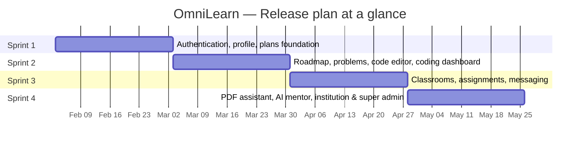

# Chapter 2 — Sprint 0

## I. Introduction

In this chapter we start by defining the specification of **OmniLearn** — detailing the product backlog from a functional and non-functional standpoint. We then present the planning of the four sprints, before describing the hardware and software environment required to build the project.

## II. Requirements Specification

This section specifies both the functional and the non-functional requirements of the solution.

### 1. Functional Requirements

The table below gives a detailed view of OmniLearn's main functionalities, grouped by actor.

| PBI | Main functionality | US Code | User story |
|---|---|---|---|
| **Visitor** | | | |
| 1 | Browse the landing page | US1.1 | As a visitor, I want to browse the public landing page. |
| 2 | Sign up | US2.1 | As a visitor, I want to create an account on the platform. |
| 3 | Verify email | US3.1 | As a visitor, I want to verify my email address through a token sent by mail. |
| 4 | Choose a plan | US4.1 | As a visitor, I want to choose between Free, Pro and Institution plans at signup. |
| **Student** | | | |
| 5 | Sign in | US5.1 | As a student, I want to sign in with email and password. |
| 6 | Profile management | US6.1 | As a student, I want to view my profile. |
| | | US6.2 | As a student, I want to update my profile (avatar, bio, GitHub, LinkedIn). |
| | | US6.3 | As a student, I want to delete my account. |
| 7 | Password reset | US7.1 | As a student, I want to reset my password via email token. |
| 8 | Two-factor authentication | US8.1 | As a student, I want to enable 2FA on my account. |
| 9 | Personalized roadmap | US9.1 | As a student, I want to set my career goal, interests and languages. |
| | | US9.2 | As a student, I want to view my generated roadmap. |
| | | US9.3 | As a student, I want to track my roadmap progress. |
| | | US9.4 | As a student, I want to download a certificate when I complete the roadmap. |
| 10 | Problem catalogue | US10.1 | As a student, I want to browse the list of available problems. |
| | | US10.2 | As a student, I want to search and filter problems by tag / difficulty. |
| 11 | Solve a problem | US11.1 | As a student, I want to open a problem and read its statement. |
| | | US11.2 | As a student, I want to write code in the in-browser editor (multi-language). |
| | | US11.3 | As a student, I want to run my code and see the output. |
| | | US11.4 | As a student, I want to submit my solution and see the verdict. |
| 12 | Coding dashboard | US12.1 | As a student, I want to see my latest submissions and progress. |
| 14 | Classroom — student | US14.1 | As a student, I want to join a classroom using a code. |
| | | US14.2 | As a student, I want to see my classrooms. |
| | | US14.3 | As a student, I want to see assignments and announcements. |
| | | US14.4 | As a student, I want to submit my work to an assignment. |
| 15 | PDF assistant | US15.1 | As a student, I want to upload a course PDF. |
| | | US15.2 | As a student, I want to ask questions to the AI grounded in that PDF. |
| 16 | Real-time messaging | US16.1 | As a student, I want to see my conversations. |
| | | US16.2 | As a student, I want to send messages to peers and teachers. |
| | | US16.3 | As a student, I want to be notified of new messages. |
| 48 | AI mentor | US48.1 | As a student, I want an AI mentor that guides me without giving the final solution. |
| | | US48.2 | As a student, I want AI-assisted code correction to improve my submissions. |
| 49 | Learning tags | US49.1 | As a student, I want `/ai`, `/stack-overflow`, `/youtube` tags to find explanations and references faster. |
| **Teacher** | | | |
| 18 | Sign in | US18.1 | As a teacher, I want to sign in to access my teacher dashboard. |
| 19 | Profile management | US19.1 | As a teacher, I want to manage my profile. |
| 20 | Class management | US20.1 | As a teacher, I want to create a class linked to a Grade / Speciality / Level. |
| | | US20.2 | As a teacher, I want to invite students to a class via a class code. |
| | | US20.3 | As a teacher, I want to see the enrolled students in my class. |
| 21 | Course / modules | US21.1 | As a teacher, I want to create courses inside a class. |
| | | US21.2 | As a teacher, I want to create modules and lessons inside a course. |
| 22 | Assignments | US22.1 | As a teacher, I want to create an assignment linked to a module / class. |
| | | US22.2 | As a teacher, I want to attach problems to an assignment. |
| | | US22.3 | As a teacher, I want to review and grade student submissions. |
| 23 | Announcements | US23.1 | As a teacher, I want to post announcements visible to a class. |
| **Institution Admin** | | | |
| 24 | Onboarding | US24.1 | As an institution admin, I want to onboard my institution (name, logo, slug). |
| 25 | Invite links | US25.1 | As an institution admin, I want to generate invite links for teachers/students. |
| | | US25.2 | As an institution admin, I want to revoke an invite link. |
| 26 | Curriculum | US26.1 | As an institution admin, I want to define my own Grades. |
| | | US26.2 | As an institution admin, I want to define Specialities under each Grade. |
| | | US26.3 | As an institution admin, I want to define Levels under each Speciality. |
| 27 | Member directory | US27.1 | As an institution admin, I want to see all members of my institution. |
| | | US27.2 | As an institution admin, I want to change a member's role (teacher/student). |
| **Super Admin** | | | |
| 28 | Sign in | US28.1 | As a super admin, I want to sign in to the super admin dashboard. |
| 29 | Manage institutions | US29.1 | As a super admin, I want to list / suspend / delete institutions. |
| 30 | Problem catalogue | US30.1 | As a super admin, I want to create / update / delete problems globally. |
| | | US30.2 | As a super admin, I want to toggle a problem as Free-tier. |
| | | US30.3 | As a super admin, I want to toggle a problem as Pro-tier. |
| 31 | Ban / unban users | US31.1 | As a super admin, I want to ban or unban any user. |
| 32 | Statistics | US32.1 | As a super admin, I want to see global usage statistics. |
| **Billing / Plans** | | | |
| 33 | Stripe checkout | US33.1 | As a Free user, I want to upgrade to Pro through Stripe checkout. |
| | | US33.2 | As an organization, I want to upgrade to Institution through Stripe. |
| 34 | Plan enforcement | US34.1 | As a Free user, my access is limited to free-tier problems and basic messaging. |
| | | US34.2 | As a Pro user, I have full access to all problems + AI + PDF assistant. |
| | | US34.3 | As an Institution member, my access is scoped to my institution's resources. |

### 2. Non-Functional Requirements

Non-functional requirements indirectly impact the result and the performance of the platform, so they must not be neglected. The following criteria must be satisfied:

- **Performance:** optimize system performance to ensure fast response times and minimize loading times. The code editor must execute snippets in well under 5 seconds for short inputs.
- **Ergonomics:** design a user-friendly interface, easy to use, with intuitive navigation and a clear layout of features. Three different sidebars are provided according to plan (Free, Pro, Institution) to keep each user's navigation focused.
- **Security:** all confidential information provided by users is encrypted (bcrypt for passwords, JWT for sessions, optional 2FA with TOTP, HTTPS). Email verification and password-reset tokens have a short expiration time.
- **Availability:** the application must remain available and reliable. Long-running AI requests are sent through a streaming response so the user can be informed of progress.
- **Extensibility:** the architecture must adapt easily to new requirements — for example, adding a new programming language to the code editor or a new payment provider.
- **Multi-tenant isolation:** an Institution member must never see another institution's resources (classrooms, members, curriculum). The model enforces this at the route level.
- **Scalability:** the backend is stateless (JWT-based auth) and can be horizontally scaled; Socket.IO connections are organized per-conversation / per-class for efficient broadcasting.

## III. Sprint Planning

The goal of sprint planning is to define short-term objectives — generally on a duration of two to four weeks — by determining which functionalities to deliver and estimating the effort required.

We split the work into four sprints of approximately 4 weeks each. Items are referenced by the PBI numbers introduced in [03_chapitre1_cadre_general.md](./03_chapitre1_cadre_general.md).

| Sprint | Duration | Included PBIs (high-level) |
|---|---|---|
| **Sprint 1 — Authentication, profile, plans foundation** | 4 weeks | PBI 1, 2, 3, 4, 5, 6, 7, 8, 33 (partial) |
| **Sprint 2 — Roadmap, problems, code editor, coding dashboard** | 4 weeks | PBI 9, 10, 11, 12, 14, 30, 39, 40 |
| **Sprint 3 — Classrooms, assignments, messaging** | 4 weeks | PBI 14, 17, 20, 21, 22, 23 |
| **Sprint 4 — PDF assistant, AI mentor, institution & super admin** | 4 weeks | PBI 18, 19, 22, 23, 24, 25, 26, 27, 28, 29, 30 (mgmt), 31, 32, 33, 34, 48, 49 |

#### Release plan at a glance

The diagram below lays out the four sprints on a single timeline so the overall release plan can be read at a glance. Each bar covers one sprint of four weeks, in the order they are delivered — from the authentication foundations of Sprint 1 to the AI surfaces and admin consoles that close the project in Sprint 4. Sprints run back-to-back without overlap: every sprint builds directly on the artifacts produced by the previous one.

> See [sprint_planning_and_backlog.md](./sprint_planning_and_backlog.md) for the detailed sprint-by-sprint backlog with story points and acceptance criteria.

## IV. Work Environment

### 1. Software Environment

- **Visual Studio Code:** open-source, extensible code editor developed by Microsoft for Windows, Linux and macOS — used as the main IDE.
- **PostgreSQL + pgAdmin:** the relational database used to store users, institutions, classrooms, problems, submissions, conversations and messages.
- **Postman:** used to design and test the REST API endpoints.
- **Git + GitHub:** version control and hosting of the project.
- **Stripe CLI:** used to test webhook events locally during development of the plan-upgrade flow.

### 2. Technologies and Languages Used

OmniLearn is a JavaScript-only stack — the same language runs on the client and the server. The tables below group every technology by layer so each tier of the application can be reviewed independently.

#### 2.1. Languages & markup

The core languages every layer of the platform is written in — one runtime language (JavaScript) shared between client and server, with HTML/CSS for the rendered output.

| Technology | Version | Role |
|---|---|---|
| **HTML5** | living standard | Page markup. |
| **CSS3** | level 3 | Styling primitives. |
| **JavaScript (ES2022+)** | ES2022+ | The single application language — used both client- and server-side. The Client sets `"type": "module"`. |
| **JSX** | React 19 | Component templating on the frontend. |

#### 2.2. Frontend

The React 19 single-page application built with Vite — UI libraries, the in-browser code editor, the diagramming canvases, and the client-side networking stack.

| Technology | Version | Role |
|---|---|---|
| **React** | 19.2 | UI library. |
| **Vite** | 7.3 | Dev server + production bundler. |
| **React Router** | 7.13 | Client-side routing & route guards. |
| **Tailwind CSS** | 4.2 (via `@tailwindcss/vite`) | Utility-first styling. |
| **DaisyUI** | 5.5 | Component classes layered on Tailwind. |
| **Ant Design** | 6.3 (+ `@ant-design/icons`, `@ant-design/plots`) | Form controls, tables, charts. |
| **Chakra UI** | 3.33 | Layout primitives. |
| **shadcn / ui** | 4.0 | Headless component recipes. |
| **Lucide React** | 0.575 | Icon set. |
| **Framer Motion** | 12.38 | Animations & transitions. |
| **CodeMirror** | 6 (`@uiw/react-codemirror` + `lang-{javascript,java,python,php}`, One Dark theme) | In-browser code editor. |
| **@xyflow/react** | 12.10 | Roadmap graph (React Flow). |
| **tldraw** | 4.4 | Whiteboard canvas. |
| **Excalidraw** | 0.18 | Diagram authoring. |
| **react-pdf + pdfjs-dist** | 10.4 / 3.11 | PDF rendering inside `PdfAssistant.jsx`. |
| **socket.io-client** | 4.8 | Real-time client transport. |
| **Axios** | 1.13 | HTTP client. |
| **js-cookie** | 3.0 | JWT cookie storage. |
| **jsPDF + html2canvas** | 4.2 / 1.4 | Certificate export to PDF. |
| **Recharts** | 3.8 | Dashboard charts. |
| **react-hot-toast** | 2.6 | Toast notifications. |
| **ESLint** | 9.39 | Linting (`eslint-plugin-react-hooks`, `eslint-plugin-react-refresh`). |

#### 2.3. Backend

The Node.js runtime hosting the Express 5 REST API, the Socket.IO real-time hub, and the request-level utilities (uploads, validation, logging, env config).

| Technology | Version | Role |
|---|---|---|
| **Node.js** | 18+ LTS | JavaScript runtime hosting the API. |
| **Express** | 5.2 | HTTP framework (routes + middleware pipeline). |
| **Socket.IO (server)** | 4.8 | Real-time hub for messaging, notifications, live sessions. |
| **Multer** | 2.1 | Multipart file uploads (PDFs, avatars, code). |
| **Morgan** | 1.10 | HTTP request logging. |
| **CORS** | 2.8 | Cross-origin policy. |
| **dotenv** | 17.3 | Environment-variable loading. |
| **express-validator** | 7.3 | Request validation. |
| **Zod** | 4.4 | Schema validation for AI payloads. |
| **nodemon** | 3.1 (dev) | Hot-reload during development. |

#### 2.4. Database & storage

The persistence layer — PostgreSQL accessed through Sequelize for relational data, Chroma DB for vector embeddings, plus cloud and local disk storage for files.

| Technology | Version | Role |
|---|---|---|
| **PostgreSQL** | 14+ | Primary relational database — users, institutions, classrooms, problems, submissions, conversations, notifications. |
| **pg / pg-hstore** | 8.13 / 2.3 | Native PostgreSQL driver for Node. |
| **Sequelize** | 6.37 | ORM + schema migrations (`sequelize.sync({ alter: true })`). |
| **Chroma DB** | 3.3 (`chromadb`) | Persistent vector store for the PDF assistant. |
| **Cloudinary** | 2.10 | Cloud asset hosting (avatars, classroom media). |
| **Local disk (`uploads/`)** | — | PDFs, code workspace, `index.json`, `workspace.json`, `history.json`. |

#### 2.5. Authentication & security

The pieces that protect user accounts and sessions — password hashing, JWT-based auth, two-factor TOTP, and federated Google sign-in.

| Technology | Version | Role |
|---|---|---|
| **jsonwebtoken** | 9.0 | Stateless JWT auth across REST and Socket.IO. |
| **bcrypt** + **bcryptjs** | 6.0 / 3.0 | Password hashing. |
| **Speakeasy** | 2.0 | TOTP-based 2FA. |
| **qrcode** | 1.5 | TOTP QR provisioning. |
| **google-auth-library** | 10.6 | Google OAuth sign-in. |

#### 2.6. AI plane (LLMs, embeddings, RAG)

Everything that powers the seven AI surfaces (PDF assistant RAG, AI Mentor, code correction, problem generation, roadmap, workspace AI, slash commands) — completions, embeddings, vector store and the external knowledge feeds.

| Technology | Version | Role |
|---|---|---|
| **Groq SDK** | 0.37 | All LLM completions — model `llama-3.3-70b-versatile`. Used by PDF assistant, AI Mentor (SSE streaming), code correction, problem generation, roadmap service, slash commands. |
| **HuggingFace Inference** | 4.13 (`@huggingface/inference`) | Embeddings — model `sentence-transformers/all-MiniLM-L6-v2`, called via `HuggingFaceInferenceEmbeddings`. |
| **Chroma DB** | 3.3 | Vector store for similarity search (collection per PDF). |
| **LangChain** | 1.2 (`langchain`, `@langchain/core` 1.1, `@langchain/community` 1.1, `@langchain/openai` 1.2) | Glue between embeddings + Chroma + LLM (Document wrapper, vector store API). |
| **pdf-parse** | 1.1 | PDF text extraction prior to chunking. |
| **Stack Exchange API** | v2.3 (public, no key) | Stack Overflow enrichment for the roadmap and the `/stackoverflow` slash. |
| **YouTube Data API** | v3 (needs `YOUTUBE_API_KEY`) | Video enrichment for the roadmap and the `/video` slash. |

#### 2.7. Realtime, live sessions & video

The bidirectional transport layer — Socket.IO for messages and live coding sessions, Stream for the audio/video feature inside those sessions.

| Technology | Version | Role |
|---|---|---|
| **Socket.IO** | 4.8 | Message hub, notification push, live coding sessions (permissions, playlists, identity masking, post-session snapshots). |
| **@stream-io/node-sdk + @stream-io/video-react-sdk** | 0.7 / 1.34 | Audio/video conferencing for live sessions. |

#### 2.8. Payments & email

The external services that drive the plan-upgrade flow (Stripe Checkout + webhooks) and the transactional notifications sent to users.

| Technology | Version | Role |
|---|---|---|
| **Stripe** | 22.1 | Checkout for Pro and Institution plans + webhook handling. |
| **Nodemailer** | 8.0 | Transactional emails (email verification, password reset, invite links). |

#### 2.9. Tooling & ecosystem

The developer-side tools used to build, version, test and operate the platform — IDE, source control, API tester, DB admin UI, payment/vector-store sidecars.

| Tool | Role |
|---|---|
| **Visual Studio Code** | Main IDE. |
| **Git + GitHub** | Source control & hosting. |
| **Postman** | REST endpoint design & manual testing. |
| **pgAdmin** | PostgreSQL administration. |
| **Stripe CLI** | Local webhook tunnelling for plan-upgrade testing. |
| **Docker (optional)** | Used to run the Chroma DB server locally (`chromadb/chroma` image). |
| **slugify** | 1.6 | Stable, URL-safe IDs for problems and modules. |

### 3. Hardware Environment

### Table 4 — Hardware Environment

| Component | Specification |
|---|---|
| **Laptop** | Generic dev laptop |
| **Processor** | 11th Gen Intel(R) Core(TM) i5 |
| **RAM** | 8 GB |
| **Storage** | 1 TB SSD |
| **OS** | Windows 10 Pro |

## V. Conclusion

In this chapter we presented a complete overview of the project specification — functional and non-functional requirements, sprint planning and the work environment (software, technologies and hardware). The next chapter is devoted to the realization of the first sprint, where we put in place the first essential building blocks of the platform.

---
