# Chapter 3 — Sprint 1

## I. Introduction

In this chapter we explore the key steps for the realization of the **first increment** of OmniLearn. After identifying user needs and reviewing the global use cases, this first sprint focuses on the **essential foundations** needed to launch the platform.

## II. Sprint Objectives

The main objective of Sprint 1 is to deliver the building blocks that all later sprints depend on:

- A public **landing page** (`/`) that introduces OmniLearn and its three plans.
- A complete **authentication system**: signup, login, email verification, password reset, and optional **2FA** (TOTP via Speakeasy + QR code).
- The **user profile** page (avatar, bio, GitHub URL, LinkedIn URL) — and the profile-completion check enforced by the `Guard` component in `App.jsx`.
- A first cut of the **plan system**: Free / Pro / Institution recorded on the user record (`plan` enum + `planJoinedAt`).
- A first **Stripe Checkout** integration that lets a Free user upgrade to Pro.
- A first version of the **role-based sidebar** that branches between Free / Pro / Institution navigation.

## III. Sprint 1 Backlog

The table below lists all user stories and tasks planned for Sprint 1, grouped by actor (Visitor, Student, Cross-cutting). It is the work the team commits to deliver in this sprint.

### Table 5 — Sprint 1 Backlog

| PBI | Main functionality | US Code | User story | Task ID | Tasks |
|:---:|:---|:---:|:---|:---:|:---|
| **Visitor** | | | | | |
| 1 | Landing page | US1.1 | As a visitor, I want to browse the public landing page. | 1.1 | Build the `Home` page in `Client/src/Home/Home.jsx`. |
|   |   |   |   | 1.2 | Display the three plans (Free / Pro / Institution) with CTAs. |
| 2 | Sign up | US2.1 | As a visitor, I want to create an account. | 2.1 | Create the `Auth` page (`Client/src/Auth/Auth.jsx`) with sign-up tab. |
|   |   |   |   | 2.2 | Add input validation (email, password strength). |
|   |   |   |   | 2.3 | Implement the `User` Sequelize model in `Server/src/models/User.js`. |
|   |   |   |   | 2.4 | Implement the `POST /api/auth/register` route in `authRoutes.js`. |
|   |   |   |   | 2.5 | Hash passwords with bcryptjs (`BCRYPT_ROUNDS` from config). |
|   |   |   |   | 2.6 | Send a verification email (Nodemailer) with `emailVerificationToken`. |
| 3 | Verify email | US3.1 | As a visitor, I want to verify my email. | 3.1 | Build the `VerifyEmail` page (`Client/src/Auth/VerifyEmail.jsx`). |
|   |   |   |   | 3.2 | Implement `GET /api/auth/verify-email?token=...` and clear the expiry. |
| 4 | Choose a plan | US4.1 | As a visitor, I want to choose between Free, Pro and Institution. | 4.1 | Plan selector on the sign-up form; default = `free`. |
|   |   |   |   | 4.2 | Pro and Institution route to Stripe Checkout after signup. |
| **Student / Authenticated user** | | | | | |
| 5 | Sign in | US5.1 | As a student, I want to sign in. | 5.1 | Sign-in tab in the `Auth` page. |
|   |   |   |   | 5.2 | `POST /api/auth/login` returning a JWT and the user object. |
|   |   |   |   | 5.3 | Store `token` and `user` in cookies via `js-cookie`. |
| 6 | Profile management | US6.1 | As a student, I want to view my profile. | 6.1 | Build `Profile` page (`Client/src/components/Profile.jsx`). |
|   |   |   |   | 6.2 | `GET /api/profile/:id` returns the current user. |
|   |   | US6.2 | As a student, I want to update my profile. | 6.3 | Avatar upload (Cloudinary), bio, GitHub URL, LinkedIn URL. |
|   |   |   |   | 6.4 | `PATCH /api/profile/:id` validates and updates the user. |
|   |   |   |   | 6.5 | Emit a `profile-updated` event so `Guard` re-checks profile completeness. |
|   |   | US6.3 | As a student, I want to delete my account. | 6.6 | Add a destructive action in the profile page. |
|   |   |   |   | 6.7 | `DELETE /api/profile/:id`. |
| 7 | Password reset | US7.1 | As a student, I want to reset my password. | 7.1 | Forgot-password link in the sign-in tab. |
|   |   |   |   | 7.2 | `POST /api/auth/forgot-password` generates `passwordResetToken`. |
|   |   |   |   | 7.3 | Send the reset email via Nodemailer. |
|   |   |   |   | 7.4 | `POST /api/auth/reset-password` validates the token and rehashes. |
| 8 | Two-factor authentication | US8.1 | As a student, I want to enable 2FA. | 8.1 | Toggle in the profile page. |
|   |   |   |   | 8.2 | `POST /api/auth/2fa/setup` generates the Speakeasy secret + QR. |
|   |   |   |   | 8.3 | `POST /api/auth/2fa/verify` confirms the TOTP and sets `is2FAEnabled`. |
| **Cross-cutting** | | | | | |
| 33 (partial) | Stripe checkout — Pro upgrade | US33.1 | As a Free user, I want to upgrade to Pro. | 33.1 | Add `stripeRoutes.js` and a `/api/stripe/checkout-pro` endpoint. |
|   |   |   |   | 33.2 | Build the `PlanSection` component (`Client/src/components/PlanSection.jsx`). |
|   |   |   |   | 33.3 | Update `users.plan` to `pro` on a successful Stripe webhook. |

## IV. Design

In this section we elaborate the use-case diagram, the sequence diagrams, the activity diagrams, the class diagram and the C4 component view for Sprint 1.

### 1. Use-Case Diagram

#### Visitor side

A visitor (not logged in) can browse the landing page, sign up, verify their email, choose a plan and sign in.

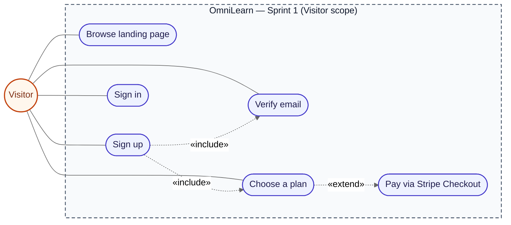

> *Figure 6 — Use-case diagram of Sprint 1 — Visitor side.*

#### Student / authenticated user side

The student's scope is organised around four **management** use cases — *Manage profile*, *Manage 2FA*, *Manage Google account*, *Manage subscription* — each of which is **specialised** into the concrete actions the user can perform (consult, update, delete, activate, link…). All four management use cases share a common `«include» Authenticate` step (the JWT check performed by the `authenticate` middleware), so authorisation is modelled once and reused.

Around the actor, the diagram also shows the **standalone** use cases that do not fit under a "manage" parent (*Sign in*, *Sign in with Google*, *Sign out*, *Reset password*, *Resend verification email*) and three **secondary actors** the system collaborates with to complete the user's intent: Google OAuth (federated identity), Stripe (paid plans), Cloudinary (avatar storage) and the Mailer (transactional emails).

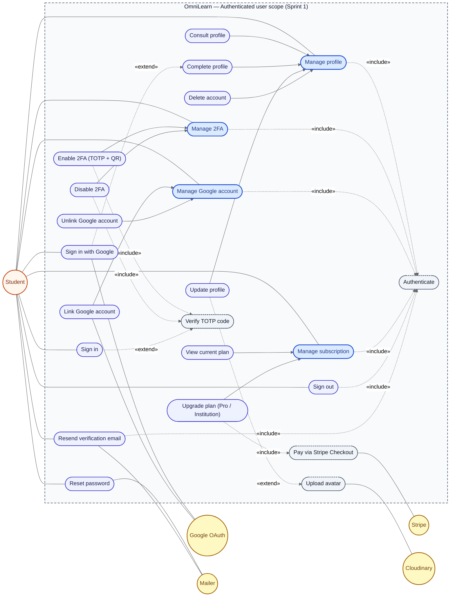

> *Figure 7 — Use-case diagram of Sprint 1 — Student side.*

**Reading the diagram**

- **Solid arrows toward a "Manage X" parent** are *generalisations*: the child use case is a specialised form of the parent (e.g. *Consult profile*, *Update profile*, *Delete account* and *Complete profile* are four ways of *Managing profile*). The student does not connect to the leaves directly — choosing the parent gives access to all of its children.
- **Dashed arrows labelled `«include»`** mark a step that always runs as part of the parent: every *Manage X* always includes *Authenticate*; *Enable 2FA* and *Disable 2FA* always include *Verify TOTP code*; *Upgrade plan* always includes *Pay via Stripe Checkout*.
- **Dashed arrows labelled `«extend»`** mark a conditional branch: *Sign in* only extends to *Verify TOTP code* when `is2FAEnabled = true`; *Update profile* only extends to *Upload avatar* when the user picks a new image; *Sign in with Google* only extends to *Complete profile* on the first OAuth landing (when `Guard` detects missing `firstname` / `lastname` / `username`).
- **Secondary actors** on the right (Google OAuth, Stripe, Cloudinary, Mailer) are external systems that collaborate with specific use cases — they are not the primary actor but they participate in the realisation of the scenario.

| Link | Type | Meaning |
|---|---|---|
| Manage profile / 2FA / Google / subscription → Authenticate | `«include»` | JWT validation by the `authenticate` middleware runs before any authenticated route resolves. |
| Sign in → Verify TOTP code | `«extend»` | Only when `is2FAEnabled = true`; a user without 2FA never sees this step. |
| Sign in with Google → Complete profile | `«extend»` | First OAuth landing only, when `Guard` redirects to `/complete-profile`. |
| Update profile → Upload avatar | `«extend»` | Avatar is optional; Cloudinary upload only runs when an image is picked. |
| Enable 2FA → Verify TOTP code | `«include»` | The server only sets `is2FAEnabled = true` after `POST /auth/2fa/verify` succeeds. |
| Disable 2FA → Verify TOTP code | `«include»` | Symmetrical: a fresh code is required so a stolen session cannot silently weaken the account. |
| Upgrade plan → Pay via Stripe Checkout | `«include»` | Every upgrade path goes through the hosted Stripe Checkout session before the webhook flips `users.plan`. |

*Sign in*, *Sign in with Google* and *Reset password* are reachable from the sign-in screen even though the actor is labelled *Student* — they are the bridge from the visitor scope into the authenticated scope. *Sign out* is a frontend-only action (it clears the JWT and refresh-token cookies); it is shown as a Student use case because it is part of the authenticated experience, but it does not need to include *Authenticate* on the server side.

### 2. Sequence Diagrams

#### 2.1. Sequence diagram — "Sign up"

The visitor fills the sign-up form; the backend hashes the password, creates the user and sends a verification email. The user is then redirected to a "check your inbox" screen.

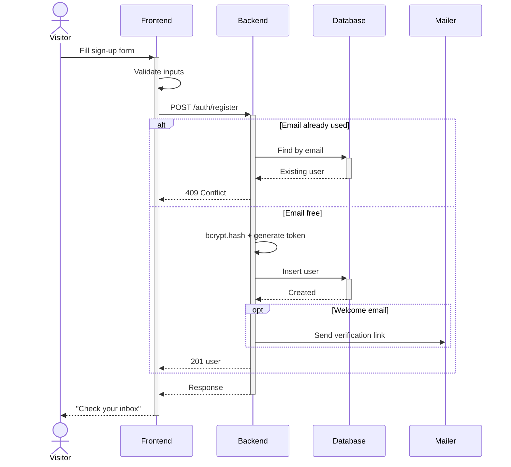

> *Figure 8 — Sequence diagram "Sign up".*

#### 2.2. Sequence diagram — "Sign in"

The student submits email and password; the backend checks them and — if 2FA is on — asks for a TOTP code. On success, a JWT is returned and stored in cookies, then the user is redirected to their dashboard.

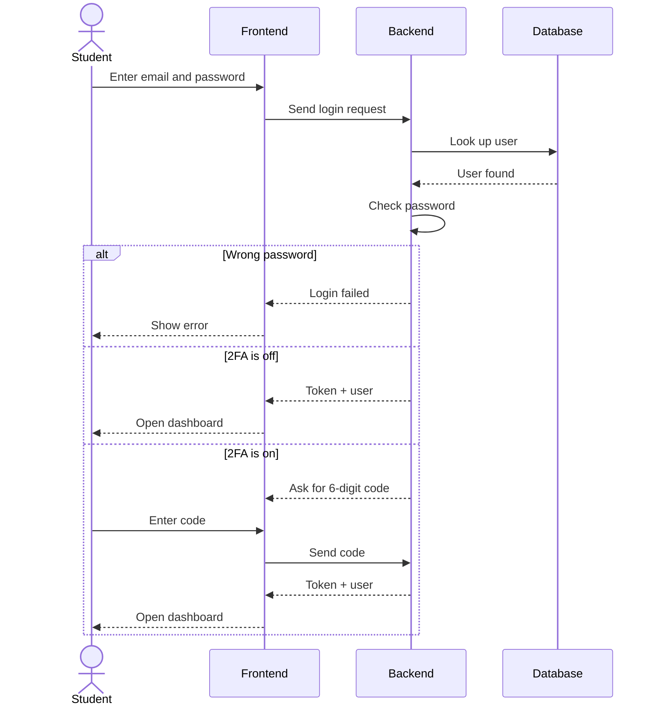

> *Figure 9 — Sequence diagram "Sign in".*

#### 2.3. Sequence diagram — "Reset password"

The user submits their email and receives a one-hour reset link; clicking it opens a form to set a new password. The API always returns the same generic message to avoid revealing whether the email exists.

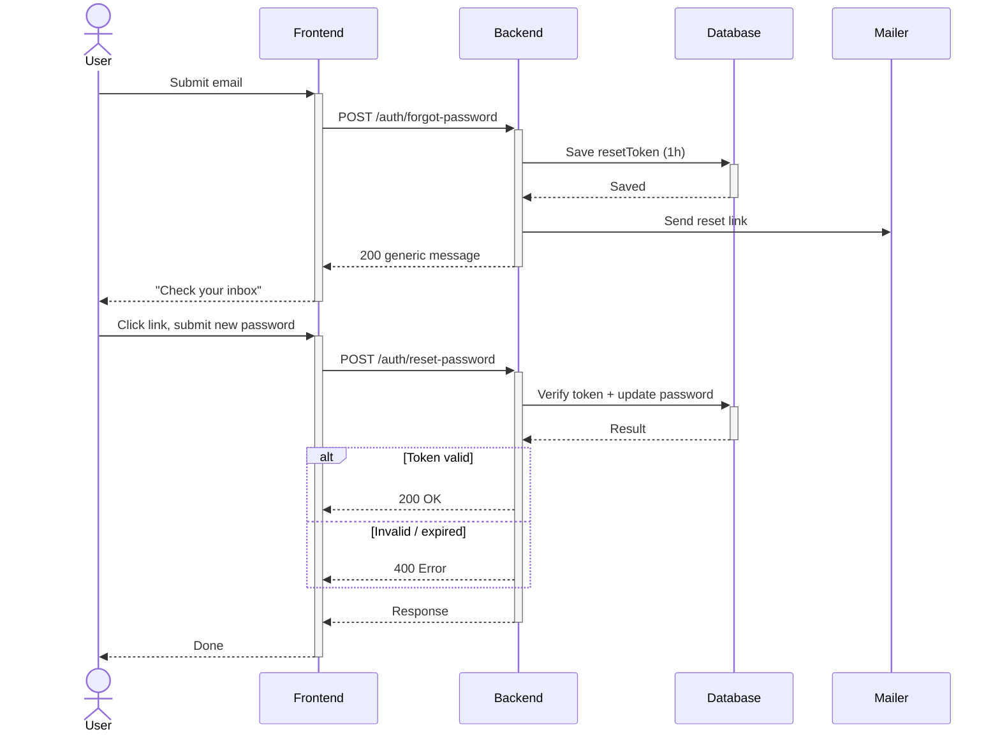

> *Figure 9.1 — Sequence diagram "Reset password".*

#### 2.4. Sequence diagram — "Delete my account"

The student confirms deletion in a modal; the backend checks the JWT, removes the user and returns 204. The frontend then clears cookies and redirects to `/auth`.

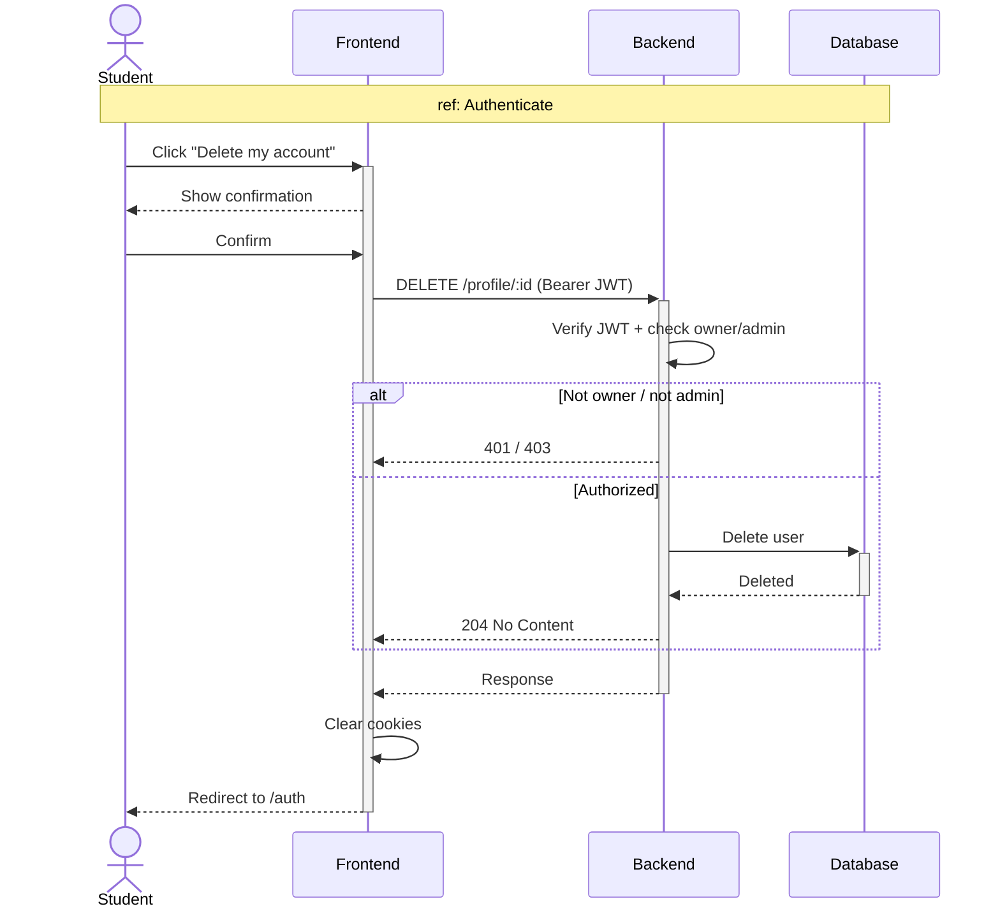

> *Figure 10 — Sequence diagram "Delete my account".*

### 3. Activity Diagrams

#### 3.1. Activity diagram — "Update profile"

The user edits their avatar, bio and social links and submits; the server validates, saves the changes and signals `Guard` to re-check that the profile is complete.

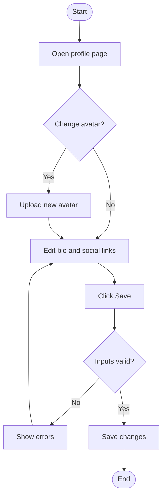

> *Figure 11 — Activity diagram "Update profile".*

#### 3.2. Activity diagram — "Reset password"

The user asks for a reset link, opens it from their inbox and sets a new password; the server checks the token is valid and not expired before updating.

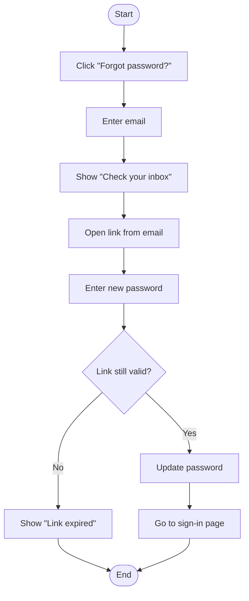

> *Figure 12 — Activity diagram "Reset password".*

### 4. Class Diagram

An abstract `User` holds the auth, profile and plan fields, with four role subclasses (Student, Teacher, Admin, InstitutionAdmin). `AuthToken` is the JWT returned by `login()` — it lives only in memory and is never saved in the database.

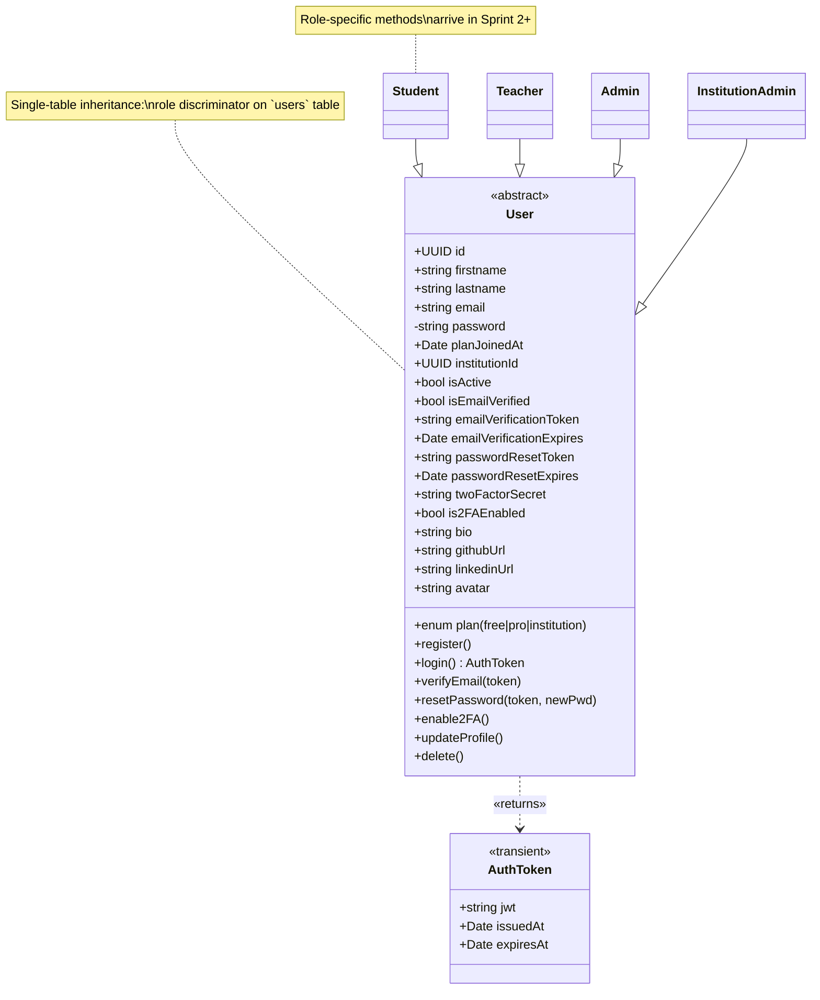

> *Figure 13 — Class diagram of Sprint 1.*

### 5. C4 Container view

A React SPA talks to a single Express API, which connects to PostgreSQL and three external services: SMTP (emails), Cloudinary (avatars) and Stripe (payments). Stripe also sends webhooks back to the API.

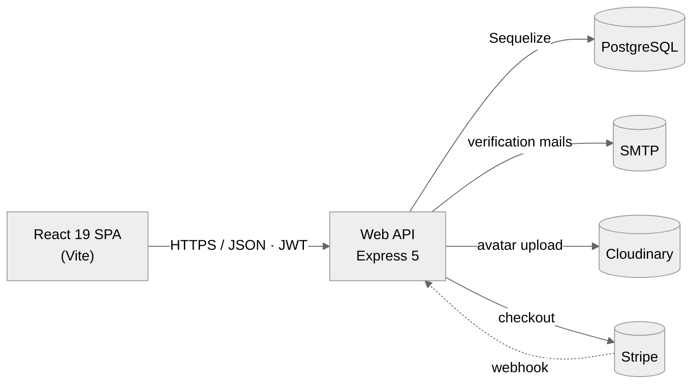

> *Figure 13.1 — Sprint 1 — C4 Container view.*

### 6. C4 Component view

The backend has three route modules (`auth`, `profile`, `stripe`), one auth middleware and the `User` model. Each endpoint uses small helpers (bcrypt, JWT, Speakeasy, Nodemailer, Cloudinary, Stripe SDK) to reach the database or external services.

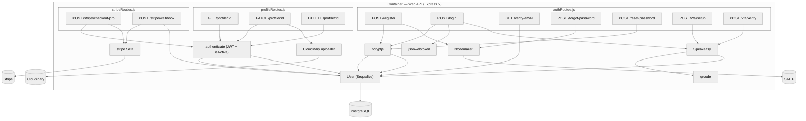

> *Figure 13.2 — Sprint 1 — C4 Component view.*

## V. Implementation

In this section we present the interfaces built during the first sprint.

### 1. Home page (`/`)

The first page a visitor sees: it presents the three plans (Free, Pro, Institution) and the main features. A button leads to `/auth` to sign up.

> *Figure 14 — Home page.*

### 2. Sign-up page

The visitor fills name, email, password and chosen plan to create an account. Inputs are checked both in the browser and on the server.

> *Figure 15 — Sign-up page.*

### 3. Sign-in page

A simple email + password form. If 2FA is on, a second step asks for the 6-digit TOTP code.

> *Figure 16 — Sign-in page.*

### 4. Email verification page

The user clicks the link received by email; the page confirms the token with the backend and then sends them to the dashboard.

> *Figure 17 — Email verification page.*

### 5. Password-reset pages

Two simple steps: first the user types their email, then they open the link from their inbox to set a new password.

> *Figure 18 — "Enter your email" page (forgot password).*
> *Figure 19 — "Set new password" page.*

### 6. Profile management page

The user can change their avatar, bio, GitHub and LinkedIn links. From here they can also turn on 2FA by scanning a QR code.

> *Figure 20 — Profile management page.*

### 7. Security tab (account protection)

The Security tab keeps all account protection settings in one place.

It has a **Change password** form. To save a new password, the user must first type their current one, so nobody can change it from a stolen session.

It also lets the user turn on **2FA** (two-factor authentication). The app shows a QR code, the user scans it with an authenticator app (like Google Authenticator), then types the 6-digit code to confirm.

To turn 2FA off, the user must enter a fresh 6-digit code again — this way, a stolen session alone is not enough to disable it.

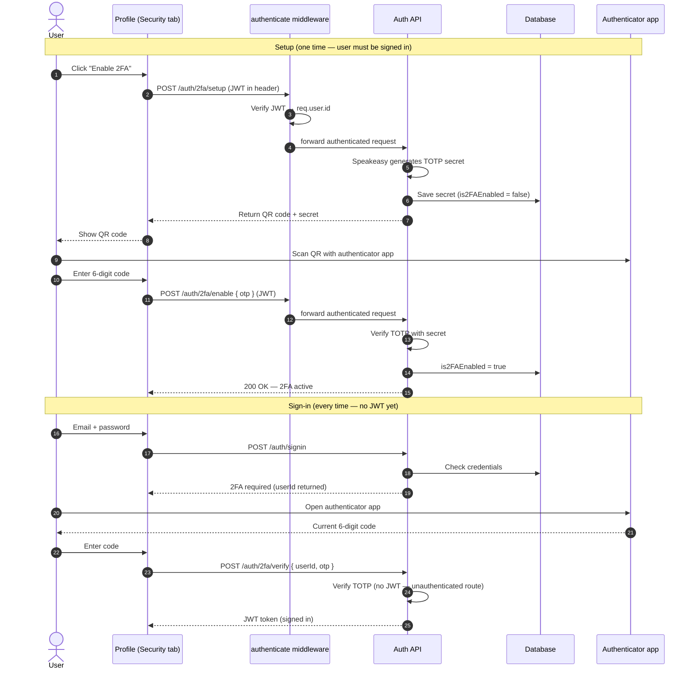

The screenshot below shows the Change password form with current / new / confirm fields.
> *Figure 20.1 — Security tab — Change password form.*

The screenshot below shows the 2FA panel with the QR code and the 6-digit verification input.
> *Figure 20.2 — Security tab — Enable 2FA (QR + TOTP).*

The screenshot below shows the 2FA setup and sign-in flow as a sequence diagram.
> *Figure 20.3 — 2FA setup and sign-in sequence (Speakeasy TOTP).*

### 8. Plan upgrade (Stripe Checkout)

A Free user clicks the Pro button, which opens Stripe Checkout in a new tab to pay. After a successful payment, a Stripe webhook updates the user's plan to `pro`.

> *Figure 21 — Pricing / plan-upgrade section.*

## VI. Conclusion

In this chapter we detailed the first sprint, which delivered the authentication, profile, password-reset, 2FA and initial plan-upgrade flows. The next chapter presents the work of Sprint 2 — roadmap personalization, problem catalogue and the code editor.

---
