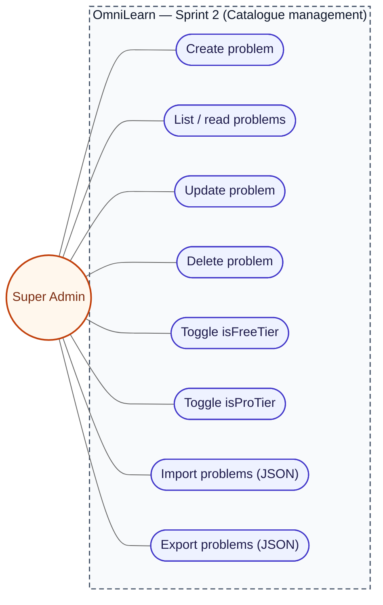
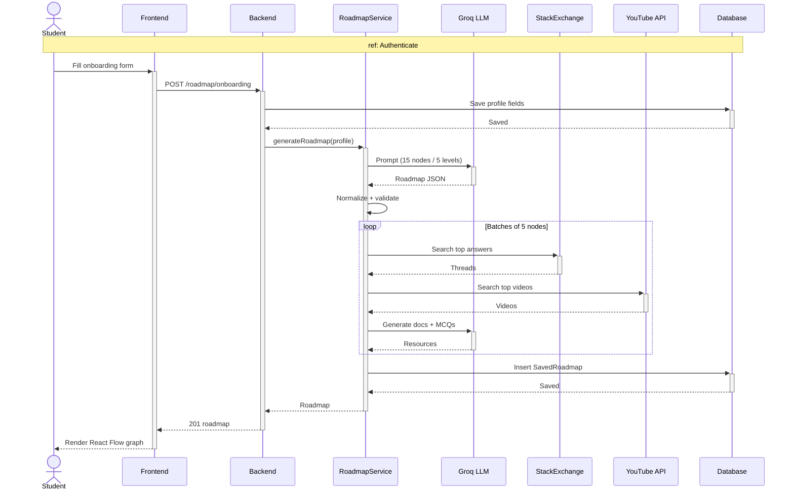
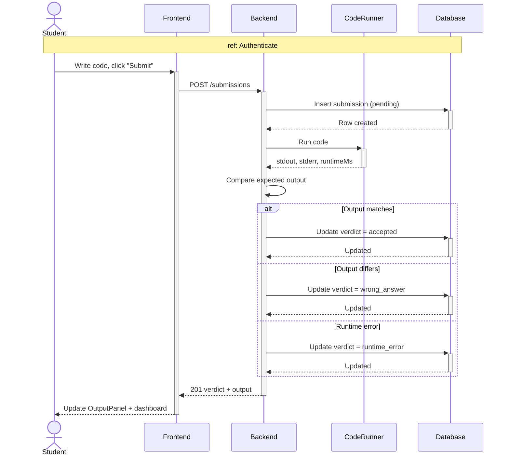
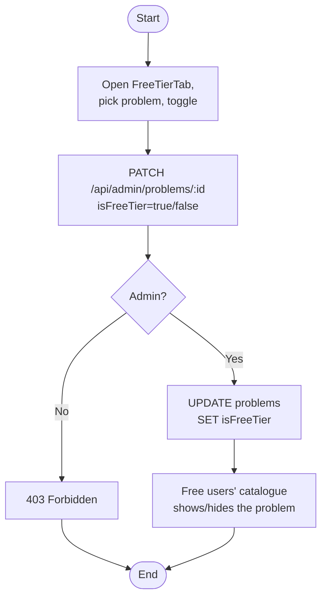
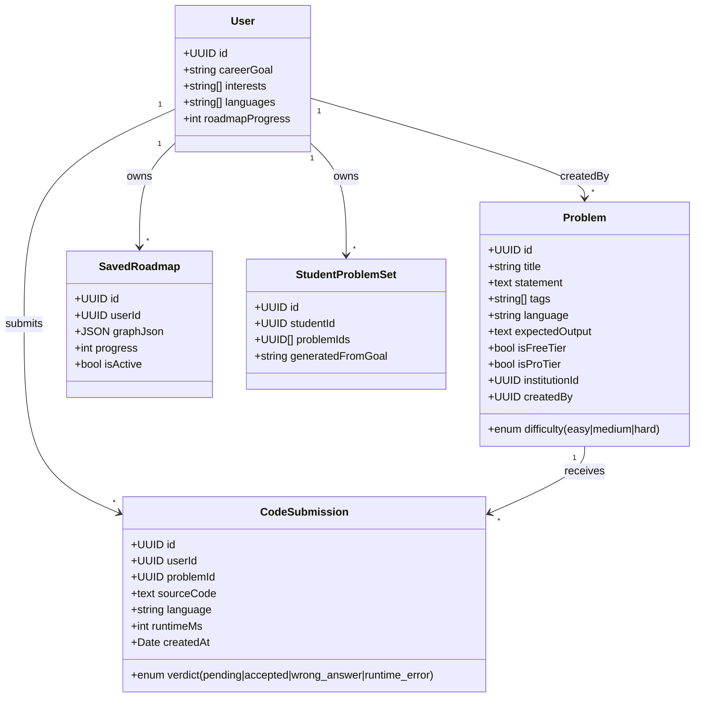
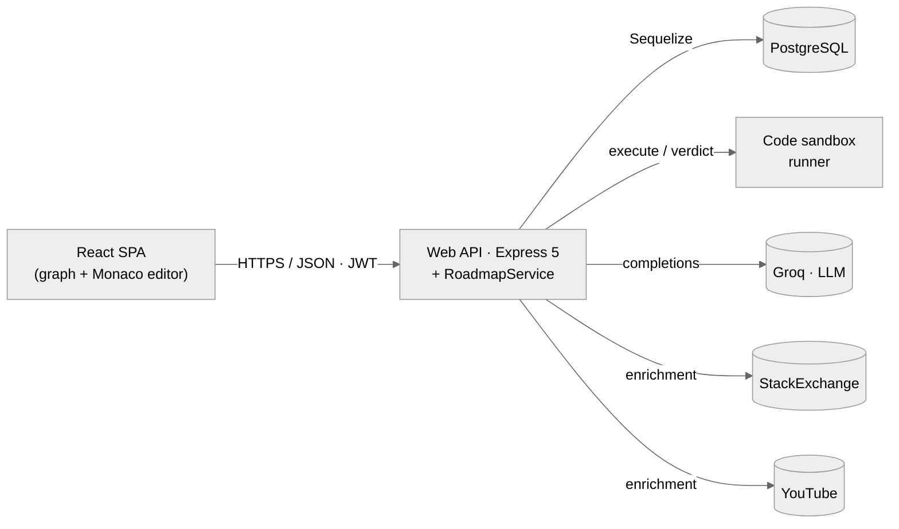
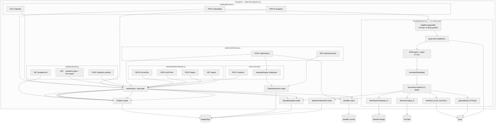

# Chapter 4 — Sprint 2

## I. Introduction

After laying the authentication and profile foundations in Sprint 1, Sprint 2 opens a new phase in OmniLearn's development. Each increment enriches the product by adding essential features while improving those already in place.

## II. Sprint Objectives

This second sprint focuses on the **core learning loop**: roadmaps, problems and code practice. By the end of the sprint, a Free or Pro user should be able to:

- Provide a **career goal**, **interests** and **programming languages**, then receive a **personalized roadmap** generated by the AI roadmap service.
- View the roadmap as a graph (powered by `@xyflow/react`), click on a node to see its details, mark progress and download a **certificate** once the roadmap is completed.
- Browse the **problem catalogue**, filtered by plan (free-tier vs pro-tier) and respecting the per-institution scoping.
- Open a problem, read its statement, and **write / run / submit** code using the in-browser **CodeMirror** editor with multi-language support.
- See their **coding dashboard** (latest submissions, success rate, problems-by-difficulty).
- For super admins: **manage the global problem catalogue** and the free/pro-tier flags.

## III. Sprint 2 Backlog

### Table 6 — Sprint 2 Backlog

| PBI | Main functionality | US Code | User story | Task ID | Tasks |
|---|---|---|---|---|---|
| **Student — Roadmap** | | | | | |
| 9 | Onboarding (career goal, interests, languages) | US9.1 | As a student, I want to fill in my career goal, interests and languages. | 9.1 | Build `OnboardingForm` in `Client/src/Roadmap/OnboardingForm.jsx`. |
| | | | | 9.2 | `POST /api/roadmap/onboarding` updates the `User` record. |
| | | US9.2 | As a student, I want my roadmap to be generated from those inputs. | 9.3 | Implement `RoadmapService.js` in `Server/src/ai/RoadmapService.js`. |
| | | | | 9.4 | Save the generated roadmap as a `SavedRoadmap` linked to the user. |
| | | US9.3 | As a student, I want to view my roadmap as a graph. | 9.5 | Build `RoadmapPage` with `@xyflow/react` and custom node types (`RoadmapNode`, `LevelLabelNode`, `InheritanceEdge`). |
| | | | | 9.6 | Open a side panel (`NodeDetailPanel`) when a node is clicked. |
| | | US9.4 | As a student, I want to track my progress. | 9.7 | `PATCH /api/roadmap/progress` updates `roadmapProgress`. |
| | | US9.5 | As a student, I want a certificate when the roadmap is complete. | 9.8 | `CertificateButton` opens the `Certificate` component with `jspdf` + `html2canvas`. |
| **Student — Problems & Code Editor** | | | | | |
| 10 | Problem catalogue | US10.1 | As a student, I want to browse the list of problems. | 10.1 | Build `ProblemsPage` with cards / filters. |
| | | | | 10.2 | `GET /api/problems` returns problems scoped by plan and institution. |
| | | US10.2 | As a student, I want to search and filter. | 10.3 | Add tags / difficulty filter on the frontend. |
| 11 | Solve a problem | US11.1 | As a student, I want to read the problem statement. | 11.1 | Build `ProblemPage` with a Markdown-rendered statement. |
| | | US11.2 | As a student, I want to write code in the editor. | 11.2 | Integrate CodeMirror with `LanguageSelector` (Java / Python / PHP / JS). |
| | | US11.3 | As a student, I want to run my code. | 11.3 | `POST /api/code/run` returns stdout / stderr / runtime. |
| | | | | 11.4 | Build `OutputPanel` to display the run result. |
| | | US11.4 | As a student, I want to submit my solution. | 11.5 | `POST /api/submissions` creates a `CodeSubmission` row. |
| | | | | 11.6 | Server compares the output to the expected one and returns the verdict. |
| 12 | Coding dashboard | US12.1 | As a student, I want to see my coding progress. | 12.1 | Build `CodingDashboard` with charts (`recharts`). |
| | | | | 12.2 | `GET /api/submissions/me` lists my submissions. |
| **Free-tier / Pro-tier enforcement** | | | | | |
| 44 | Free user — limited catalogue | US44.1 | As a Free user, I see only free-tier problems. | 44.1 | Filter problems by `isFreeTier=true` when `user.plan === "free"`. |
| | | | | 44.2 | Seed first 10 problems with `isFreeTier=true` on boot (done in `server.js`). |
| 46 | Pro user — full catalogue | US46.1 | As a Pro user, I see all pro-tier problems. | 46.1 | Filter problems by `isProTier=true` when `user.plan === "pro"`. |
| | | | | 46.2 | Seed all problems with `isProTier=true` on first boot (done in `server.js`). |
| **Super Admin — catalogue management** | | | | | |
| 30 | Manage problems | US30.1 | As a super admin, I want to CRUD problems. | 30.1 | Build `AdminDashboard` (`Client/src/Admin/AdminDashboard.jsx`). |
| | | | | 30.2 | `POST/PATCH/DELETE /api/admin/problems`. |
| | | US30.2 | As a super admin, I want to toggle Free-tier. | 30.3 | Build `FreeTierTab` (`Client/src/Admin/FreeTierTab.jsx`). |
| | | US30.3 | As a super admin, I want to toggle Pro-tier. | 30.4 | Build `ProTierTab` (`Client/src/Admin/ProTierTab.jsx`). |
| 39 | Manage problem dataset | US39.1 | As a super admin, I want to import / export problems. | 39.1 | `GET /api/admin/problems/export`. |
| | | | | 39.2 | `POST /api/admin/problems/import` with JSON file upload. |

## IV. Design

### 1. Use-Case Diagram

#### Student side

The student can: complete the roadmap onboarding, view the roadmap, click a node, track progress, download a certificate, browse problems, open a problem, run code, submit code and see the coding dashboard.


> *Figure 22 — Use-case diagram of Sprint 2 — Student side.*

#### Super admin side

The super admin can: CRUD problems, toggle Free-tier, toggle Pro-tier, and import / export the problem dataset.



> *Figure 23 — Use-case diagram of Sprint 2 — Super Admin side.*

### 2. Sequence Diagrams

#### 2.1. Sequence diagram — "Generate personalized roadmap"

The student opens the `OnboardingForm`, fills in career goal / interests / languages, and submits. The frontend calls `POST /api/roadmap/onboarding`. The backend persists the inputs on the `User` row, then invokes `RoadmapService.js` which calls the LLM (Groq / OpenAI), parses the JSON answer, validates it, and creates a `SavedRoadmap` linked to the user. The page navigates to `/roadmap` and renders the graph.



> *Figure 24 — Sequence diagram "Generate personalized roadmap".*

#### 2.2. Sequence diagram — "Submit a code solution"

The student writes code in the CodeMirror editor and clicks "Submit". The frontend calls `POST /api/submissions` with the problem id, the source code and the language. The backend creates a pending `CodeSubmission`, runs the code in a sandbox, compares the output to the expected one, updates the submission with the verdict and returns it. The frontend updates the `OutputPanel` and the `CodingDashboard`.



> *Figure 25 — Sequence diagram "Submit code".*

### 3. Activity Diagrams

#### 3.1. Activity diagram — "Toggle problem as Free-tier"

The super admin opens the `FreeTierTab`, selects a problem and toggles the switch. The frontend calls `PATCH /api/admin/problems/:id { isFreeTier: true|false }`. The backend updates the row. Free users immediately see / hide that problem in their catalogue.



> *Figure 26 — Activity diagram "Toggle problem as Free-tier".*

#### 3.2. Activity diagram — "Generate certificate"

When the student reaches 100% roadmap progress, the `CertificateButton` becomes active. The user clicks it, the `Certificate` component renders the certificate HTML, `html2canvas` snapshots it, and `jspdf` exports it as a PDF download.

```mermaid
flowchart TD
  A([Start]) --> B[Student marks last node as done]
  B --> C[PATCH /api/roadmap/progress]
  C --> D{progress == 100%?}
  D -- No --> E[Save progress] --> Z([End])
  D -- Yes --> F[Save progress, unlock certificate]
  F --> G[CertificateButton becomes active]
  G --> H[Click button]
  H --> I[Certificate.jsx renders HTML template (name, roadmap title, date)]
  I --> J[html2canvas snapshots the node]
  J --> K[jsPDF builds the PDF from the canvas]
  K --> L[Trigger browser download] --> Z
```

> *Figure 27 — Activity diagram "Generate certificate".*

### 4. Class Diagram

The Sprint-2 class diagram extends the Sprint-1 model with the entities required by the coding and roadmap features. A `Problem` entity carries the statement, difficulty, tags, target language, expected output and tier flags (`isFreeTier`, `isProTier`), and may optionally belong to an institution. Each attempt is persisted as a `CodeSubmission`, which links a user to a problem and stores the submitted source code, language, verdict and runtime. To group exercises generated for a learner, a `StudentProblemSet` holds the list of problem identifiers together with the goal that produced them, while `SavedRoadmap` stores the personalised learning graph as JSON nodes and edges along with the user's progress. On the relational side, a user can author many problems and submit many solutions (`User 1 — N Problem`, `User 1 — N CodeSubmission`), a problem aggregates all its attempts (`Problem 1 — N CodeSubmission`), and each user owns a single active roadmap (`User 1 — 1 SavedRoadmap`) and several generated problem sets (`User 1 — N StudentProblemSet`).



> *Figure 28 — Class diagram of Sprint 2.*

### 5. C4 Container view

Sprint 2 keeps the same two-tier shape but the API gains a synchronous AI orchestrator (`RoadmapService`) that talks to Groq, StackExchange and YouTube, and a sidecar **code-sandbox runner** that executes user submissions in isolation. PostgreSQL now stores roadmaps, problems and submissions on top of the Sprint 1 schema.



> *Figure 28.1 — Sprint 2 — C4 Container view.*

### 6. C4 Component view

Sprint 2 adds five route modules (`roadmapRoutes`, `problemRoutes`, `submissionRoutes`, `runRoutes`, `admin/problemsRoutes`) and the `RoadmapService` AI orchestrator. The Component view groups every public endpoint and exposes the internal building blocks of `RoadmapService.js` (prompt → LLM → repair → normalize → enrichment batcher).



> *Figure 28.2 — Sprint 2 — C4 Component view.*

## V. Implementation

### 1. Onboarding form

The roadmap onboarding form lets the student declare a career goal (e.g. "Full-stack web developer"), pick interests (frontend, backend, AI, mobile…), and select known programming languages.

> *Figure 29 — Onboarding form.*

### 2. Personalized roadmap graph

The `RoadmapPage` renders the roadmap as a React Flow graph with custom node types — level labels, regular roadmap nodes and inheritance edges. Clicking a node opens a side panel with prerequisites, resources and a "mark as done" button.

> *Figure 30 — Personalized roadmap graph view.*

### 3. Roadmap node detail panel

> *Figure 31 — Roadmap node detail panel.*

### 4. Certificate

After 100% completion, the student can download a personalized certificate as a PDF.

> *Figure 32 — Roadmap completion certificate.*

### 5. Problems page

The `ProblemsPage` lists problems with filters by difficulty and tag. The catalogue is automatically scoped to the user's plan and institution.

> *Figure 33 — Problems catalogue page.*

### 6. Problem page (statement + code editor)

The `ProblemPage` combines the statement (left) with the CodeMirror code editor (right). A language selector lets the student switch between Java, Python, PHP and JavaScript. An `OutputPanel` shows the result of each "Run" and the verdict after each "Submit".

> *Figure 34 — Problem page with code editor and output panel.*

### 7. Coding dashboard

The `CodingDashboard` aggregates the student's submissions and visualizes them as charts (success rate, problems-by-difficulty, recent submissions).

> *Figure 35 — Coding dashboard.*

### 8. Super-admin problems tabs (Free-tier / Pro-tier)

> *Figure 36 — `FreeTierTab` — toggle problems as free-tier.*
> *Figure 37 — `ProTierTab` — toggle problems as pro-tier.*

## VI. Conclusion

Sprint 2 delivered the personalized roadmap, the problem catalogue, the multi-language code editor, the coding dashboard and the super-admin catalogue management. With these features, the platform already provides a complete learning loop for individual learners on the Free and Pro plans. The next chapter — Sprint 3 — adds the multi-actor collaborative dimension: classrooms, assignments and real-time messaging.

---
