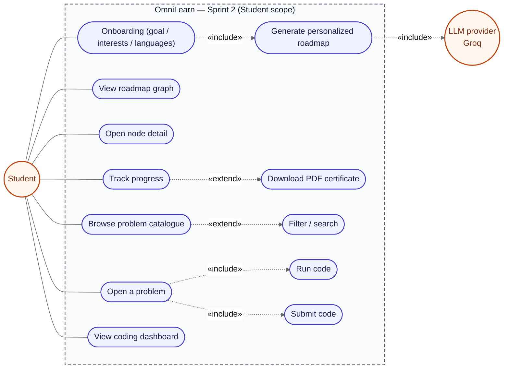
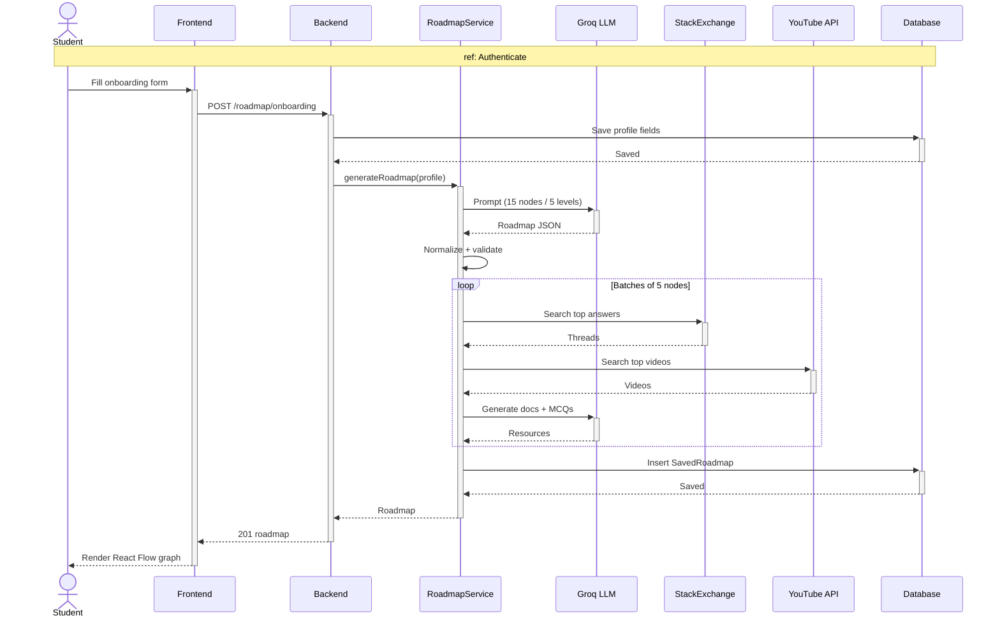
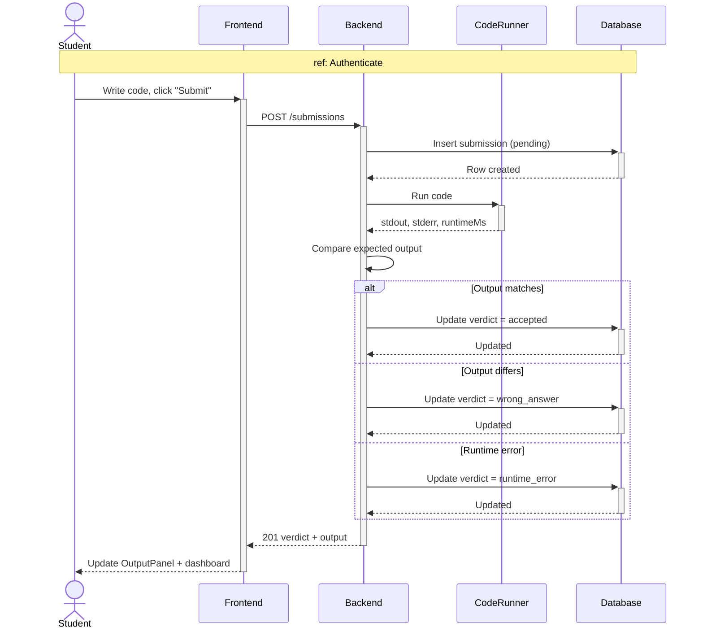
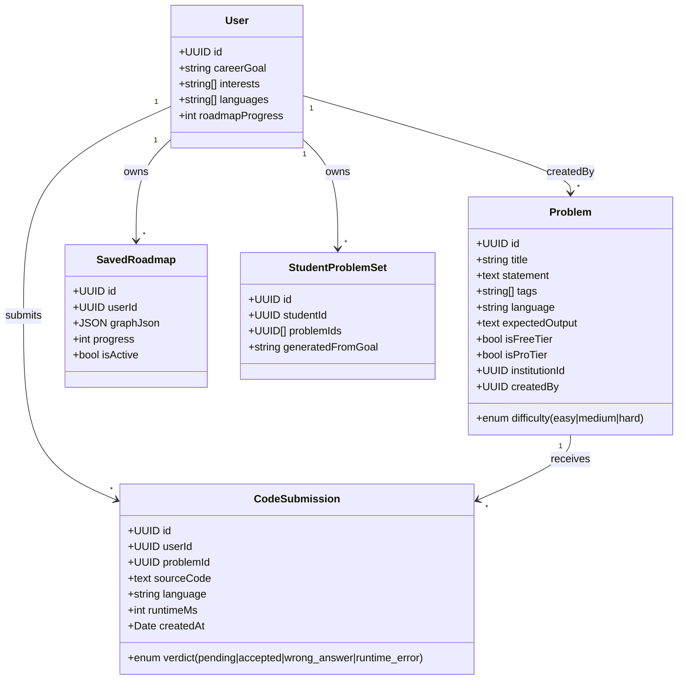
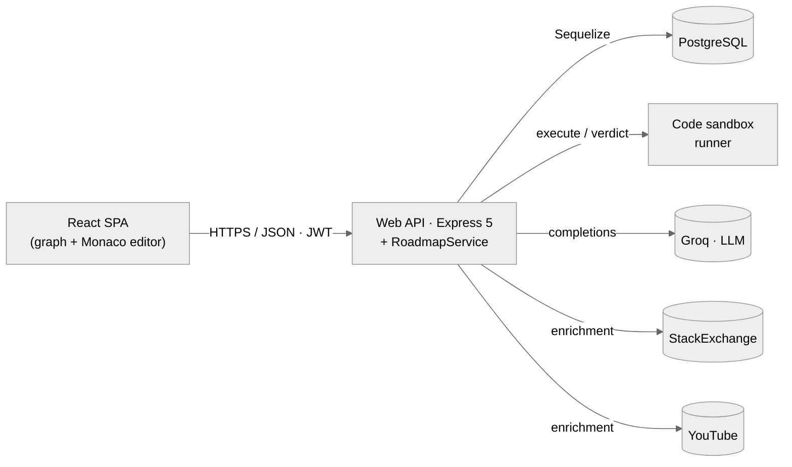
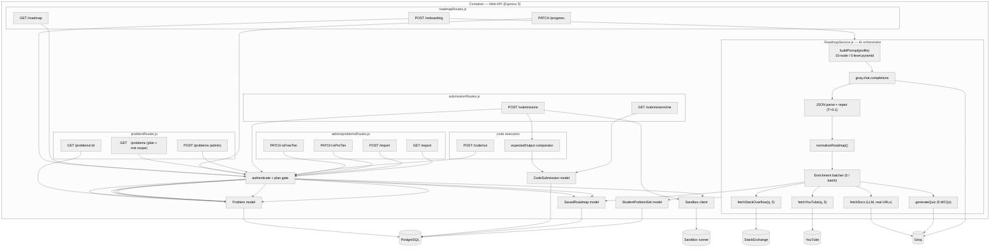

# Chapter 4 — Sprint 2

## I. Introduction

After laying the authentication and profile foundations in Sprint 1, Sprint 2 opens a new phase in OmniLearn's development. Each increment enriches the product by adding essential features while improving those already in place.

## II. Sprint Objectives

This sprint builds the **core learning loop** of OmniLearn so users can actually start learning. Students enter their goals and interests to get a personalized roadmap, then follow it as a visual graph until they earn a certificate. They can also browse problems matching their plan and solve them in the browser with a code editor that runs and grades their solutions. Super admins, on their side, manage the full problem catalogue and control which problems are free or pro.

## III. Sprint 2 Backlog

### Table 6 — Sprint 2 Backlog

| PBI | Main functionality | US Code | User story | Task ID | Tasks |
|---|---|---|---|---|---|
| **Student — Roadmap** | | | | | |
| 9 | Onboarding (career goal, interests, languages) | US9.1 | As a student, I want to fill in my career goal, interests and languages. | 9.1 | Build `OnboardingForm` in `Client/src/Roadmap/OnboardingForm.jsx`. |
| | | | | 9.2 | `POST /api/roadmap/onboarding` updates the `User` record. |
| | | US9.2 | As a student, I want my roadmap to be generated from those inputs. | 9.3 | Implement `RoadmapService.js` in `Server/src/ai/RoadmapService.js`. |
| | | | | 9.4 | Save the generated roadmap as a `SavedRoadmap` linked to the user. |
| | | US9.3 | As a student, I want to view my roadmap as a graph. | 9.5 | Build `RoadmapPage` with `@xyflow/react` and custom node types (`RoadmapNode`, `LevelLabelNode`, `InheritanceEdge`). |
| | | | | 9.6 | Open a side panel (`NodeDetailPanel`) when a node is clicked. |
| | | US9.4 | As a student, I want to track my progress. | 9.7 | `PATCH /api/roadmap/progress` updates `roadmapProgress`. |
| | | US9.5 | As a student, I want a certificate when the roadmap is complete. | 9.8 | `CertificateButton` opens the `Certificate` component with `jspdf` + `html2canvas`. |
| **Student — Problems & Code Editor** | | | | | |
| 10 | Problem catalogue | US10.1 | As a student, I want to browse the list of problems. | 10.1 | Build `ProblemsPage` with cards / filters. |
| | | | | 10.2 | `GET /api/problems` returns problems scoped by plan and institution. |
| | | US10.2 | As a student, I want to search and filter. | 10.3 | Add tags / difficulty filter on the frontend. |
| 11 | Solve a problem | US11.1 | As a student, I want to read the problem statement. | 11.1 | Build `ProblemPage` with a Markdown-rendered statement. |
| | | US11.2 | As a student, I want to write code in the editor. | 11.2 | Integrate CodeMirror with `LanguageSelector` (Java / Python / PHP / JS). |
| | | US11.3 | As a student, I want to run my code. | 11.3 | `POST /api/code/run` returns stdout / stderr / runtime. |
| | | | | 11.4 | Build `OutputPanel` to display the run result. |
| | | US11.4 | As a student, I want to submit my solution. | 11.5 | `POST /api/submissions` creates a `CodeSubmission` row. |
| | | | | 11.6 | Server compares the output to the expected one and returns the verdict. |
| 12 | Coding dashboard | US12.1 | As a student, I want to see my coding progress. | 12.1 | Build `CodingDashboard` with charts (`recharts`). |
| | | | | 12.2 | `GET /api/submissions/me` lists my submissions. |
| **Free-tier / Pro-tier enforcement** | | | | | |
| 44 | Free user — limited catalogue | US44.1 | As a Free user, I see only free-tier problems. | 44.1 | Filter problems by `isFreeTier=true` when `user.plan === "free"`. |
| | | | | 44.2 | Seed first 10 problems with `isFreeTier=true` on boot (done in `server.js`). |
| 46 | Pro user — full catalogue | US46.1 | As a Pro user, I see all pro-tier problems. | 46.1 | Filter problems by `isProTier=true` when `user.plan === "pro"`. |
| | | | | 46.2 | Seed all problems with `isProTier=true` on first boot (done in `server.js`). |
| **Super Admin — catalogue management** | | | | | |
| 30 | Manage problems | US30.1 | As a super admin, I want to CRUD problems. | 30.1 | Build `AdminDashboard` (`Client/src/Admin/AdminDashboard.jsx`). |
| | | | | 30.2 | `POST/PATCH/DELETE /api/admin/problems`. |
| | | US30.2 | As a super admin, I want to toggle Free-tier. | 30.3 | Build `FreeTierTab` (`Client/src/Admin/FreeTierTab.jsx`). |
| | | US30.3 | As a super admin, I want to toggle Pro-tier. | 30.4 | Build `ProTierTab` (`Client/src/Admin/ProTierTab.jsx`). |
| 39 | Manage problem dataset | US39.1 | As a super admin, I want to import / export problems. | 39.1 | `GET /api/admin/problems/export`. |
| | | | | 39.2 | `POST /api/admin/problems/import` with JSON file upload. |

## IV. Design

### 1. Use-Case Diagram

#### Student side

This diagram shows what a student can do in Sprint 2.
The student fills the onboarding, views the roadmap, solves problems, runs/submits code and checks the dashboard.



> *Figure 22 — Use-case diagram of Sprint 2 — Student side.*

#### Super admin side

This diagram shows what the super admin can do.
They create, edit and delete problems, switch Free/Pro tiers, and import or export the catalogue.


> *Figure 23 — Use-case diagram of Sprint 2 — Super Admin side.*

### 2. Sequence Diagrams

#### 2.1. Sequence diagram — "Generate personalized roadmap"

This diagram shows how a roadmap is built after the student submits the onboarding form.
The backend asks the AI for a roadmap, saves it, and the page displays it as a graph.



> *Figure 24 — Sequence diagram "Generate personalized roadmap".*

#### 2.2. Sequence diagram — "Submit a code solution"

This diagram shows what happens when the student submits code.
The backend runs the code, compares the output and returns a verdict shown in the output panel.



> *Figure 25 — Sequence diagram "Submit code".*

### 3. Activity Diagrams

#### 3.1. Activity diagram — "Toggle problem as Free-tier"

This diagram shows how the admin marks a problem as Free-tier.
The admin flips the switch and the problem instantly appears or disappears for Free users.


> *Figure 26 — Activity diagram "Toggle problem as Free-tier".*

#### 3.2. Activity diagram — "Generate certificate"

This diagram shows how the certificate is created when the roadmap reaches 100%.
The student clicks the button and the page is exported as a PDF.

```mermaid
flowchart TD
  A([Start]) --> B[Student marks last node as done]
  B --> C[PATCH /api/roadmap/progress]
  C --> D{progress == 100%?}
  D -- No --> E[Save progress] --> Z([End])
  D -- Yes --> F[Save progress, unlock certificate]
  F --> G[CertificateButton becomes active]
  G --> H[Click button]
  H --> I[Certificate.jsx renders HTML template (name, roadmap title, date)]
  I --> J[html2canvas snapshots the node]
  J --> K[jsPDF builds the PDF from the canvas]
  K --> L[Trigger browser download] --> Z
```

> *Figure 27 — Activity diagram "Generate certificate".*

### 4. Class Diagram

This diagram shows the main data classes added in Sprint 2.
A user has one roadmap and many problems, submissions and problem sets.



> *Figure 28 — Class diagram of Sprint 2.*

### 5. C4 Container view

This diagram shows the main containers of the app in Sprint 2.
The API now talks to an AI service and a code sandbox to run user code.



> *Figure 28.1 — Sprint 2 — C4 Container view.*

### 6. C4 Component view

This diagram shows the internal components of the backend in Sprint 2.
It groups the API routes and the AI roadmap service that builds and enriches the roadmap.



> *Figure 28.2 — Sprint 2 — C4 Component view.*

## V. Implementation

### 1. Onboarding form

This screen lets the student set a career goal and pick interests and languages.
These answers are used by the AI to build the personalized roadmap.

> *Figure 29 — Onboarding form.*

### 2. Personalized roadmap graph

This screen shows the roadmap as an interactive graph.
Each node is a topic the student needs to learn to reach their goal.

> *Figure 30 — Personalized roadmap graph view.*

### 3. Roadmap node detail panel

This panel opens when the student clicks a node on the roadmap.
It shows the topic, its resources and a button to mark it as done.

> *Figure 31 — Roadmap node detail panel.*

#### 3.1. Docs tab

Lists official documentation and articles for the topic.
The student opens them to read the reference material.

> *Figure 31.1 — Node detail panel — Docs tab.*

#### 3.2. YouTube tab

Shows curated video tutorials with thumbnail and channel.
The student watches them to learn the topic visually.

> *Figure 31.2 — Node detail panel — YouTube tab.*

#### 3.3. Stack Overflow tab

Shows top Stack Overflow questions linked to the topic.
The student opens them to see real problems and answers.

> *Figure 31.3 — Node detail panel — Stack Overflow tab.*

#### 3.4. Quiz tab

A short multiple-choice quiz to test the topic.
The student must pass it to mark the step as completed.

> *Figure 31.4 — Node detail panel — Quiz tab.*

### 4. Certificate

This is the certificate the student gets after finishing the roadmap.
It can be downloaded as a PDF with the student's name.

> *Figure 32 — Roadmap completion certificate.*

#### 4.1. Roadmaps & Certifications (Profile tab)

This profile tab gathers all the learning paths the student started and the certificates they earned.
From here the student can resume a roadmap or download a certificate again.

> *Figure 32.1 — Profile — Roadmaps & Certifications tab.*

### 5. Problems page

This page lists all coding problems available to the student.
The student can search and filter by difficulty or tag.

> *Figure 33 — Problems catalogue page.*

### 6. Problem page (statement + code editor)

This page shows the problem statement next to a code editor.
The student writes, runs and submits the code, then sees the result.

> *Figure 34 — Problem page with code editor and output panel.*

The left panel has four tabs that help the student understand and plan the solution.

#### 6.1. Description tab

Shows the problem statement, examples and the expected output.
The student reads it first to understand what the code must do.

> *Figure 34.1 — Problem page — Description tab.*

#### 6.2. Hints tab

Lists short hints the student can read when stuck.
Each hint gives one small clue without revealing the full solution.

> *Figure 34.2 — Problem page — Hints tab.*

#### 6.3. Paint tab

A free drawing area to sketch ideas, diagrams or pseudo-code.
The student uses it to plan the approach before writing the code.

> *Figure 34.3 — Problem page — Paint tab.*

#### 6.4. Roadmap tab

A visual graph of the steps to follow to solve the problem.
Clicking a node shows the step title, an example and a hint.

> *Figure 34.4 — Problem page — Roadmap tab.*

### 7. Coding dashboard

This page shows the student's coding stats with charts.
It displays the success rate, last submissions and progress by difficulty.

> *Figure 35 — Coding dashboard.*

### 8. Super-admin problems tabs (Free-tier / Pro-tier)

These two tabs let the admin choose which problems are Free or Pro.
A simple switch turns the flag on or off for each problem.

> *Figure 36 — `FreeTierTab` — toggle problems as free-tier.*
> *Figure 37 — `ProTierTab` — toggle problems as pro-tier.*

## VI. Conclusion

Sprint 2 delivered the personalized roadmap, the problem catalogue, the multi-language code editor, the coding dashboard and the super-admin catalogue management. With these features, the platform already provides a complete learning loop for individual learners on the Free and Pro plans. The next chapter — Sprint 3 — adds the multi-actor collaborative dimension: classrooms, assignments and real-time messaging.

---
