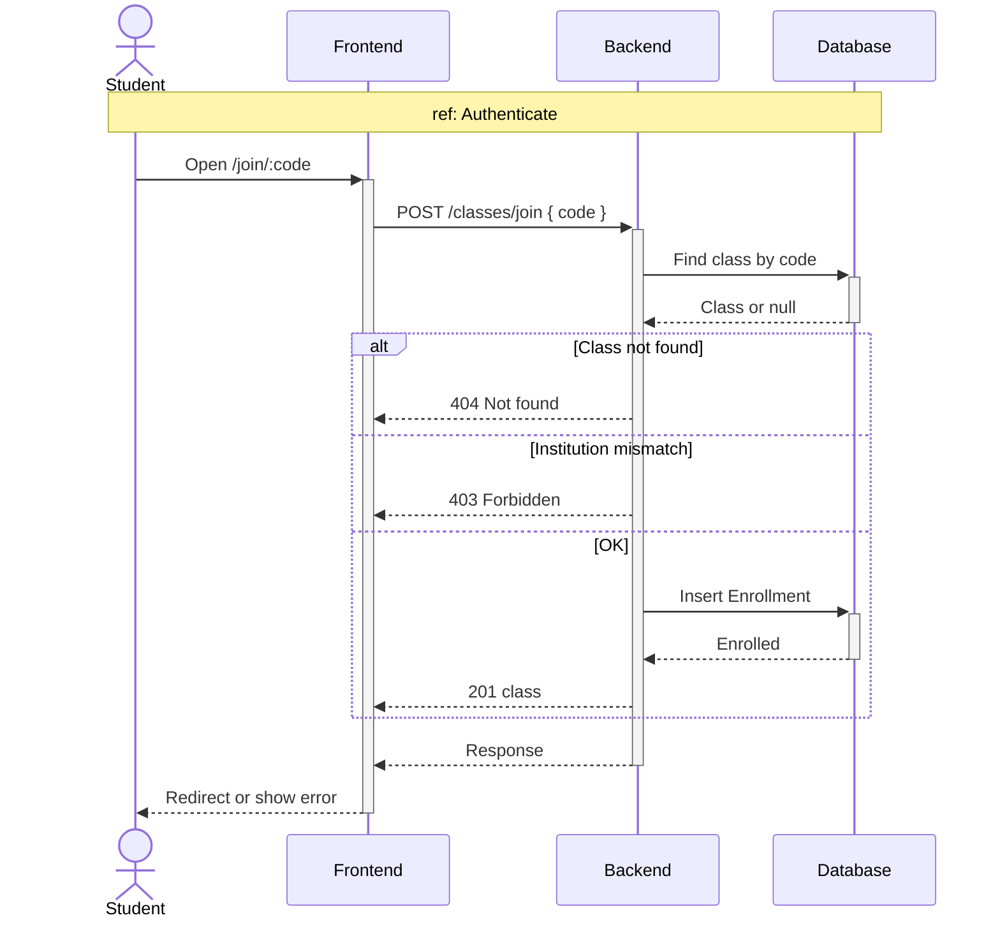
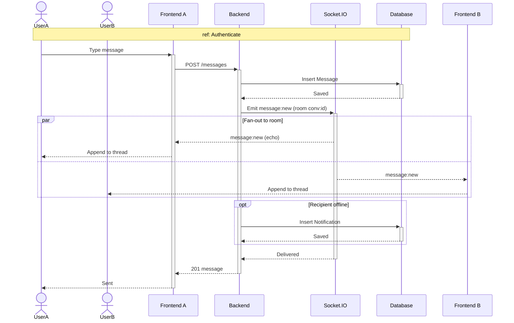
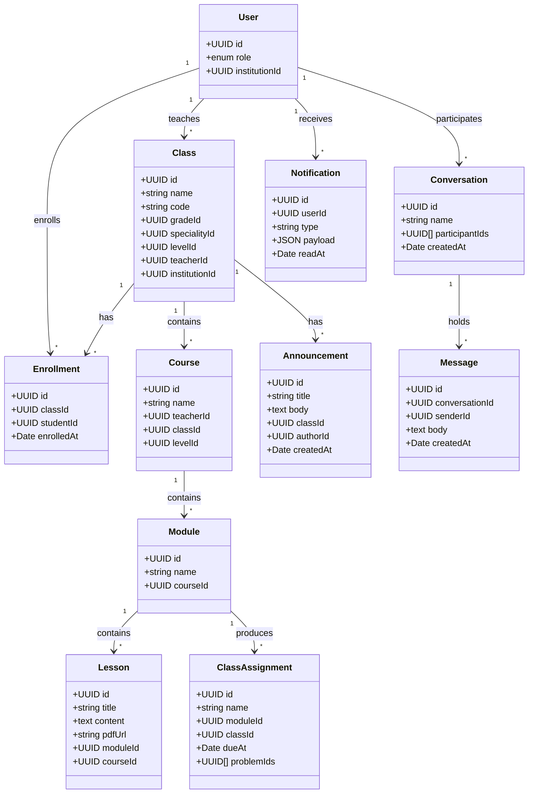
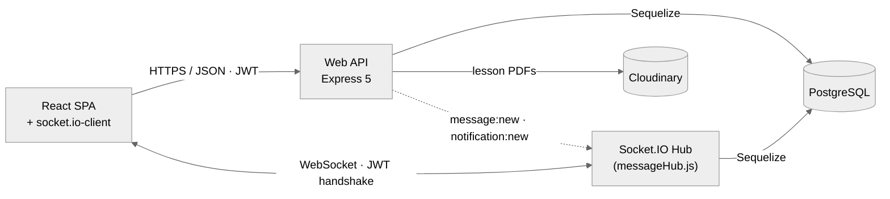

# Chapter 5 — Sprint 3

## I. Introduction

In this chapter, following the work of Sprint 2 (roadmap + code editor + problems), we present in detail all the steps needed to implement the **third increment** of OmniLearn.

## II. Sprint Objectives

Sprint 3 of OmniLearn focuses on the **collaboration layer**. Where Sprint 2 turned OmniLearn into a powerful single-user learning tool, Sprint 3 turns it into a true multi-actor platform. Key objectives:
- Build the **classroom system**: teacher creates a class linked to Grade / Speciality / Level, students join via a class code (`JoinClassroom.jsx`), and members see their classroom (`ClassroomView.jsx`).
- Add **assignments** (`ClassAssignmentsPage.jsx`) linked to modules / classes, with submission and grading flows.
- Implement the **announcements** broadcast inside a class.
- Implement the **real-time messaging system** with `Conversation`, `Message`, Socket.IO, and the `Messages.jsx` page.
- Add the **notifications** panel with `Notification.js` model and `notificationRoutes.js`.

## III. Sprint 3 Backlog

### Table 7 — Sprint 3 Backlog

| PBI | Main functionality | US Code | User story | Task ID | Tasks |
|---|---|---|---|---|---|
| **Classroom — Teacher / Institution Admin** | | | | | |
| 20 | Class management | US20.1 | As a teacher, I want to create a class. | 20.1 | Implement `Class` model in `Server/src/models/Class.js`. |
| | | | | 20.2 | `POST /api/classes` linked to a Grade / Speciality / Level. |
| | | US20.2 | As a teacher, I want a class code to invite students. | 20.3 | Generate a unique short code per class on creation. |
| | | US20.3 | As a teacher, I want to see enrolled students. | 20.4 | `GET /api/classes/:id/members` via `Enrollment` model. |
| 21 | Courses / modules / lessons | US21.1 | As a teacher, I want to create courses. | 21.1 | Implement `Course`, `Module`, `Lesson` models. |
| | | US21.2 | As a teacher, I want to create modules and lessons inside a course. | 21.2 | CRUD endpoints for `/api/courses`, `/api/modules`, `/api/lessons`. |
| **Classroom — Student** | | | | | |
| 14 | Join a classroom | US14.1 | As a student, I want to join with a code. | 14.1 | Build `JoinClassroom.jsx` at `/join/:code`. |
| | | | | 14.2 | `POST /api/classes/join` creates an `Enrollment`. |
| | | US14.2 | As a student, I want to see my classrooms. | 14.3 | Build `MyClassrooms.jsx` listing my enrollments. |
| | | US14.3 | As a student, I want to view a class's content. | 14.4 | Build `ClassroomView.jsx` showing modules, lessons, announcements, assignments. |
| **Assignments** | | | | | |
| 22 | Create assignment | US22.1 | As a teacher, I want to create an assignment linked to a module / class. | 22.1 | Implement `ClassAssignment` model. |
| | | | | 22.2 | `POST /api/assignments` creates the assignment. |
| | | US22.2 | As a teacher, I want to attach problems to an assignment. | 22.3 | Build `ModuleProblemsTab.jsx` and `ModuleAssignmentsTab.jsx`. |
| | | US22.3 | As a teacher, I want to grade submissions. | 22.4 | `Grade` model + `POST /api/grades`. |
| | | US22.4 | As a student, I want to see and submit assignments. | 22.5 | Build `ClassAssignmentsPage.jsx`. |
| **Announcements** | | | | | |
| 23 | Class announcements | US23.1 | As a teacher, I want to post an announcement to a class. | 23.1 | Implement `Announcement` model and CRUD routes. |
| | | | | 23.2 | Display announcements in `ClassroomView.jsx`. |
| **Messaging — Real-time** | | | | | |
| 16 | Conversations | US16.1 | As a user, I want to see my conversations. | 16.1 | Implement `Conversation` and `Message` models. |
| | | | | 16.2 | `GET /api/conversations` returns my conversations with last message. |
| | | US16.2 | As a user, I want to send a message in real time. | 16.3 | Build `Messages.jsx` page with thread view. |
| | | | | 16.4 | `POST /api/messages` persists the message. |
| | | | | 16.5 | Implement `Server/src/realtime/messageHub.js` (Socket.IO) for broadcast. |
| | | | | 16.6 | Use `socket.io-client` on the frontend to receive new messages live. |
| | | US16.3 | As a user, I want to be notified of new messages. | 16.7 | Push a `Notification` row + Socket.IO event when a message is received. |
| | | | | 16.8 | Build a notifications dropdown in the sidebar. |

## IV. Design

### 1. Use-Case Diagrams

#### Student side

The student can: join a classroom via code, view classrooms, see announcements, submit assignments, send messages and receive notifications.


> *Figure 38 — Use-case diagram of Sprint 3 — Student side.*

#### Teacher side

The teacher can: create a class, generate a class code, list enrolled students, create courses / modules / lessons, create assignments, attach problems to an assignment, post announcements and respond to messages.


> *Figure 39 — Use-case diagram of Sprint 3 — Teacher side.*

### 2. Sequence Diagrams

#### 2.1. Sequence diagram — "Join a classroom"

A student receives an invite code, opens `/join/:code`. The frontend calls `POST /api/classes/join`. The backend looks up the class by code, ensures the student belongs to the same institution, creates an `Enrollment`, and returns the class. The student is redirected to `MyClassrooms`.



> *Figure 40 — Sequence diagram "Join a classroom".*

#### 2.2. Sequence diagram — "Send a real-time message"

A user opens `Messages.jsx`, picks a conversation and types a message. On submit, the frontend calls `POST /api/messages`. The backend persists the `Message`, then emits a `message:new` event on the conversation's Socket.IO room. All connected clients in the room receive the message and append it to the thread; a `Notification` is created for offline recipients.



> *Figure 41 — Sequence diagram "Send a real-time message".*

### 3. Activity Diagrams

#### 3.1. Activity diagram — "Create an assignment"

```mermaid
flowchart TD
  A([Start]) --> B[Teacher opens ModuleAssignmentsTab]
  B --> C[Fill name, due date, description]
  C --> D[Select a module / class]
  D --> E{Attach problems?}
  E -- Yes --> F[Pick problems from catalogue]
  E -- No --> G
  F --> G[POST /api/assignments]
  G --> H{Authorized as teacher of the class?}
  H -- No --> I[403 Forbidden] --> Z([End])
  H -- Yes --> J[INSERT ClassAssignment]
  J --> K[Notify enrolled students (Notification + Socket.IO)]
  K --> L[Assignment appears in ClassAssignmentsPage]
  L --> Z
```

> *Figure 43 — Activity diagram "Create an assignment".*

### 4. Class Diagram

The Sprint-3 class diagram introduces the collaboration entities:

- `Class` — `id`, `name`, `code`, `gradeId`, `specialityId`, `levelId`, `teacherId`, `institutionId`.
- `Enrollment` — `id`, `classId`, `studentId`, `enrolledAt`.
- `Course` — `id`, `name`, `teacherId`, `classId`, `levelId`.
- `Module` — `id`, `name`, `courseId`.
- `Lesson` — `id`, `title`, `content`, `pdfUrl?`, `moduleId?`, `courseId?`.
- `ClassAssignment` — `id`, `name`, `moduleId`, `classId`, `dueAt`, `problemIds[]`.
- `Announcement` — `id`, `title`, `body`, `classId`, `authorId`, `createdAt`.
- `Conversation` — `id`, `name?`, `participantIds[]`, `createdAt`.
- `Message` — `id`, `conversationId`, `senderId`, `body`, `createdAt`.
- `Notification` — `id`, `userId`, `type`, `payload`, `readAt?`.



> *Figure 44 — Class diagram of Sprint 3.*

### 5. C4 Container view

Sprint 3 introduces a second long-lived process — the **Socket.IO message hub** (`messageHub.js`) — that shares the same JWT and the same PostgreSQL database as the HTTP API. The SPA opens a WebSocket alongside its REST calls; the API emits message/notification events into the hub, which routes them by conversation room. Lesson PDFs go through Cloudinary.



> *Figure 44.1 — Sprint 3 — C4 Container view.*

### 6. C4 Component view

Sprint 3 adds the **collaboration plane** (classes, courses, modules, lessons, assignments, announcements, conversations, messages, notifications) and the **real-time plane** (`messageHub.js` Socket.IO server). The Component view shows every public endpoint and the internal building blocks of the hub (handshake, rooms, presence, broadcaster, fan-out, disconnect cleanup).



```mermaid
%%{init: {"theme":"neutral"} }%%
flowchart TB
  subgraph WebAPI["Container — Web API + Realtime"]
    direction TB

    subgraph ClassC["classRoutes.js"]
      CCre["POST /classes"]
      CList["GET  /classes/mine"]
      CJoin["POST /classes/join"]
      CMem["GET  /classes/:id/members"]
    end

    subgraph CurC["course / module / lesson routes"]
      CrCRUD["CRUD /courses"]
      MoCRUD["CRUD /modules"]
      LeCRUD["CRUD /lessons"]
    end

    subgraph AssC["assignmentRoutes.js"]
      ACre["POST /assignments"]
      ASub["POST /assignments/:id/submissions"]
      AGr["POST /grades"]
    end

    subgraph AnnC["announcementRoutes.js"]
      AnCRUD["CRUD /announcements"]
    end

    subgraph ConvC["conversation + message routes"]
      CvList["GET  /conversations"]
      MsPost["POST /messages"]
    end

    subgraph NotC["notificationRoutes.js"]
      NList["GET   /notifications"]
      NRead["PATCH /notifications/:id/read"]
    end

    subgraph Hub["messageHub.js (Socket.IO)"]
      Hand["JWT handshake"]
      Rooms["Room manager — one room per conversation"]
      Pres["Presence tracker (userId → sockets)"]
      Bcast["Broadcaster — message:new"]
      Fan["Notification fan-out (offline)"]
      DC["Disconnect cleanup"]
    end

    MW["authenticate + role gate"]
    CM["Class model"]
    EM["Enrollment model"]
    CrM["Course / Module / Lesson models"]
    AM["ClassAssignment / Grade models"]
    NM["Announcement model"]
    CvM["Conversation / Message models"]
    NotM["Notification model"]
  end

  PG[(PostgreSQL)]
  CloudExt[(Cloudinary — lesson PDFs)]
  Client[/"socket.io-client (browser)"/]

  CCre  --> MW --> CM
  CList --> EM
  CJoin --> EM
  CMem  --> EM

  CrCRUD --> MW --> CrM
  MoCRUD --> MW --> CrM
  LeCRUD --> MW --> CrM
  LeCRUD --> CloudExt

  ACre --> MW --> AM
  ASub --> MW --> AM
  AGr  --> MW --> AM

  AnCRUD --> MW --> NM

  CvList --> CvM
  MsPost --> MW --> CvM
  MsPost --> Bcast

  Hand --> Rooms
  Hand --> Pres
  Bcast --> Rooms
  Bcast --> Fan --> Pres
  Fan --> NotM
  DC --> Rooms
  DC --> Pres

  Bcast -. "WS push" .-> Client
  Fan   -. "notification:new" .-> Client

  NList --> NotM
  NRead --> NotM

  CM   --> PG
  EM   --> PG
  CrM  --> PG
  AM   --> PG
  NM   --> PG
  CvM  --> PG
  NotM --> PG
```

> *Figure 44.2 — Sprint 3 — C4 Component view.*

## V. Implementation

### 1. My classrooms (student)

`MyClassrooms.jsx` is the student's entry point into the classroom system. It displays every class the student is enrolled in as a grid of cards, each showing the class name, the teacher, the linked subject, and the number of members, alongside a quick-access button to open the classroom. From this dashboard, the student can also join a new class by entering an invitation code, which routes them to the join confirmation page.

> *Figure 48 — `MyClassrooms` listing of the student's enrolled classes.*

### 2. Classroom view

`ClassroomView.jsx` centralizes every resource attached to a class inside a single interface. The content is organised into tabs — Modules, Lessons, Announcements and Assignments — so the student navigates seamlessly between course materials, teacher messages and the tasks to complete. A sidebar surfaces the enrolled members and the teacher's profile, keeping the social context one click away.

> *Figure 49 — Classroom view (modules, lessons, announcements).*

### 3. Join a classroom

The `/join/:code` route opens `JoinClassroom.jsx`, which automatically resolves the class information from the invitation code embedded in the URL. The student is shown a summary of the class (name, teacher, subject) and confirms the enrolment with a single click. On success, the class is appended to their personal list and they are redirected to the classroom view to start exploring its content.

> *Figure 50 — Join a classroom page.*

### 4. Assignments page

`ClassAssignmentsPage.jsx` lists every assignment published by the teacher for a given class. Each entry exposes the title, description, due date, attached problems and current submission status (not started, in progress, submitted, graded). The student can open an assignment to access the linked exercises and submit their work directly from the platform, with all state updates reflected back in the listing.

> *Figure 51 — Class assignments page.*

### 5. Real-time messaging (`Messages.jsx`)

`Messages.jsx` ships a modern two-pane interface inspired by mainstream messaging apps. The left pane lists conversations (teachers, classmates, group chats) with a preview of the latest message and an unread-count badge. The right pane displays the full history of the active thread, with instant delivery over Socket.IO, typing indicators and read receipts — enabling fluid communication across the entire educational community.

> *Figure 52 — Real-time messaging page.*

## VI. Conclusion

Sprint 3 transformed OmniLearn into a real collaborative platform — classrooms, assignments, announcements, real-time messaging and notifications all came online. The next chapter — Sprint 4 — focuses on the AI-grounded PDF assistant and the full Institution / Super Admin management consoles.

---
