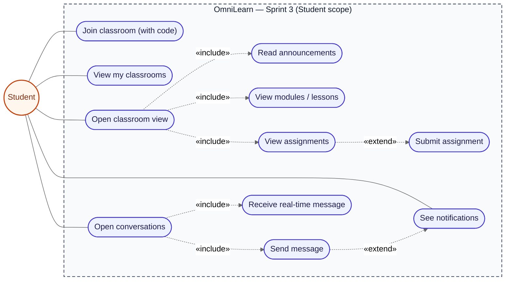
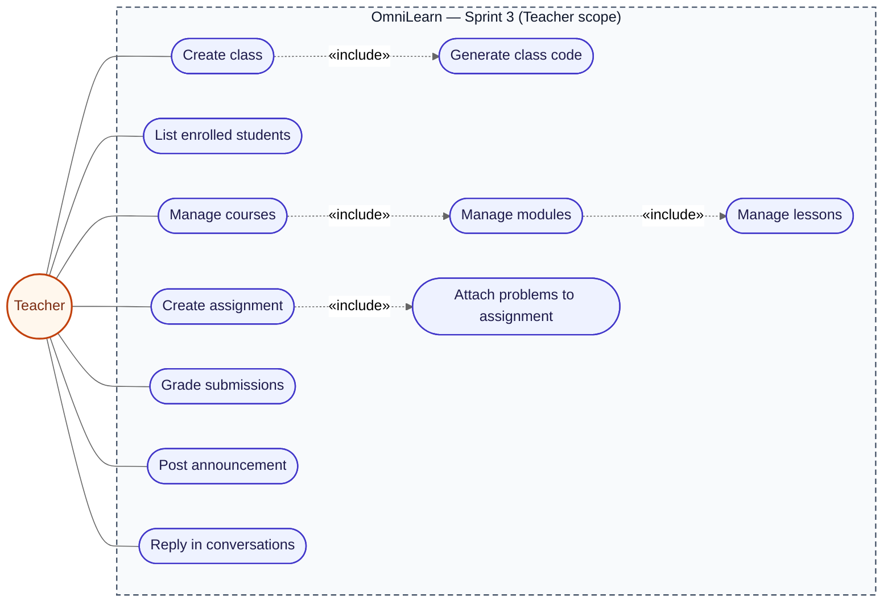
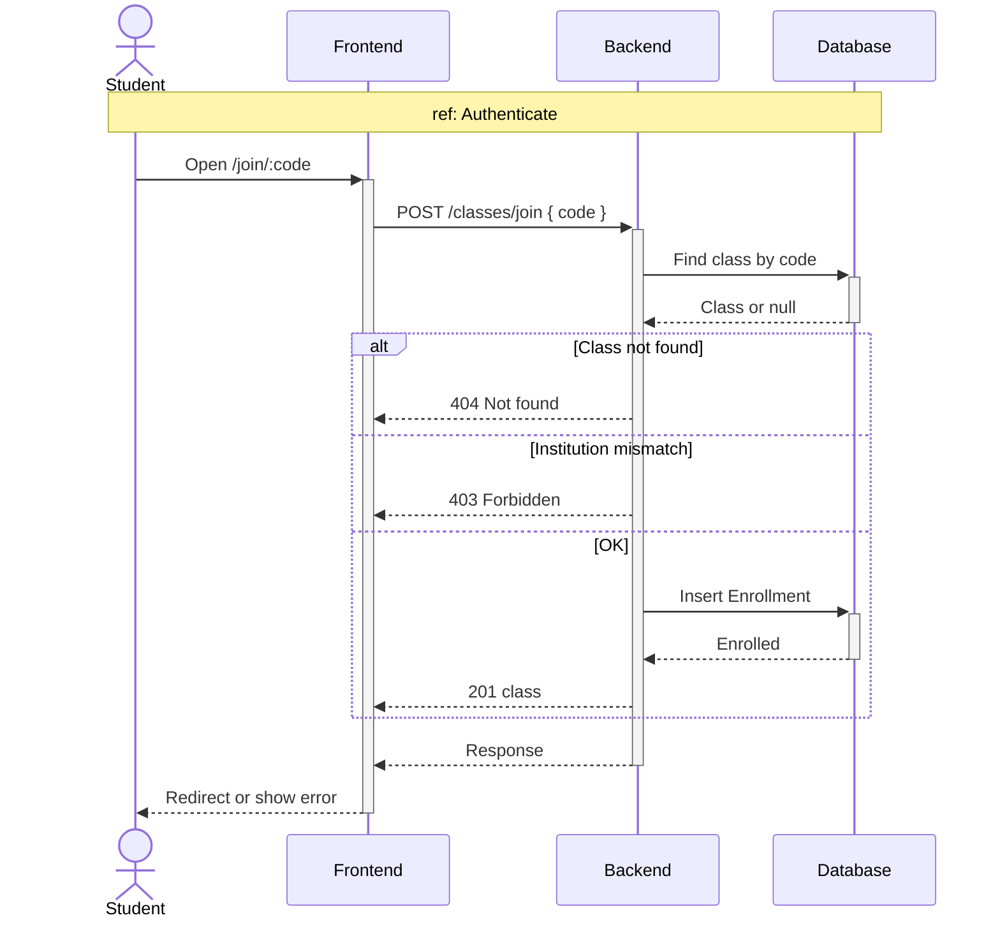
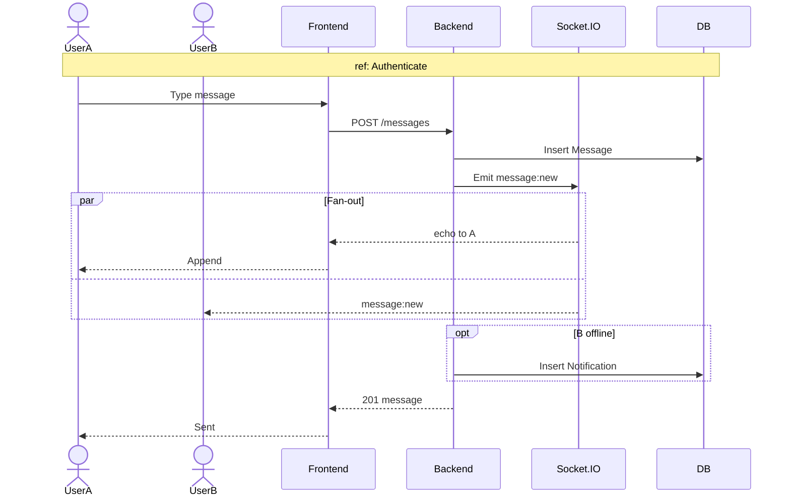
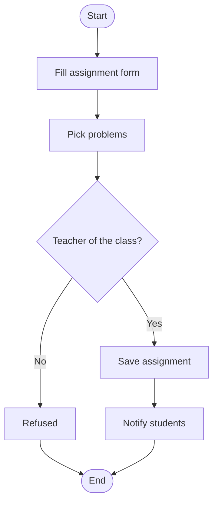
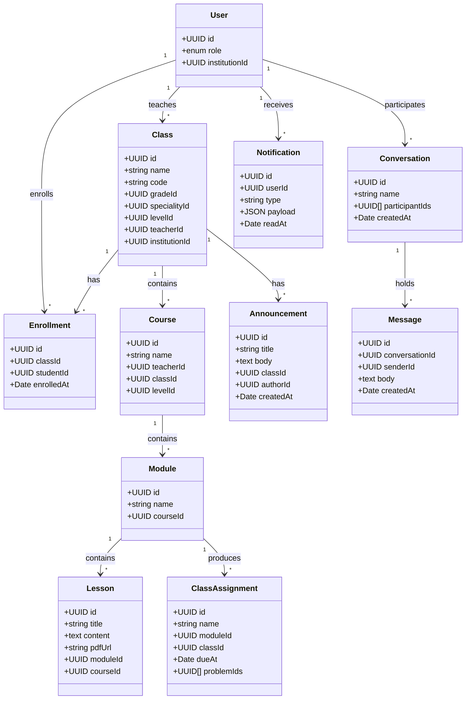
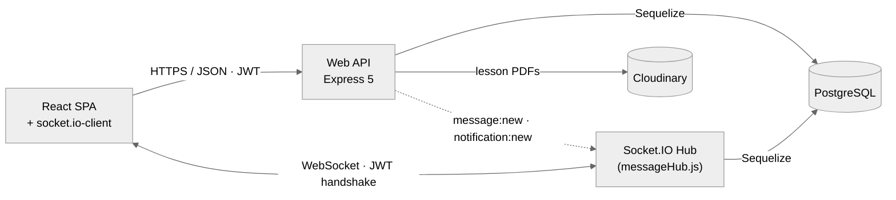

# Chapter 5 — Sprint 3

## I. Introduction

In this chapter, following the work of Sprint 2 (roadmap + code editor + problems), we present in detail all the steps needed to implement the **third increment** of OmniLearn.

## II. Sprint Objectives

Sprint 3 of OmniLearn focuses on the **collaboration layer**. Where Sprint 2 turned OmniLearn into a powerful single-user learning tool, Sprint 3 turns it into a true multi-actor platform. Key objectives:
- Build the **classroom system**: teacher creates a class linked to Grade / Speciality / Level, students join via a class code (`JoinClassroom.jsx`), and members see their classroom (`ClassroomView.jsx`).
- Add **assignments** (`ClassAssignmentsPage.jsx`) linked to modules / classes, with submission and grading flows.
- Implement the **announcements** broadcast inside a class.
- Implement the **real-time messaging system** with `Conversation`, `Message`, Socket.IO, and the `Messages.jsx` page.
- Add the **notifications** panel with `Notification.js` model and `notificationRoutes.js`.

## III. Sprint 3 Backlog

### Table 7 — Sprint 3 Backlog

| PBI | Main functionality | US Code | User story | Task ID | Tasks |
|---|---|---|---|---|---|
| **Classroom — Teacher / Institution Admin** | | | | | |
| 20 | Class management | US20.1 | As a teacher, I want to create a class. | 20.1 | Implement `Class` model in `Server/src/models/Class.js`. |
| | | | | 20.2 | `POST /api/classes` linked to a Grade / Speciality / Level. |
| | | US20.2 | As a teacher, I want a class code to invite students. | 20.3 | Generate a unique short code per class on creation. |
| | | US20.3 | As a teacher, I want to see enrolled students. | 20.4 | `GET /api/classes/:id/members` via `Enrollment` model. |
| 21 | Courses / modules / lessons | US21.1 | As a teacher, I want to create courses. | 21.1 | Implement `Course`, `Module`, `Lesson` models. |
| | | US21.2 | As a teacher, I want to create modules and lessons inside a course. | 21.2 | CRUD endpoints for `/api/courses`, `/api/modules`, `/api/lessons`. |
| **Classroom — Student** | | | | | |
| 14 | Join a classroom | US14.1 | As a student, I want to join with a code. | 14.1 | Build `JoinClassroom.jsx` at `/join/:code`. |
| | | | | 14.2 | `POST /api/classes/join` creates an `Enrollment`. |
| | | US14.2 | As a student, I want to see my classrooms. | 14.3 | Build `MyClassrooms.jsx` listing my enrollments. |
| | | US14.3 | As a student, I want to view a class's content. | 14.4 | Build `ClassroomView.jsx` showing modules, lessons, announcements, assignments. |
| **Assignments** | | | | | |
| 22 | Create assignment | US22.1 | As a teacher, I want to create an assignment linked to a module / class. | 22.1 | Implement `ClassAssignment` model. |
| | | | | 22.2 | `POST /api/assignments` creates the assignment. |
| | | US22.2 | As a teacher, I want to attach problems to an assignment. | 22.3 | Build `ModuleProblemsTab.jsx` and `ModuleAssignmentsTab.jsx`. |
| | | US22.3 | As a teacher, I want to grade submissions. | 22.4 | `Grade` model + `POST /api/grades`. |
| | | US22.4 | As a student, I want to see and submit assignments. | 22.5 | Build `ClassAssignmentsPage.jsx`. |
| **Announcements** | | | | | |
| 23 | Class announcements | US23.1 | As a teacher, I want to post an announcement to a class. | 23.1 | Implement `Announcement` model and CRUD routes. |
| | | | | 23.2 | Display announcements in `ClassroomView.jsx`. |
| **Messaging — Real-time** | | | | | |
| 16 | Conversations | US16.1 | As a user, I want to see my conversations. | 16.1 | Implement `Conversation` and `Message` models. |
| | | | | 16.2 | `GET /api/conversations` returns my conversations with last message. |
| | | US16.2 | As a user, I want to send a message in real time. | 16.3 | Build `Messages.jsx` page with thread view. |
| | | | | 16.4 | `POST /api/messages` persists the message. |
| | | | | 16.5 | Implement `Server/src/realtime/messageHub.js` (Socket.IO) for broadcast. |
| | | | | 16.6 | Use `socket.io-client` on the frontend to receive new messages live. |
| | | US16.3 | As a user, I want to be notified of new messages. | 16.7 | Push a `Notification` row + Socket.IO event when a message is received. |
| | | | | 16.8 | Build a notifications dropdown in the sidebar. |

## IV. Design

### 1. Use-Case Diagrams

#### Student side

This diagram shows what a student can do in Sprint 3.
They can join a class, read its content, send messages, and get notifications.

> *Figure 38 — Use-case diagram of Sprint 3 — Student side.*

#### Teacher side

This diagram shows what a teacher can do in Sprint 3.
They can create classes, add courses and assignments, post announcements, and reply to messages.

> *Figure 39 — Use-case diagram of Sprint 3 — Teacher side.*

### 2. Sequence Diagrams

#### 2.1. Sequence diagram — "Join a classroom"

The student opens the join link with the class code.
The server checks the code, adds the student to the class, and sends them to their classroom list.

> *Figure 40 — Sequence diagram "Join a classroom".*

#### 2.2. Sequence diagram — "Send a real-time message"

A user sends a message, and the server saves it then pushes it live to the other user.
If the other user is offline, a notification is stored for them to see later.

> *Figure 41 — Sequence diagram "Send a real-time message".*

### 3. Activity Diagrams

#### 3.1. Activity diagram — "Create an assignment"

This diagram shows the steps the teacher follows to create an assignment.
The teacher fills the form, picks problems, the server checks the rights, saves the assignment, and notifies the students.

> *Figure 43 — Activity diagram "Create an assignment".*

### 4. Class Diagram

This diagram shows the main data tables added in Sprint 3 (classes, courses, assignments, messages, notifications) and how they are linked.
It explains how a teacher, a class, and its students share content and chat together.

> *Figure 44 — Class diagram of Sprint 3.*

### 5. C4 Container view

This view shows the main parts of the app: the web frontend, the API, the real-time message hub, and the database.
The frontend talks to the API for normal requests and to the hub for live messages.

> *Figure 44.1 — Sprint 3 — C4 Container view.*

### 6. C4 Component view

This view zooms inside the API to show the routes for classes, courses, assignments, messages, and notifications.
It also shows the inside of the message hub that handles live chat and notifications.

```mermaid
%%{init: {"theme":"neutral"} }%%
flowchart TB
  subgraph WebAPI["Container — Web API + Realtime"]
    direction TB

    subgraph ClassC["classRoutes.js"]
      CCre["POST /classes"]
      CList["GET  /classes/mine"]
      CJoin["POST /classes/join"]
      CMem["GET  /classes/:id/members"]
    end

    subgraph CurC["course / module / lesson routes"]
      CrCRUD["CRUD /courses"]
      MoCRUD["CRUD /modules"]
      LeCRUD["CRUD /lessons"]
    end

    subgraph AssC["assignmentRoutes.js"]
      ACre["POST /assignments"]
      ASub["POST /assignments/:id/submissions"]
      AGr["POST /grades"]
    end

    subgraph AnnC["announcementRoutes.js"]
      AnCRUD["CRUD /announcements"]
    end

    subgraph ConvC["conversation + message routes"]
      CvList["GET  /conversations"]
      MsPost["POST /messages"]
    end

    subgraph NotC["notificationRoutes.js"]
      NList["GET   /notifications"]
      NRead["PATCH /notifications/:id/read"]
    end

    subgraph Hub["messageHub.js (Socket.IO)"]
      Hand["JWT handshake"]
      Rooms["Room manager — one room per conversation"]
      Pres["Presence tracker (userId → sockets)"]
      Bcast["Broadcaster — message:new"]
      Fan["Notification fan-out (offline)"]
      DC["Disconnect cleanup"]
    end

    MW["authenticate + role gate"]
    CM["Class model"]
    EM["Enrollment model"]
    CrM["Course / Module / Lesson models"]
    AM["ClassAssignment / Grade models"]
    NM["Announcement model"]
    CvM["Conversation / Message models"]
    NotM["Notification model"]
  end

  PG[(PostgreSQL)]
  CloudExt[(Cloudinary — lesson PDFs)]
  Client[/"socket.io-client (browser)"/]

  CCre  --> MW --> CM
  CList --> EM
  CJoin --> EM
  CMem  --> EM

  CrCRUD --> MW --> CrM
  MoCRUD --> MW --> CrM
  LeCRUD --> MW --> CrM
  LeCRUD --> CloudExt

  ACre --> MW --> AM
  ASub --> MW --> AM
  AGr  --> MW --> AM

  AnCRUD --> MW --> NM

  CvList --> CvM
  MsPost --> MW --> CvM
  MsPost --> Bcast

  Hand --> Rooms
  Hand --> Pres
  Bcast --> Rooms
  Bcast --> Fan --> Pres
  Fan --> NotM
  DC --> Rooms
  DC --> Pres

  Bcast -. "WS push" .-> Client
  Fan   -. "notification:new" .-> Client

  NList --> NotM
  NRead --> NotM

  CM   --> PG
  EM   --> PG
  CrM  --> PG
  AM   --> PG
  NM   --> PG
  CvM  --> PG
  NotM --> PG
```

> *Figure 44.2 — Sprint 3 — C4 Component view.*

## V. Implementation

### 1. My classrooms (student)

This page shows all the classes the student has joined, as a grid of cards.
The student can also join a new class here by entering an invitation code.

> *Figure 48 — `MyClassrooms` listing of the student's enrolled classes.*

### 2. Classroom view

This page gathers everything in one class: modules, lessons, announcements, and assignments, split into tabs.
A side panel shows the teacher and the other students of the class.

> *Figure 49 — Classroom view (modules, lessons, announcements).*

### 3. Join a classroom

This page shows a short summary of the class (name, teacher, subject) found from the invitation code.
The student clicks one button to join and is sent directly into the classroom.

> *Figure 50 — Join a classroom page.*

### 4. Assignments page

This page lists all the assignments given by the teacher, with the due date and the status of each one.
The student can open an assignment, do the exercises, and submit the work from the same page.

> *Figure 51 — Class assignments page.*

### 5. Create a classroom (teacher)

The teacher fills a short form to start a new class and shares it with students through an auto-generated invite link and class code.

#### 5.1. Create-classroom form

The teacher names the class and links it to a Grade, Speciality and Level.

> *Figure 50.1 — Teacher's create-classroom form.*

#### 5.2. Invite link and class code

Once saved, the system shows a shareable invite link and a short code students use to join the class.

> *Figure 50.2 — Created classroom showing the invite link and class code.*

### 6. Classroom problem bank (teacher)

This tab holds all the problems that belong only to the teacher's class.
The teacher can add problems manually or generate them with AI, and later use them in assignments.

> *Figure 51.1 — Classroom problem bank used by the teacher.*

### 7. Creating an assignment (teacher)

This form lets the teacher set a title, a due date, and pick problems from the class bank to build an assignment.
Once saved, the assignment shows up for all students, and the teacher can check their progress with a Stats button.

> *Figure 51.2 — Teacher's assignment editor with the problem picker driven by the class bank.*

### 8. Real-time messaging (`Messages.jsx`)

This page has two panels: the list of conversations on the left and the chosen chat on the right.
Messages are sent and received instantly, like in a normal messaging app.

> *Figure 53 — Real-time messaging page.*

## VI. Conclusion

Sprint 3 transformed OmniLearn into a real collaborative platform — classrooms, assignments, announcements, real-time messaging and notifications all came online. The next chapter — Sprint 4 — focuses on the AI-grounded PDF assistant and the full Institution / Super Admin management consoles.

---
