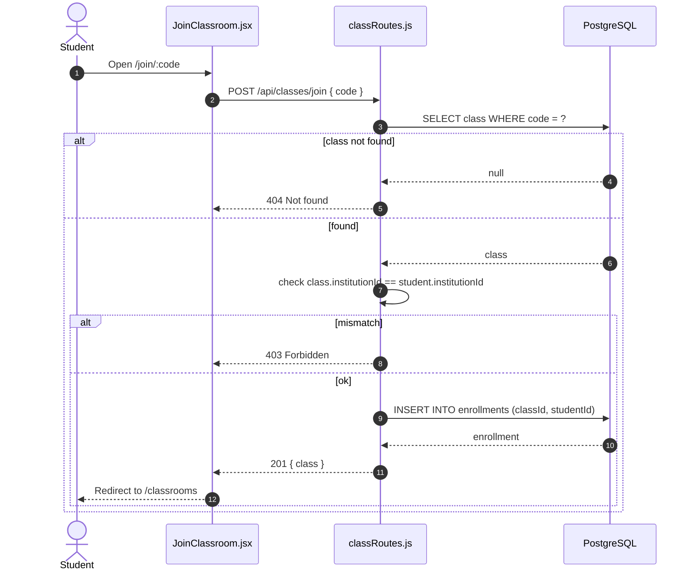
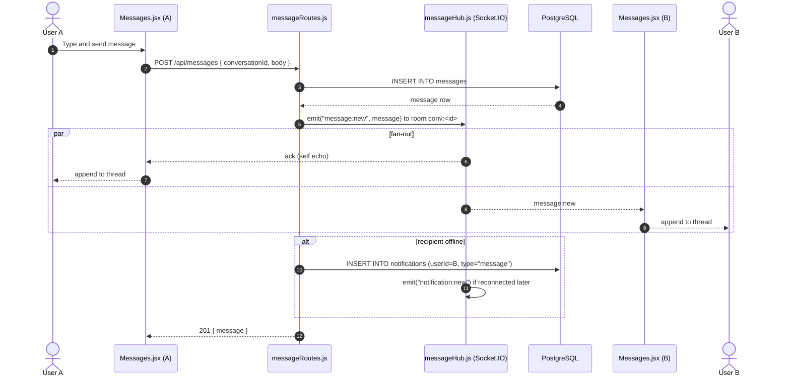
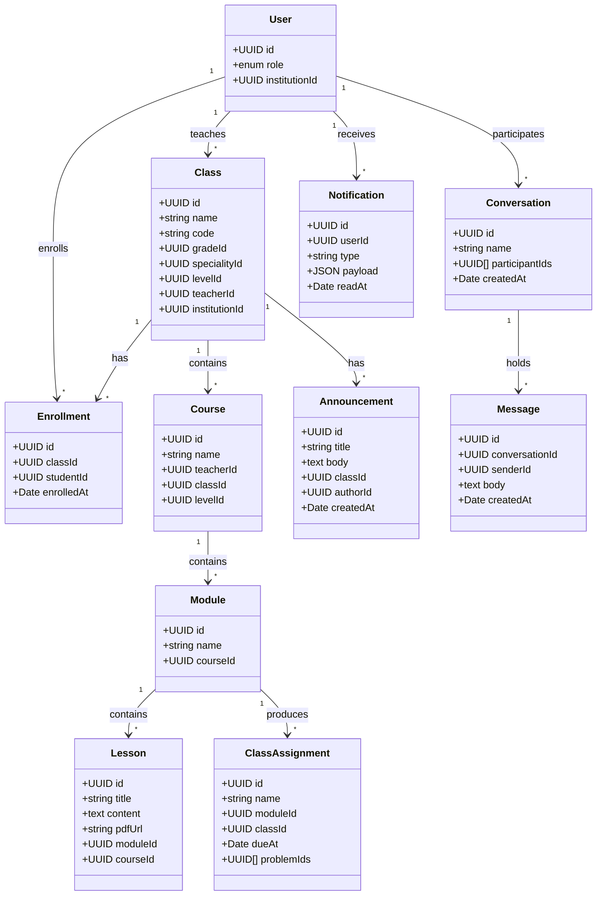
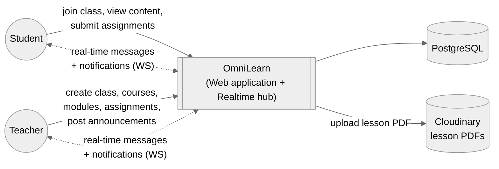
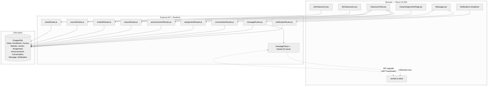
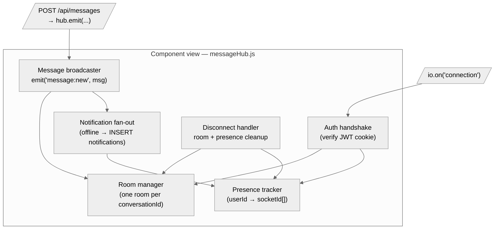

# Chapter 5 — Sprint 3

## I. Introduction

In this chapter, following the work of Sprint 2 (roadmap + code editor + problems), we present in detail all the steps needed to implement the **third increment** of OmniLearn.

## II. Sprint Objectives

Sprint 3 of OmniLearn focuses on the **collaboration layer**. Where Sprint 2 turned OmniLearn into a powerful single-user learning tool, Sprint 3 turns it into a true multi-actor platform. Key objectives:
- Build the **classroom system**: teacher creates a class linked to Grade / Speciality / Level, students join via a class code (`JoinClassroom.jsx`), and members see their classroom (`ClassroomView.jsx`).
- Add **assignments** (`ClassAssignmentsPage.jsx`) linked to modules / classes, with submission and grading flows.
- Implement the **announcements** broadcast inside a class.
- Implement the **real-time messaging system** with `Conversation`, `Message`, Socket.IO, and the `Messages.jsx` page.
- Add the **notifications** panel with `Notification.js` model and `notificationRoutes.js`.

## III. Sprint 3 Backlog

### Table 7 — Sprint 3 Backlog

| PBI | Main functionality | US Code | User story | Task ID | Tasks |
|---|---|---|---|---|---|
| **Classroom — Teacher / Institution Admin** | | | | | |
| 20 | Class management | US20.1 | As a teacher, I want to create a class. | 20.1 | Implement `Class` model in `Server/src/models/Class.js`. |
| | | | | 20.2 | `POST /api/classes` linked to a Grade / Speciality / Level. |
| | US20.2 | As a teacher, I want a class code to invite students. | 20.3 | Generate a unique short code per class on creation. |
| | US20.3 | As a teacher, I want to see enrolled students. | 20.4 | `GET /api/classes/:id/members` via `Enrollment` model. |
| 21 | Courses / modules / lessons | US21.1 | As a teacher, I want to create courses. | 21.1 | Implement `Course`, `Module`, `Lesson` models. |
| | US21.2 | As a teacher, I want to create modules and lessons inside a course. | 21.2 | CRUD endpoints for `/api/courses`, `/api/modules`, `/api/lessons`. |
| **Classroom — Student** | | | | | |
| 14 | Join a classroom | US14.1 | As a student, I want to join with a code. | 14.1 | Build `JoinClassroom.jsx` at `/join/:code`. |
| | | | | 14.2 | `POST /api/classes/join` creates an `Enrollment`. |
| | US14.2 | As a student, I want to see my classrooms. | 14.3 | Build `MyClassrooms.jsx` listing my enrollments. |
| | US14.3 | As a student, I want to view a class's content. | 14.4 | Build `ClassroomView.jsx` showing modules, lessons, announcements, assignments. |
| **Assignments** | | | | | |
| 22 | Create assignment | US22.1 | As a teacher, I want to create an assignment linked to a module / class. | 22.1 | Implement `ClassAssignment` model. |
| | | | | 22.2 | `POST /api/assignments` creates the assignment. |
| | US22.2 | As a teacher, I want to attach problems to an assignment. | 22.3 | Build `ModuleProblemsTab.jsx` and `ModuleAssignmentsTab.jsx`. |
| | US22.3 | As a teacher, I want to grade submissions. | 22.4 | `Grade` model + `POST /api/grades`. |
| | US22.4 | As a student, I want to see and submit assignments. | 22.5 | Build `ClassAssignmentsPage.jsx`. |
| **Announcements** | | | | | |
| 23 | Class announcements | US23.1 | As a teacher, I want to post an announcement to a class. | 23.1 | Implement `Announcement` model and CRUD routes. |
| | | | | 23.2 | Display announcements in `ClassroomView.jsx`. |
| **Messaging — Real-time** | | | | | |
| 16 | Conversations | US16.1 | As a user, I want to see my conversations. | 16.1 | Implement `Conversation` and `Message` models. |
| | | | | 16.2 | `GET /api/conversations` returns my conversations with last message. |
| | US16.2 | As a user, I want to send a message in real time. | 16.3 | Build `Messages.jsx` page with thread view. |
| | | | | 16.4 | `POST /api/messages` persists the message. |
| | | | | 16.5 | Implement `Server/src/realtime/messageHub.js` (Socket.IO) for broadcast. |
| | | | | 16.6 | Use `socket.io-client` on the frontend to receive new messages live. |
| | US16.3 | As a user, I want to be notified of new messages. | 16.7 | Push a `Notification` row + Socket.IO event when a message is received. |
| | | | | 16.8 | Build a notifications dropdown in the sidebar. |

## IV. Design

### 1. Use-Case Diagrams

#### Student side

The student can: join a classroom via code, view classrooms, see announcements, submit assignments, send messages and receive notifications.


> *Figure 38 — Use-case diagram of Sprint 3 — Student side.*

#### Teacher side

The teacher can: create a class, generate a class code, list enrolled students, create courses / modules / lessons, create assignments, attach problems to an assignment, post announcements and respond to messages.


> *Figure 39 — Use-case diagram of Sprint 3 — Teacher side.*

### 2. Sequence Diagrams

#### 2.1. Sequence diagram — "Join a classroom"

A student receives an invite code, opens `/join/:code`. The frontend calls `POST /api/classes/join`. The backend looks up the class by code, ensures the student belongs to the same institution, creates an `Enrollment`, and returns the class. The student is redirected to `MyClassrooms`.



> *Figure 40 — Sequence diagram "Join a classroom".*

#### 2.2. Sequence diagram — "Send a real-time message"

A user opens `Messages.jsx`, picks a conversation and types a message. On submit, the frontend calls `POST /api/messages`. The backend persists the `Message`, then emits a `message:new` event on the conversation's Socket.IO room. All connected clients in the room receive the message and append it to the thread; a `Notification` is created for offline recipients.



> *Figure 41 — Sequence diagram "Send a real-time message".*

### 3. Activity Diagrams

#### 3.1. Activity diagram — "Create an assignment"

```mermaid
flowchart TD
  A([Start]) --> B[Teacher opens ModuleAssignmentsTab]
  B --> C[Fill name, due date, description]
  C --> D[Select a module / class]
  D --> E{Attach problems?}
  E -- Yes --> F[Pick problems from catalogue]
  E -- No --> G
  F --> G[POST /api/assignments]
  G --> H{Authorized as teacher of the class?}
  H -- No --> I[403 Forbidden] --> Z([End])
  H -- Yes --> J[INSERT ClassAssignment]
  J --> K[Notify enrolled students (Notification + Socket.IO)]
  K --> L[Assignment appears in ClassAssignmentsPage]
  L --> Z
```

> *Figure 43 — Activity diagram "Create an assignment".*

### 4. Class Diagram

The Sprint-3 class diagram introduces the collaboration entities:

- `Class` — `id`, `name`, `code`, `gradeId`, `specialityId`, `levelId`, `teacherId`, `institutionId`.
- `Enrollment` — `id`, `classId`, `studentId`, `enrolledAt`.
- `Course` — `id`, `name`, `teacherId`, `classId`, `levelId`.
- `Module` — `id`, `name`, `courseId`.
- `Lesson` — `id`, `title`, `content`, `pdfUrl?`, `moduleId?`, `courseId?`.
- `ClassAssignment` — `id`, `name`, `moduleId`, `classId`, `dueAt`, `problemIds[]`.
- `Announcement` — `id`, `title`, `body`, `classId`, `authorId`, `createdAt`.
- `Conversation` — `id`, `name?`, `participantIds[]`, `createdAt`.
- `Message` — `id`, `conversationId`, `senderId`, `body`, `createdAt`.
- `Notification` — `id`, `userId`, `type`, `payload`, `readAt?`.



> *Figure 44 — Class diagram of Sprint 3.*

### 5. C4 architecture views

Sprint 3 introduces the **collaboration plane** (classrooms, courses, assignments, announcements) and the **real-time plane** (`messageHub.js` Socket.IO server). The C4 model isolates both at three levels.

#### 5.1. Level 1 — System Context



> *Figure 44.1 — Sprint 3 — C4 Level 1 (System Context).*

#### 5.2. Level 2 — Containers



> *Figure 44.2 — Sprint 3 — C4 Level 2 (Containers).*

#### 5.3. Level 3 — Components inside `messageHub.js`



> *Figure 44.3 — Sprint 3 — C4 Level 3 (Realtime hub components).*

## V. Implementation

### 1. My classrooms (student)

> *Figure 48 — `MyClassrooms` listing of the student's enrolled classes.*

### 2. Classroom view

`ClassroomView.jsx` shows modules, lessons, announcements and assignments for a class.

> *Figure 49 — Classroom view (modules, lessons, announcements).*

### 3. Join a classroom

The `/join/:code` route opens `JoinClassroom.jsx` and asks the student to confirm the join.

> *Figure 50 — Join a classroom page.*

### 4. Assignments page

The `ClassAssignmentsPage` shows the assignments of a class with their due dates, attached problems and submission status.

> *Figure 51 — Class assignments page.*

### 5. Real-time messaging (`Messages.jsx`)

A two-pane layout: conversations on the left, the active thread on the right. Messages stream in live through Socket.IO.

> *Figure 52 — Real-time messaging page.*

## VI. Conclusion

Sprint 3 transformed OmniLearn into a real collaborative platform — classrooms, assignments, announcements, real-time messaging and notifications all came online. The next chapter — Sprint 4 — focuses on the AI-grounded PDF assistant and the full Institution / Super Admin management consoles.

---
