# Chapter 6 — Sprint 4

## I. Introduction

In this chapter — after the elaboration of Sprint 3 features — we precisely expose all the phases needed to realize the **final sprint** of OmniLearn.

## II. Sprint Objectives

This final sprint completes OmniLearn by adding the **AI tutor** and the **multi-tenant administration** layer. Students get an AI mentor that guides them while coding, a PDF assistant to chat with their courses, and slash commands for quick help in the messenger. Schools can onboard as institutions and manage their members, while super admins oversee everything globally and Stripe handles payments for the Pro and Institution plans.

## III. Sprint 4 Backlog

### Table 8 — Sprint 4 Backlog

| PBI | Main functionality | US Code | User story | Task ID | Tasks |
|---|---|---|---|---|---|
| **PDF Assistant — RAG** | | | | | |
| 15 | Upload & ingest a PDF | US15.1 | As a student, I want to upload a course PDF. | 15.1 | Build `PdfAssistant.jsx` with drag-and-drop. |
| | | | | 15.2 | `POST /api/pdf/upload` stores the file (Multer + Cloudinary). |
| | | | | 15.3 | Server extracts text (`pdf-parse`) and splits into 800-word chunks (`chunkText()`). |
| | | | | 15.4 | Embeddings (`sentence-transformers/all-MiniLM-L6-v2` via HuggingFace) indexed in Chroma DB — implemented inline in `Server/src/routes/pdfRoutes.js`. |
| | | US15.2 | As a student, I want to chat with the AI grounded in that PDF. | 15.5 | `POST /api/pdf/chat` runs `similaritySearch(q, 3)` + Groq completion. Falls back to keyword scoring if Chroma is unreachable. |
| | | | | 15.6 | Additional endpoints: `/explain`, `/summarize`, `/quiz` (10 / 20 MCQs), `/smart-search`, `/highlights`, `/bookmarks`. |
| **AI Mentor** | | | | | |
| — | Cross-feature AI tutor | — | As a student, I want an AI mentor that knows my roadmap and submissions. | M.1 | Build `AIMentor.jsx`. |
| | | | | M.2 | `POST /api/ai/mentor` injects user context into the LLM prompt. |
| | | | | M.3 | Provide guidance without final answers + AI-assisted code correction. |
| **Learning tags** | | | | | |
| — | Curated learning tags | — | As a student, I want `/ai`, `/stack-overflow`, `/youtube` tags to learn faster. | T.1 | Add tag shortcuts and a filterable tag list. |
| **Institution Onboarding** | | | | | |
| 24 | Onboard an institution | US24.1 | As a new Institution buyer, I want to onboard my institution. | 24.1 | Build `OnboardInstitution.jsx`. |
| | | | | 24.2 | `POST /api/plan/institution` creates `Institution` + assigns the user as `institution_admin`. |
| | | | | 24.3 | Update `Guard` in `App.jsx` to redirect to onboarding if `plan==='institution' && !institutionId`. |
| **Invite Links** | | | | | |
| 25 | Generate invite links | US25.1 | As an institution admin, I want to generate invite links. | 25.1 | Implement `InviteLink` model with `role`, `expiresAt`, `maxUses`. |
| | | | | 25.2 | `POST /api/plan/invite-links`. |
| | | US25.2 | As an institution admin, I want to revoke a link. | 25.3 | `DELETE /api/plan/invite-links/:id`. |
| 26 | Join via invite link | US26.1 | As a visitor, I want to join via the invite link. | 26.1 | Build `JoinInstitution.jsx` at `/join-institution/:token`. |
| | | | | 26.2 | `POST /api/plan/join-institution` validates the token, links the user to the institution and sets the role. |
| **Institution Curriculum** | | | | | |
| 27 | Per-institution curriculum | US27.1 | As an institution admin, I want to manage Grades / Specialities / Levels for my institution. | 27.1 | CRUD endpoints in `institutionCurriculumRoutes.js`. |
| | | | | 27.2 | Build `InstitutionTab.jsx` and its forms. |
| **Institution Member Directory** | | | | | |
| 35 | List members | US35.1 | As an institution admin, I want to see all members of my institution. | 35.1 | `GET /api/admin/institution/members` filters by `institutionId`. |
| | | | | 35.2 | Display the directory in `InstitutionTab.jsx`. |
| **Super Admin** | | | | | |
| 28 | Super Admin sign-in | US28.1 | As a super admin, I want to access the super admin dashboard. | 28.1 | Add a guard for `role === "admin"` on `/education`. |
| 29 | Manage institutions | US29.1 | As a super admin, I want to list / suspend institutions. | 29.1 | `GET /api/admin/institutions` and suspend / delete actions. |
| 31 | Ban / unban users | US31.1 | As a super admin, I want to ban or unban users. | 31.1 | `PATCH /api/admin/users/:id { isActive }`. |
| 32 | Statistics | US32.1 | As a super admin, I want global statistics. | 32.1 | Build `UsersByPlanOverview.jsx` and `UsersByPlanTab.jsx` (charts with `@ant-design/plots`). |
| **Plans (Stripe)** | | | | | |
| 33 | Stripe checkout — Pro / Institution | US33.1 | As a Free user, I want to upgrade to Pro. | 33.1 | `POST /api/stripe/checkout-pro`. |
| | | US33.2 | As an organization, I want to upgrade to Institution. | 33.2 | `POST /api/stripe/checkout-institution`. |
| | | | | 33.3 | Stripe webhook updates `users.plan` and triggers institution onboarding. |
| **Notifications** | | | | | |
| 22 | In-app notifications | US22.1 | As a user, I want notifications for messages, assignments and grades. | 22.1 | `Notification` model + `notificationRoutes.js`. |
| | | | | 22.2 | Real-time push via Socket.IO. |

## IV. Design

### 1. Use-Case Diagrams

#### Super Admin side

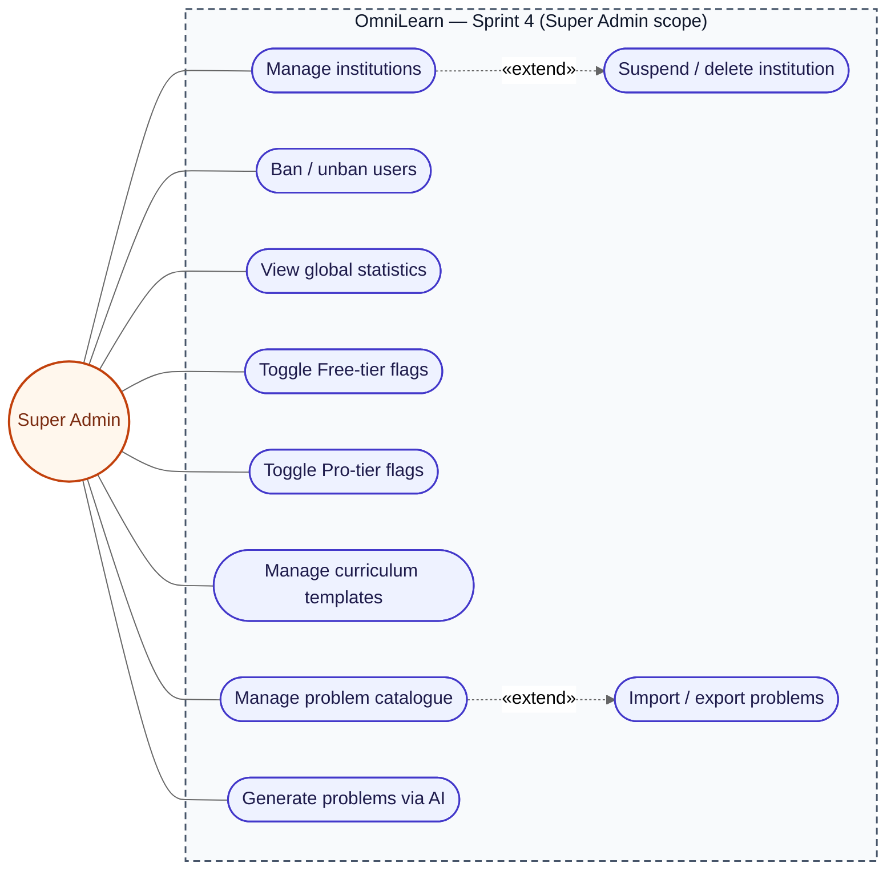

This diagram shows everything the super admin can do on the platform.
They manage institutions, users, plans, the problem catalogue, and view global statistics.

> *Figure 53 — Use-case diagram of Sprint 4 — Super Admin side.*

#### Institution Admin side

This diagram covers everything an Institution Admin actually does in Sprint 4 —
from buying the plan and onboarding the school (`planRoutes.js`
`/upgrade/institution`, `/institutions/self-create`), to running the day-to-day
command center exposed by `InstitutionTab.jsx` (Overview, Classrooms,
Teachers, Students, Invites, Announcements, Analytics, Curriculum, Problem
Bank, Settings). Every endpoint in `planRoutes.js` and
`institutionCurriculumRoutes.js` is mapped to a use case so the surface matches
the real implementation. To keep the diagram compact, relations are limited to
direct associations and `«include»` only — no `«extend»`.

```mermaid
%%{init: {"theme":"neutral"} }%%
flowchart LR
  classDef actor    fill:#fff7ed,stroke:#c2410c,stroke-width:2px,color:#7c2d12
  classDef sysactor fill:#ecfeff,stroke:#0891b2,stroke-width:2px,color:#083344
  classDef uc       fill:#eef2ff,stroke:#4338ca,stroke-width:1.5px,color:#1e1b4b
  classDef sys      fill:#f8fafc,stroke:#475569,stroke-width:1.5px,stroke-dasharray:6 4,color:#0f172a

  IA((Institution<br/>Admin)):::actor
  Member((Member<br/>Teacher / Student)):::actor
  Stripe((Stripe)):::sysactor
  Groq((Groq LLM)):::sysactor

  subgraph T["OmniLearn — Sprint 4 — Institution Admin scope"]
    direction TB

    %% ── Institution lifecycle ──────────────────────────────────
    subgraph TInst["Institution lifecycle"]
      direction TB
      PayPlan(["Pay Institution plan"]):::uc
      Onb(["Onboard institution<br/>(name / logo / type /<br/>contact / seat limit)"]):::uc
      EditProf(["Edit institution profile"]):::uc
    end

    %% ── Members ────────────────────────────────────────────────
    subgraph TMem["Member directory"]
      direction TB
      Dir(["Browse members<br/>(teachers / students)"]):::uc
      Rem(["Remove a member<br/>(downgrade to Free)"]):::uc
    end

    %% ── Invitations ────────────────────────────────────────────
    subgraph TInv["Invitations"]
      direction TB
      Search(["Search invitable users"]):::uc
      InvEmail(["Invite user by email"]):::uc
      Links(["Generate / list / revoke<br/>invite links"]):::uc
      NotifyOne(["Notify invited user"]):::uc
    end

    %% ── Curriculum ─────────────────────────────────────────────
    subgraph TCur["Curriculum"]
      direction TB
      Cur(["Manage Grades /<br/>Specialities / Levels"]):::uc
      Seed(["Seed default curriculum"]):::uc
    end

    %% ── Classrooms audit ───────────────────────────────────────
    subgraph TCls["Classrooms (read-only audit)"]
      direction TB
      AuditList(["List & filter classrooms"]):::uc
      Roster(["View classroom roster"]):::uc
      ArchCls(["Archive / reactivate<br/>classroom"]):::uc
    end

    %% ── Announcements ──────────────────────────────────────────
    subgraph TAnn["Institution announcements"]
      direction TB
      PostAnn(["Post announcement<br/>(targeted: all /<br/>teachers / students)"]):::uc
      PinAnn(["Pin / delete<br/>announcement"]):::uc
      NotifyAll(["Notify members"]):::uc
    end

    %% ── Problem bank ───────────────────────────────────────────
    Bank(["Manage institution<br/>problem bank<br/>(manual / AI / fork / delete)"]):::uc

    %% ── Insights ──────────────────────────────────────────────
    subgraph TStat["Insights"]
      direction TB
      Overview(["View overview & seat usage"]):::uc
      Analytics(["View analytics<br/>(completion rate /<br/>heatmap / teacher activity)"]):::uc
    end
  end
  class T sys

  %% ── IA direct associations ─────────────────────────
  IA --- PayPlan
  IA --- Onb
  IA --- EditProf
  IA --- Dir
  IA --- Rem
  IA --- InvEmail
  IA --- Links
  IA --- Cur
  IA --- Seed
  IA --- AuditList
  IA --- Roster
  IA --- ArchCls
  IA --- PostAnn
  IA --- PinAnn
  IA --- Bank
  IA --- Overview
  IA --- Analytics

  %% ── Secondary system actors ────────────────────────
  Stripe --- PayPlan
  Groq   --- Bank
  Member --- NotifyOne
  Member --- NotifyAll

  %% ── «include» relations ────────────────────────────
  InvEmail -. "«include»" .-> Search
  InvEmail -. "«include»" .-> NotifyOne
  PostAnn  -. "«include»" .-> NotifyAll
```

> *Figure 54 — Use-case diagram of Sprint 4 — Institution Admin side.*

#### Student side

This diagram is organised around the seven Sprint 4 student features — PDF
assistant chat, PDF library, personal workspace, AI tutor, personalised
roadmap, plan & institution lifecycle, and notifications. Each rectangle
holds **one or two main entities** the student directly triggers, and each
entity is enriched with exactly **two optional behaviors** drawn as
`«extend»` arrows (extension → base, per UML 2.5). The secondary actors
`Groq LLM`, `Stripe` and the `Realtime Hub` (Socket.IO) attach to the main
entities they collaborate with, since extensions inherit the actor
associations of their base. Teachers share the same AI surface — only the
`Student` actor is drawn to keep the diagram compact.

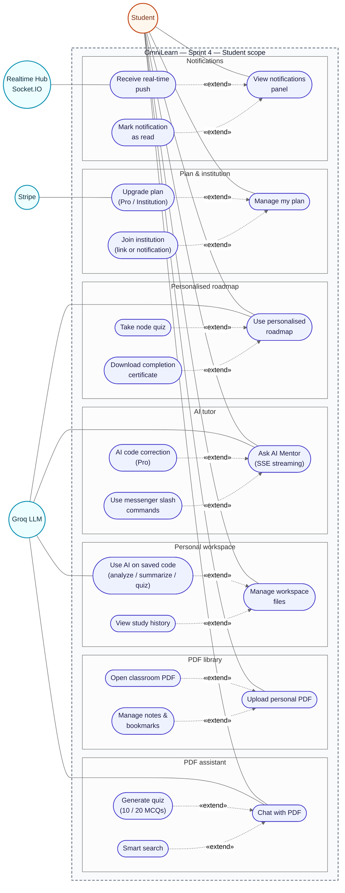

> *Figure 55 — Use-case diagram of Sprint 4 — Student side.*

### 2. Sequence Diagrams

#### 2.1. PDF Assistant Question Handling Workflow

The student uploads a PDF and asks a question.
The system finds the most relevant parts of the PDF and uses the AI model to answer based on them.

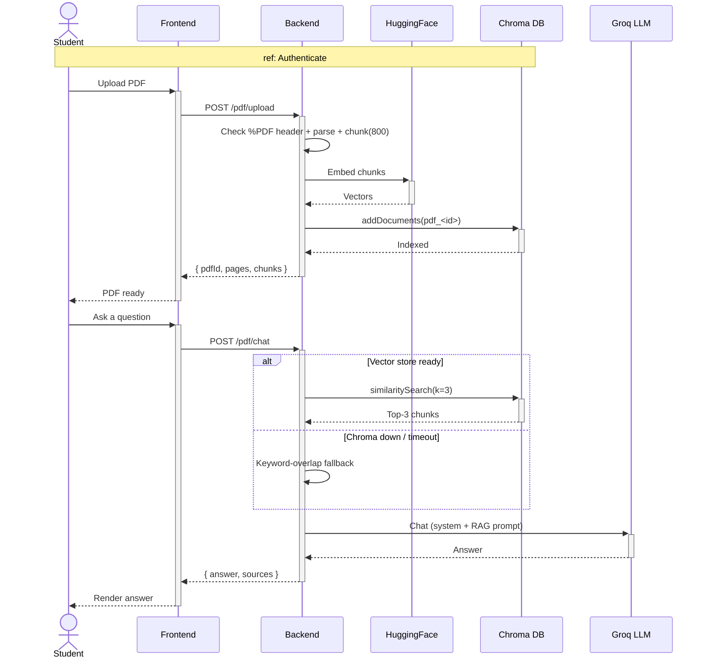

> *Figure 56. Sequence diagram of the PDF assistant question handling workflow.*

#### 2.2. AI Mentor Socratic Streaming Interaction

The student asks a question and the AI Mentor streams an answer word by word.
The mentor gives hints instead of full solutions and always ends with a guiding question.

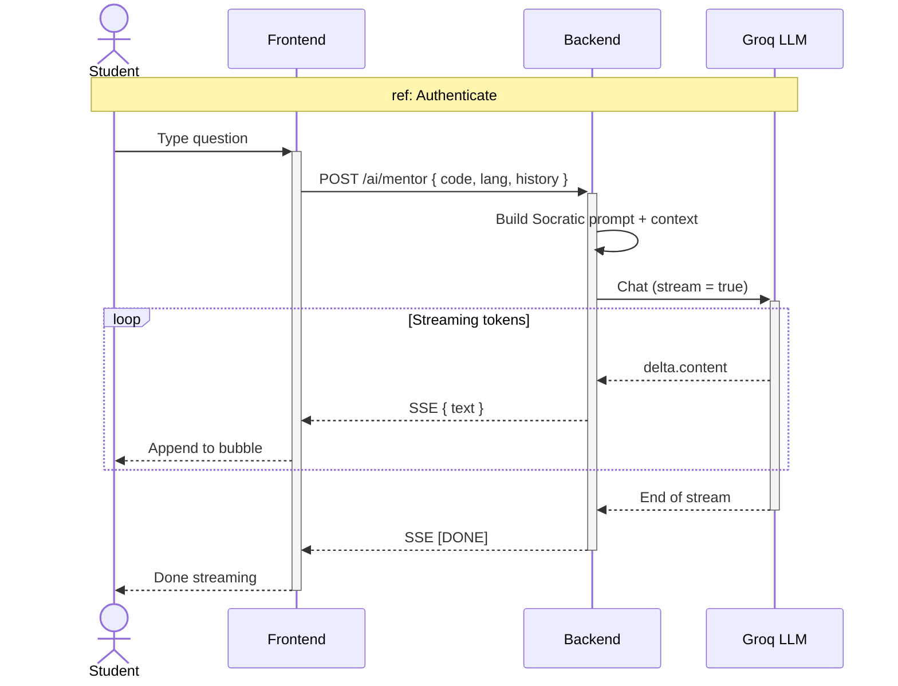

> *Figure 56.2. Sequence diagram of the AI Mentor Socratic streaming interaction.*

#### 2.3. AI Code Correction for Pro Users

A Pro user sends their failing code and the AI returns a corrected version with a list of changes.
Free users instead see an upgrade message.

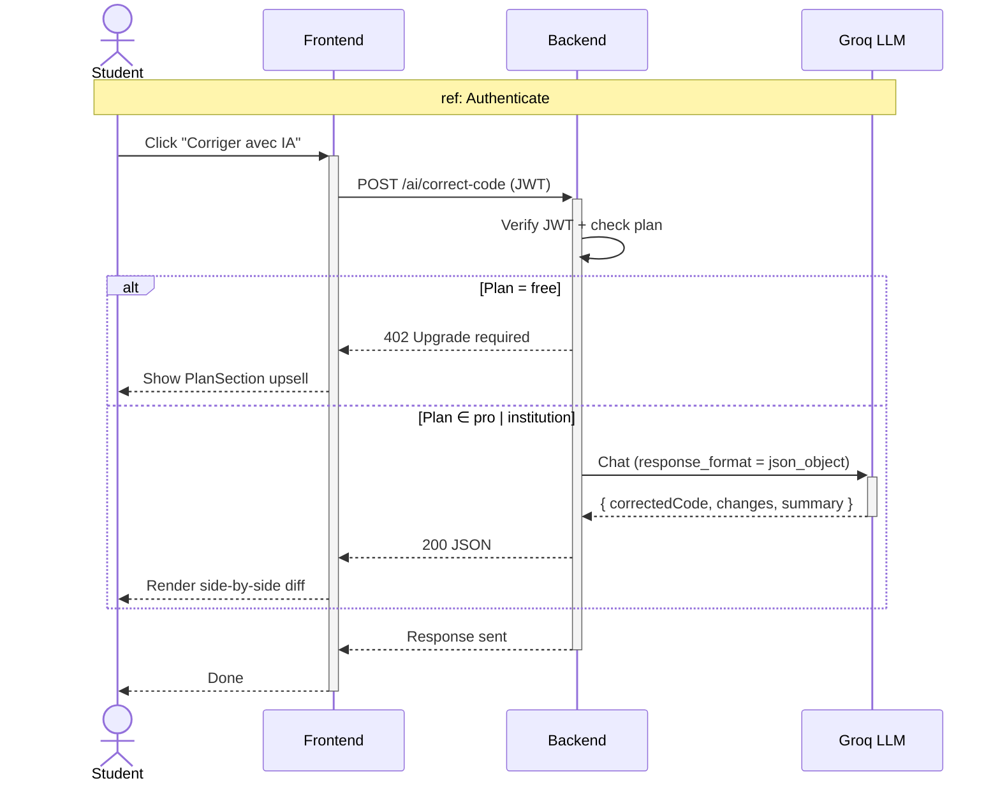

> *Figure 56.3. Sequence diagram of the AI code correction process for Pro users.*

#### 2.4. Institution Enrollment via Invite Link

A visitor opens the invite link and sees the institution and assigned role.
After signing in, the backend links the user to the institution and sends them to the dashboard.

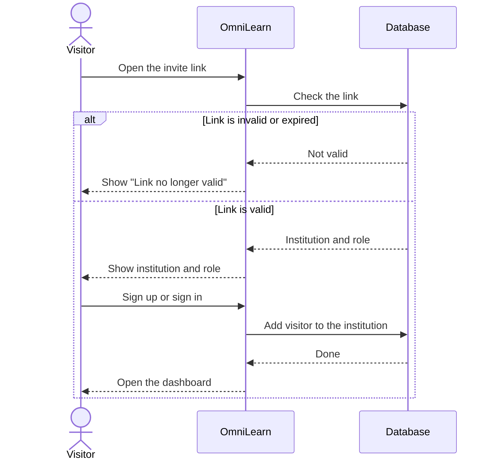

> *Figure 57. Sequence diagram of institution enrollment via invite link.*

### 3. Activity Diagrams

#### 3.1. User Account Suspension Process

The super admin picks a user and clicks Ban, then confirms in a modal.
The user is marked inactive and signed out automatically on their next request.

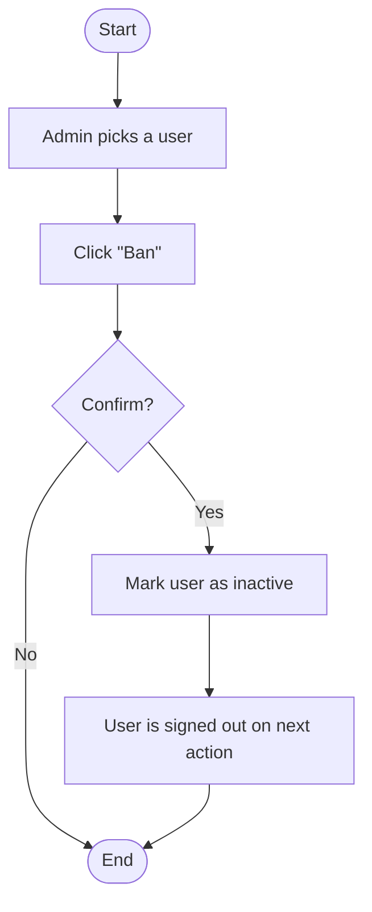

> *Figure 58. Activity diagram of the user account suspension process.*

#### 3.2. New Institution Onboarding Workflow

After paying for the Institution plan, the user is redirected to the onboarding form.
They fill it in, and the backend creates the institution and makes them its admin.

```mermaid
flowchart TD
  A([Start]) --> B[User completes Stripe Checkout (Institution)]
  B --> C[Stripe webhook: POST /api/stripe/webhook]
  C --> D[UPDATE users SET plan = 'institution']
  D --> E[User navigates to a guarded route]
  E --> F{Guard: plan == 'institution' AND institutionId == null?}
  F -- No --> M[Continue to requested route] --> Z([End])
  F -- Yes --> G[Redirect to /onboarding/institution]
  G --> H[Fill name, slug, logo]
  H --> I[POST /api/plan/institution]
  I --> J[INSERT Institution] --> K[UPDATE users SET institutionId, role = 'institution_admin']
  K --> L[Redirect to Institution Admin dashboard] --> Z
```

> *Figure 59. Activity diagram of the new institution onboarding workflow.*

### 4. Class Diagram

This diagram shows the new entities added in Sprint 4 and how they connect to the User.
The main new ones are Institution, InviteLink, PdfDocument, and the per-institution curriculum classes.

Sprint 4 adds:

- `Institution` — `id`, `name`, `slug`, `logoUrl?`, `plan`, `createdAt`.
- `InviteLink` — `id`, `institutionId`, `token`, `role`, `expiresAt`, `maxUses`, `usedCount`.
- Per-institution `Grade` / `Speciality` / `Level` — same schema as Sprint 3, but with `institutionId` nullable (null = global template owned by the super admin).
- `Notification` (already defined) used across PDF assistant, classrooms and messaging.

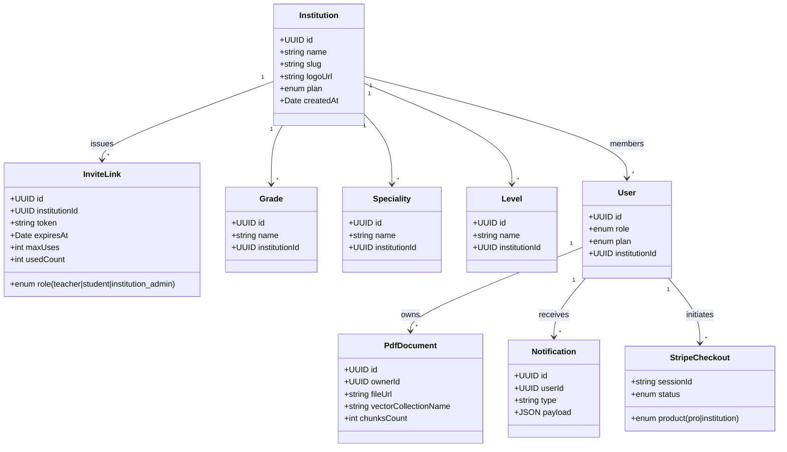

> *Figure 60 — Class diagram of Sprint 4.*

### 5. C4 Component view

Sprint 4 adds an AI plane (PDF, mentor, workspace) and an admin plane (plans, institutions, super admin).
The diagram groups every endpoint by module and shows shared helpers like the plan gate and timeouts.

```mermaid
%%{init: {"theme":"neutral"} }%%
flowchart TB
  subgraph WebAPI["Container — Web API (Sprint 4 additions)"]
    direction TB

    subgraph PdfC["pdfRoutes.js (RAG)"]
      Upl["upload (multer + %PDF + pdf-parse)"]
      Chk["chunkText(800)"]
      Emb["HF embeddings (all-MiniLM-L6-v2)"]
      Vec["Chroma vector store"]
      Sim["similaritySearch(q, k=3)"]
      KW["keyword fallback (top-3 overlap)"]
      RAG["RAG prompt builder"]
      Chat["POST /chat"]
      Exp["POST /explain"]
      Sum["POST /summarize"]
      Quiz["POST /quiz (10 / 20 MCQs)"]
      Smart["POST /smart-search"]
      Hi["POST /highlights, /bookmarks"]
      Cache["pdfCache (Map) + index.json"]
      Loader["loadPdfData / loadPdfTextOnly"]
    end

    subgraph AiC["aiRoutes.js"]
      Men["POST /mentor (SSE stream)"]
      Cor["POST /correct-code (JSON diff)"]
      Gen["POST /problems/generate-draft"]
      SaveD["POST /problems/save-draft"]
      RmGen["POST /generate/problem-roadmap"]
      Fork["POST /problems/:id/fork"]
      Repair["JSON-repair retry (T=0.1)"]
      Norm["normalizeRoadmap()"]
    end

    subgraph WsC["workspaceRoutes.js"]
      WsAn["POST /code/analyze"]
      WsSm["POST /code/summarize"]
      WsQz["POST /code/quiz"]
      WsCR["CRUD pdfs / code files"]
      WsLd["loadCodeForUser() (12k char cap)"]
      Hist["history.json (50 / user)"]
    end

    subgraph PlanC["planRoutes.js"]
      Inst["POST /plan/institution"]
      InvCre["POST   /plan/invite-links"]
      InvRev["DELETE /plan/invite-links/:id"]
      InvGet["GET    /plan/invite-links/:token"]
      InvJoin["POST   /plan/join-institution"]
    end

    subgraph CurC["institutionCurriculumRoutes.js"]
      GrCRUD["CRUD Grade / Speciality / Level (institutionId scoped)"]
    end

    subgraph AdmC["adminRoutes.js"]
      InstList["GET  /admin/institutions"]
      InstSusp["DELETE / suspend institution"]
      Members["GET  /admin/institution/members"]
      Ban["PATCH /admin/users/:id (isActive)"]
      Stats["GET  /admin/stats"]
    end

    subgraph StripeC["stripeRoutes.js"]
      ChPro["POST /checkout-pro"]
      ChIns["POST /checkout-institution"]
      WhS["POST /webhook"]
    end

    Gate["authenticate + requirePro + role gate"]
    GroqC["groq SDK (chat.completions, stream)"]
    HFC["@huggingface/inference"]
    ChrC["@langchain/community Chroma client"]
    StripeS["stripe SDK"]
    Race["Promise.race(call, 8s / 5s)"]

    PdfM["PdfDocument + vector collection"]
    InstM["Institution / InviteLink models"]
    UserM["User model"]
    NotM["Notification model"]
  end

  Groq[(Groq)]
  HF[(HuggingFace)]
  Chroma[(Chroma DB)]
  Disk[("uploads/*.pdf")]
  Stripe[(Stripe)]
  SO[(StackExchange)]
  YT[(YouTube)]
  PG[(PostgreSQL)]

  Upl --> Chk --> Emb --> Vec
  Emb --> HFC --> HF
  Vec --> ChrC --> Chroma
  Upl --> Disk
  Upl --> Cache
  Cache --> Loader
  Loader --> Vec
  Chat --> Loader --> Sim --> RAG
  Sim -. "Chroma down" .-> KW --> RAG
  RAG --> GroqC --> Groq
  Exp --> RAG
  Sum --> Loader
  Sum --> GroqC
  Quiz --> Loader --> GroqC
  Smart --> Sim
  Hi --> PdfM
  Vec --> Race
  Sim --> Race

  Men --> Gate
  Men --> GroqC
  Cor --> Gate
  Cor --> GroqC
  Gen --> GroqC
  Gen --> Repair --> Norm
  SaveD --> PG
  RmGen --> GroqC
  Fork --> PG

  WsAn --> WsLd --> GroqC
  WsSm --> WsLd --> GroqC
  WsQz --> WsLd --> GroqC
  WsCR --> Disk
  WsQz --> Hist
  Exp --> Hist

  Inst --> InstM
  InvCre --> InstM
  InvRev --> InstM
  InvGet --> InstM
  InvJoin --> InstM
  InvJoin --> UserM

  GrCRUD --> InstM
  InstList --> InstM
  InstSusp --> InstM
  Members --> UserM
  Ban --> UserM
  Stats --> UserM
  Stats --> InstM

  ChPro --> StripeS --> Stripe
  ChIns --> StripeS
  Stripe -. "webhook" .-> WhS
  WhS --> UserM
  WhS --> NotM

  SO -. "used by /stackoverflow slash" .-> AiC
  YT -. "used by /video slash" .-> AiC

  PdfM --> PG
  InstM --> PG
  UserM --> PG
  NotM --> PG
```

> *Figure 60.1 — Sprint 4 — C4 Component view.*

## V. Implementation

### 1. PDF Assistant — RAG deep dive

The PDF assistant lets a Pro / Institution student drag a PDF (≤ 50 MB), ingest it, and ask grounded questions. The whole pipeline lives inline in [pdfRoutes.js](../Server/src/routes/pdfRoutes.js) and is best understood through the **C4 model** (Context → Container → Component → Code).

#### 1.1. C4 Level 1 — System Context

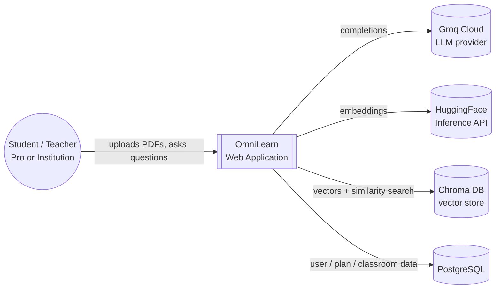

The student only talks to OmniLearn.
OmniLearn then calls Groq, HuggingFace, and Chroma in the background.

#### 1.2. C4 Level 2 — Containers

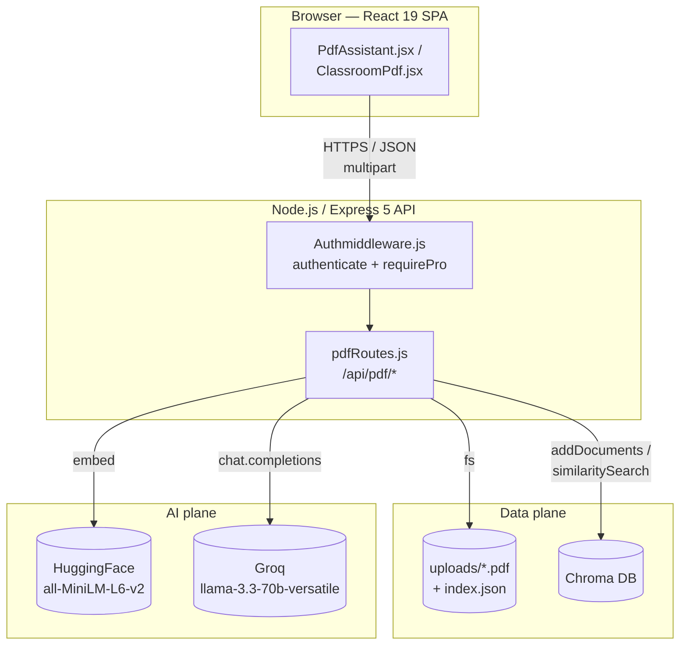

The PDF router talks to HuggingFace, Chroma, and Groq, and saves the PDFs on disk.
A small index file lets it rebuild the cache after a server restart.

#### 1.3. C4 Level 3 — Components inside `pdfRoutes.js`

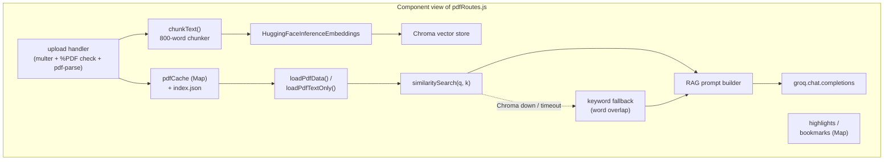

A few design choices are worth calling out:

- `chunkText()` is **fixed-size** (no sentence-aware splitter). The prompt re-injects each chunk verbatim, so a ragged boundary costs nothing and saves a dependency.
- `pdfCache` is the hot path. After a server restart, `loadPdfData()` rebuilds it from `index.json` so users don't have to re-upload.
- The retriever has a **two-tier strategy**: vector search when the store was built successfully, keyword scoring when it wasn't. They feed the same downstream prompt — the UI never knows which one fired.
- `loadPdfTextOnly()` exists for `/summarize` and `/quiz`, which don't need similarity search — it skips the Chroma round-trip entirely.

#### 1.4. C4 Level 4 — Code paths

**Ingestion** (`POST /api/pdf/upload`):

```
multer.diskStorage           → uploads/<ts>-<safeName>.pdf
%PDF header check            → 400 if not a real PDF
pdfParse(buffer)             → { text, numpages }    (best-effort)
chunkText(text, 800)         → string[]
chunks.map(new Document(…))  → LangChain Document[]
Promise.race(
  Chroma.fromDocuments(docs, embeddings, {
    collectionName: "pdf_<sanitised pdfId>",
    persistDirectory: process.env.CHROMA_PERSIST_DIR || "./chroma_db",
    url: process.env.CHROMA_URL || "http://127.0.0.1:8000",
  }),
  8s-timeout
)                            → vectorStore | null
pdfCache.set(pdfId, payload)
writeIndex([{ pdfId, filename, storedName, fileUrl, … }, …])
```

**Query** (`POST /api/pdf/chat`):

```
loadPdfData(pdfId)
context = vectorStore
  ? vectorStore.similaritySearch(q, 3).map(r => r.pageContent).join("\n\n")
  : top-3 chunks by word-overlap score
groq.chat.completions({
  model: "llama-3.3-70b-versatile",
  messages: [system, `Context:\n${context}\n\nQuestion: ${q}`],
})
```

#### 1.5. Numerical defaults

**Table 20 — PDF assistant numerical defaults (chunk size, top-k, timeouts)**

| Constant | Value | Where |
|---|---|---|
| Max PDF size | **50 MB** | `multer` `limits.fileSize` |
| Chunk size | **800 words** | `chunkText(text, maxWords = 800)` |
| Top-k retrieved chunks (chat) | **3** | `similaritySearch(q, 3)` |
| Top-k retrieved chunks (smart search) | **5** | `similaritySearch(q, 5)` |
| Chroma upload timeout | **8 s** | `Promise.race` in `/upload` |
| Chroma read timeout | **5 s** | `Promise.race` in `loadPdfData` |
| Quiz max context | **12 000 chars** | `quizContext.slice(0, 12000)` |
| Summary context | **first 5 chunks** | `chunks.slice(0, 5).join(...)` |
| Embedding model | `sentence-transformers/all-MiniLM-L6-v2` | `HuggingFaceInferenceEmbeddings` |
| Completion model | `llama-3.3-70b-versatile` | `groq.chat.completions.create` |
| Plan gate | `authenticate` + `requirePro` | top of `pdfRoutes.js` |

#### 1.6. Failure modes

| Failure | Symptom | Behaviour |
|---|---|---|
| Uploaded file isn't a real PDF | bytes don't start with `%PDF` | 400, file deleted |
| `pdf-parse` throws on a weird PDF | empty text | upload still succeeds, `textExtracted: false`, AI features degrade gracefully |
| HuggingFace key invalid / rate-limited | embedding call hangs | 8 s timeout, `vectorStore` stays `null`, keyword fallback fires on query |
| Chroma server down | `fromDocuments` hangs | same as above |
| LLM returns invalid JSON | `JSON.parse` throws | catch + regex-extract `{…}`/`[…]` + retry pass at `temperature: 0.1` |
| LLM returns empty content | `summary` is `undefined` | 502 "AI returned an empty summary" |

The screenshot below shows the upload area and the chat panel of the PDF assistant.
A student drops a PDF here and can immediately start asking questions about it.

> *Figure 61 — PDF assistant — upload and chat view.*

The screenshot below shows an AI answer with the source passages from the PDF.
The student can see exactly which parts of the document the answer was based on.

> *Figure 62 — PDF assistant — answer with grounded citations.*

#### 1.7. Beyond chat — the assistant tabs

Chat is only one of **six tabs** exposed by `PdfAssistant.jsx`. Each tab targets a different study workflow over the same uploaded PDF (or, in code mode, the same workspace code file). They all share the cache, the embeddings and the LLM client described above — the table below is the full feature surface.

| Tab | What the student does | Backend endpoint | Notes |
|---|---|---|---|
| **Chat** | Multi-turn Q&A grounded in the PDF; top bar exposes a one-click **Summarize** button. | `POST /api/pdf/chat`, `POST /api/pdf/summarize` (code mode: `/api/workspace/code/analyze`, `/code/summarize`). | Replays the last user / assistant turns as `history` so the model can follow context. |
| **Notes** | Selects text in the PDF (or code), opens a modal, attaches a free-text **note** and saves the **highlight**. Each saved item lists with a **Go** button that jumps back to the page (PDF) or scrolls the snippet into view (code). | `GET / POST / DELETE /api/pdf/highlights*`. Code-mode highlights live in `localStorage` under `code-highlights-<id>`. | Highlights persist server-side per user + per PDF, so notes survive a reload. |
| **Bookmarks** | One-click **Bookmark this page** while reading; bookmarks are listed with a **Go** button that jumps back to the saved page. | `POST / DELETE /api/pdf/bookmarks*`. | PDF-only — page-based navigation does not apply in code mode. |
| **Search** | Semantic **smart-search**: the query runs through the Chroma vector store (top-5 similarity, not keyword) and returns excerpts ranked by relevance. | `POST /api/pdf/smart-search`. | Same retrieval engine as Chat, exposed standalone for "find a concept" workflows. |
| **Quiz** | Generates **10 or 20 MCQs** from the PDF. The student first picks a **page range** (`From` / `To`) to scope the quiz; in code mode the whole file (≤ 12 000 chars) is used. Each question is rendered with radio options; **Submit Quiz** scores answers locally (letter A–D or full-text matching via `normalizeAnswer()`); a result card shows `score / total` plus **Review Answers** and **Retry Quiz**. | `POST /api/pdf/quiz` / `POST /api/workspace/code/quiz`. | Quiz submission is auto-appended to the History tab (see below). |
| **History** | Persistent **study history** — every quiz submission (`type: "quiz"`, with `score`, `total`, `questions`) and every "Explain this passage" call (`type: "explanation"`) is appended automatically. The tab header shows a **badge** with the count; each entry lists its date and score; per-entry **delete** and **Clear All** actions are available. | `GET / POST / DELETE /api/workspace/history*`. | Capped at **50 entries per user** server-side in `history.json` (see §V.7). |

Two cross-tab interactions are worth calling out because they are easy to miss when only reading the routes:

- **Quiz feeds History.** `submitQuiz()` calls `saveToHistory({ type: "quiz", score, total, questions })` right after scoring, which is why the History tab is the only place a student can review a past quiz attempt — the Quiz tab itself only keeps the *current* attempt in component state.
- **Explain feeds History too.** Whenever the student selects PDF text and clicks **Explain**, the answer is also pushed as `{ type: "explanation", … }` so the History tab doubles as a "things the AI taught me today" log, not just a quiz scoreboard.

Code mode reuses every tab except **Bookmarks**. The same component switches its data sources based on whether it was opened with a `pdfId` (PDF mode, routes under `/api/pdf/*`) or a `codeId` (code mode, routes under `/api/workspace/code/*`).

The screenshot below shows the Quiz tab with the page-range picker, the 10 / 20-questions buttons, and the result card with per-question Correct / Wrong tags.

> *Figure 62.1 — PDF assistant — Quiz tab with page-range scoping and scoring.*

The screenshot below shows the Notes tab with saved highlights and their attached free-text notes, and the **Go** button that jumps back to the original page.

> *Figure 62.2 — PDF assistant — Notes (highlights + notes) tab.*

The screenshot below shows the History tab listing past quiz attempts (with score / total) and explanation entries, plus the per-entry delete and **Clear All** actions.

> *Figure 62.3 — PDF assistant — Study History tab.*

### 2. Classroom PDF

This is the PDF assistant tied to a classroom lesson, so every student in the class shares the same PDF.
It uses the same routes and AI pipeline as the personal PDF assistant.

The screenshot below shows the Classroom PDF assistant used by a class.
Every student in the class sees the same lesson PDF and can ask questions about it.

> *Figure 63 — Classroom PDF assistant.*

### 3. AI Mentor — Socratic streaming tutor

The AI Mentor is a chat sidebar next to the code editor that helps the student like a real teacher.
It reads the student's code and question, then streams the answer word by word in real time.
It never gives the full solution — instead it follows three strict rules:

> 1. NEVER give a complete solution or write the full corrected code.
> 2. Always teach the WHY behind concepts and bugs.
> 3. Ask a guiding reflective question at the end of each response.

> *Figure 64 — AI Mentor side panel.*

### 4. AI-assisted code correction (Pro only)

`POST /api/ai/ai/correct-code` is gated by `authenticate + requirePro`. Free users get a `402 Upgrade required` that the UI catches and turns into an upsell. The route takes the student's failing code, the language, the problem statement, and the **actual stdout** the code currently produced; it then asks Groq with `response_format: { type: "json_object" }` for:

```jsonc
{
  "correctedCode": "...full file...",
  "changes": [
    { "lineNumber": 12, "type": "fix", "description": "off-by-one in loop", "oldCode": "...", "newCode": "..." }
  ],
  "summary": "Fixed loop bound and switched test inputs to match Example 2."
}
```

The prompt pins three critical rules: keep every `print` / test invocation at the bottom of the file; keep the original test inputs unless they cannot produce the expected output (in which case use inputs from `examples`); produce stdout that — after trimming each line and ignoring blank lines and case — **matches `expectedOutput` exactly**. The UI uses `changes[]` to drive a side-by-side diff view.

### 5. Problem generation (AI and manual)

Staff can create new problems in two ways: by hand through a form, or by asking the AI to generate them.
The AI takes a topic and a difficulty, then returns ready-made problems that the teacher can review, edit, and save.

#### 5.1. Manual problem creation

The teacher fills a form with the title, description, examples, constraints, and expected output.
This way gives full control but takes more time when many problems are needed.

> *Figure 65 — Manual problem creation form.*

#### 5.2. AI problem generation

The teacher only picks a topic and a difficulty, then the AI writes one or several complete problems in seconds.
The teacher can still review and edit the result before saving it to the platform.

> *Figure 66 — AI problem generation.*

### 6. Personalised roadmap

The roadmap service ([RoadmapService.js](../Server/src/ai/RoadmapService.js)) takes the student's onboarding profile (career goal, interests, programming languages, weaknesses) and asks Groq for a **15-node, 5-level pyramid**:

```
Level 1 (foundations)     1 node    n1
Level 2 (core skills)     2 nodes   n2, n3
Level 3 (applied)         3 nodes   n4, n5, n6
Level 4 (integration)     4 nodes   n7..n10
Level 5 (advanced)        5 nodes   n11..n15
```

Each node has a `type ∈ { concept, debugging, challenge, project, stackoverflow, youtube }` plus a `stackoverflowQuery` and a `youtubeQuery`. The graph is then enriched in **batches of 5** with four parallel out-of-LLM calls per node:

1. `fetchStackOverflow(query, 5)` — Stack Exchange `search/advanced`, ordered by votes (no API key needed).
2. `fetchYouTube(query, 3)` — YouTube Data API v3, ordered by `viewCount` (needs `YOUTUBE_API_KEY`, otherwise returns `[]`).
3. `fetchDocs(title, youtubeQuery)` — Groq call that returns 3 **real** official-docs URLs; the prompt forbids the model from inventing URLs.
4. `generateQuiz(title, description)` — 5 MCQs per node, letter-coded answers, `passingScore: 80`.

Each user can keep multiple roadmaps (`SavedRoadmap`, `isActive` flag for the current one). When `roadmapProgress` hits 100 % the certificate button unlocks (`Certificate.jsx` → html2canvas → jsPDF).

### 7. Workspace code AI

The workspace is a personal space where the student saves PDFs and code files.
On top of these saved files, three AI actions are available to help the student study:

| Route | Purpose | Output |
|---|---|---|
| `POST /workspace/code/analyze` | Chat with the AI about the code to understand what it does and how to improve it. | Markdown |
| `POST /workspace/code/summarize` | Get a short summary of the code in plain language. | Markdown |
| `POST /workspace/code/quiz` | Generate multiple-choice questions from the code to test understanding. | JSON array |

### 8. Messenger slash commands

Inside the chat, the student types `/` to open a small menu of quick commands.
Each command brings an instant answer directly into the conversation without leaving the chat:

| Command | What it does |
|---|---|
| `/ai <question>` | The AI replies with an explanation as a bot message. |
| `/stackoverflow <query>` | Shows the top Stack Overflow answers for the question. |
| `/video <query>` | Shows a few YouTube videos about the topic. |

### 9. Shared building blocks across the AI plane

Two design rules apply to every AI call in the codebase:

1. **Strict JSON contracts.** Every prompt that asks the LLM for structured data appends explicit JSON rules (no markdown fences, no trailing commas, escape rules); the route then strips fences and extracts the first balanced `{...}` or `[...]` substring before parsing. Two endpoints (`/ai/generate/problems`, `/ai/correct-code`) additionally implement a **JSON-repair fallback** — on first parse failure they re-ask the same model to "fix this malformed JSON" with `temperature: 0.1`.
2. **Time-boxed external calls.** Anything that talks to Chroma or HuggingFace is wrapped in `Promise.race(call, timeout)` so a hanging embeddings call or a down Chroma server never blocks the response. The PDF upload races against 8 s, the chat path against 5 s, and falls back to keyword search when the timeout fires.

### 10. Environment variables

The AI features need a few secret keys to talk to the outside services they rely on.
These keys are stored in a `.env` file so they stay out of the source code:

| Variable | Used by |
|---|---|
| `GROQ_API_KEY` | All AI features (chat, mentor, generation). |
| `HF_API_KEY` | PDF assistant embeddings. |
| `CHROMA_URL` | The Chroma vector database used by the PDF assistant. |
| `CHROMA_PERSIST_DIR` | Where Chroma stores its data on disk. |
| `YOUTUBE_API_KEY` | The `/video` command and the roadmap videos. |

### 11. Institution onboarding

After paying for the Institution plan, the user is sent to the onboarding page.
They fill in the institution name, slug, and logo to register it.

The screenshot below shows the institution onboarding form.
The new admin enters the name, slug, and logo to register the institution.

> *Figure 66 — Institution onboarding form.*

### 12. Invite links

The institution admin creates invite links for either teachers or students.
Each link has an expiration date and a maximum number of uses.

The screenshot below shows the form used by the admin to generate an invite link.
They choose the role (teacher or student), the expiration date, and the max number of uses.

> *Figure 67 — Invite-link generation form.*

The screenshot below shows the public page that invited people see.
They confirm the institution and role, then sign in or sign up to join.

> *Figure 68 — Public "Join institution" page (`JoinInstitution.jsx`).*

### 13. Institution Admin console

The institution admin sees the list of members and the curriculum of their institution.
They can also view the institution's classes and basic statistics.

The screenshot below shows the directory of members in the institution.
The admin can search, see each member's role, and update it from this page.

> *Figure 69 — Institution member directory (`InstitutionTab.jsx`).*

The screenshot below shows the page where the admin manages Grades, Specialities, and Levels.
These define the curriculum that only belongs to this institution.

> *Figure 70 — Per-institution curriculum management.*

### 14. Super Admin console

The super admin manages every institution, the global problems, and the Free / Pro plan flags.
They can also ban or unban users and view platform-wide statistics.

The screenshot below shows the main super admin dashboard.
It centralizes institutions, problems, plans, bans, and platform statistics.

> *Figure 71 — Super admin dashboard.*

The screenshot below shows charts of how many users belong to each plan.
The super admin can quickly see the split between Free, Pro, and Institution users.

> *Figure 72 — Users-by-plan overview (charts).*

The screenshot below shows the tab that controls features available to Free users.
The super admin can turn features on or off for the Free plan from here.

> *Figure 73 — Free-tier management tab.*

The screenshot below shows the tab that controls features available to Pro users.
The super admin can toggle Pro-only features such as AI code correction.

> *Figure 74 — Pro-tier management tab.*

The screenshot below shows the page used to assign modules to classes or students.
This lets the admin decide who has access to which learning modules.

> *Figure 75 — Module assignments management.*

### 15. Pricing / Plan section

This page shows the three plans (Free, Pro, Institution) side by side.
Each plan has a Stripe checkout button to upgrade.

The screenshot below shows the pricing page with the three plans side by side.
Each plan card has a Stripe button that starts the checkout flow.

> *Figure 76 — Pricing / Plan section with Stripe upgrade buttons.*

## VI. Conclusion

In this last chapter we added several major features. The PDF assistant lets students ask questions grounded in their own course material; the AI Mentor follows them across the app and supports code correction without giving final solutions; learning tags provide faster access to references; institution onboarding and invite links enable schools to bring their entire community under one roof; and the super-admin and institution-admin consoles round off the multi-tenant administration of the platform.

---
