# Flows and Diagrams

This file gathers — in one place — the **flowcharts**, **sequence diagrams**, **activity diagrams**, **use-case diagrams** and **class diagrams** that describe OmniLearn end-to-end. The diagrams below are written in **Mermaid** so they can be rendered directly in any Markdown viewer that supports Mermaid (GitHub, VS Code, Obsidian, etc.).

---

## 1. High-level system architecture

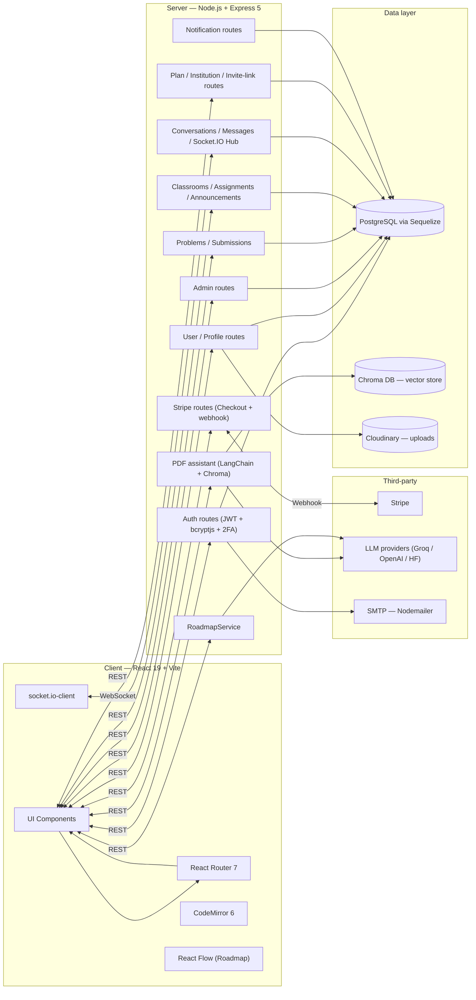
```mermaid
flowchart LR
  subgraph Client["Client — React 19 + Vite"]
    UI["UI Components"]
    Router["React Router 7"]
    Socket["socket.io-client"]
    Editor["CodeMirror 6"]
    Flow["React Flow (Roadmap)"]
  end

  subgraph Server["Server — Node.js + Express 5"]
    Auth["Auth routes (JWT + bcryptjs + 2FA)"]
    UserAPI["User / Profile routes"]
    AdminAPI["Admin routes"]
    Problems["Problems / Submissions"]
    Classroom["Classrooms / Assignments / Announcements"]
    Messaging["Conversations / Messages / Socket.IO Hub"]
    PDFAI["PDF assistant (LangChain + Chroma)"]
    RoadmapAI["RoadmapService"]
    Plan["Plan / Institution / Invite-link routes"]
    StripeAPI["Stripe routes (Checkout + webhook)"]
    Notif["Notification routes"]
  end

  subgraph Data["Data layer"]
    PG[("PostgreSQL via Sequelize")]
    Chroma[("Chroma DB — vector store")]
    Cloud[("Cloudinary — uploads")]
  end

  subgraph Third["Third-party"]
    StripeSvc["Stripe"]
    LLM["LLM providers (Groq / OpenAI / HF)"]
    SMTP["SMTP — Nodemailer"]
  end

  UI --> Router
  Router --> UI
  UI <-->|REST| Auth
  UI <-->|REST| UserAPI
  UI <-->|REST| AdminAPI
  UI <-->|REST| Problems
  UI <-->|REST| Classroom
  UI <-->|REST| PDFAI
  UI <-->|REST| RoadmapAI
  UI <-->|REST| Plan
  UI <-->|REST| StripeAPI
  Socket <-->|WebSocket| Messaging

  Auth --> PG
  UserAPI --> PG
  AdminAPI --> PG
  Problems --> PG
  Classroom --> PG
  Messaging --> PG
  Plan --> PG
  Notif --> PG
  PDFAI --> Chroma
  PDFAI --> LLM
  RoadmapAI --> LLM
  UserAPI --> Cloud
  StripeAPI <-->|Webhook| StripeSvc
  Auth --> SMTP
```

---

## 2. Global use-case diagram

```mermaid
flowchart LR
  Visitor((Visitor))
  Student((Student))
  Teacher((Teacher))
  InstAdmin((Institution Admin))
  SuperAdmin((Super Admin))

  Visitor --> SignUp["Sign up"]
  Visitor --> Verify["Verify email"]
  Visitor --> Login["Sign in"]

  Student --> Profile["Manage profile + 2FA"]
  Student --> Onboard["Roadmap onboarding"]
  Student --> Roadmap["View / progress roadmap"]
  Student --> Cert["Download certificate"]
  Student --> Problems["Browse problems"]
  Student --> Solve["Solve a problem (Editor + Submit)"]
  Student --> Dashboard["Coding dashboard"]
  Student --> JoinClass["Join classroom (code or invite)"]
  Student --> Class["View classroom + announcements + assignments"]
  Student --> SubmitAssn["Submit assignment"]
  Student --> Msg["Real-time messaging"]
  Student --> PDF["Ask PDF assistant"]
  Student --> Mentor["Ask AI Mentor"]
  Student --> LearnTags["Use learning tags (/ai, /stack-overflow, /youtube)"]

  Teacher --> CreateClass["Create class + invite code"]
  Teacher --> CreateCourse["Create course / module / lesson"]
  Teacher --> CreateAssn["Create assignment + attach problems"]
  Teacher --> Grade["Review + grade submissions"]
  Teacher --> Announce["Post announcement"]
  Teacher --> PDFUpload["Upload lesson PDF"]
  Teacher --> Msg

  InstAdmin --> OnboardInst["Onboard institution"]
  InstAdmin --> Invites["Generate / revoke invite links"]
  InstAdmin --> Curriculum["Manage Grades / Specialities / Levels"]
  InstAdmin --> Directory["Manage member directory"]
  InstAdmin --> Assign["Assign teachers to classes"]

  SuperAdmin --> Insts["Manage institutions"]
  SuperAdmin --> ProbsAdmin["Manage problem catalogue"]
  SuperAdmin --> FreeTier["Toggle Free-tier"]
  SuperAdmin --> ProTier["Toggle Pro-tier"]
  SuperAdmin --> Ban["Ban / unban users"]
  SuperAdmin --> Stats["View global statistics"]
```

---

## 3. End-to-end class diagram (data model)

```mermaid
classDiagram
  class User {
    +UUID id
    +string firstname
    +string lastname
    +string email
    +string password
    +enum role  // admin | institution_admin | teacher | student
    +enum plan  // free | pro | institution
    +Date planJoinedAt
    +UUID institutionId
    +boolean isActive
    +boolean isEmailVerified
    +string emailVerificationToken
    +string passwordResetToken
    +string twoFactorSecret
    +boolean is2FAEnabled
    +string bio
    +string githubUrl
    +string linkedinUrl
    +string avatar
    +string careerGoal
    +json interests
    +json programmingLanguages
    +json roadmap
    +int roadmapProgress
  }

  class Institution {
    +UUID id
    +string name
    +string slug
    +string logoUrl
    +enum plan
  }

  class InviteLink {
    +UUID id
    +UUID institutionId
    +string token
    +enum role
    +Date expiresAt
    +int maxUses
    +int usedCount
  }

  class Grade {
    +UUID id
    +string name
    +UUID institutionId
  }
  class Speciality {
    +UUID id
    +string name
    +UUID gradeId
    +UUID institutionId
  }
  class Level {
    +UUID id
    +string name
    +UUID specialityId
    +UUID institutionId
  }

  class Class {
    +UUID id
    +string name
    +string code
    +UUID teacherId
    +UUID gradeId
    +UUID specialityId
    +UUID levelId
  }
  class Enrollment {
    +UUID id
    +UUID classId
    +UUID studentId
    +Date enrolledAt
  }
  class Course {
    +UUID id
    +string name
    +UUID teacherId
    +UUID classId
    +UUID levelId
  }
  class Module {
    +UUID id
    +string name
    +UUID courseId
  }
  class Lesson {
    +UUID id
    +string title
    +text content
    +string pdfUrl
    +UUID moduleId
    +UUID courseId
  }
  class ClassAssignment {
    +UUID id
    +string name
    +UUID moduleId
    +UUID classId
    +Date dueAt
  }
  class Announcement {
    +UUID id
    +string title
    +text body
    +UUID classId
    +UUID authorId
  }
  class Problem {
    +UUID id
    +string title
    +text statement
    +string difficulty
    +json tags
    +string language
    +text expectedOutput
    +boolean isFreeTier
    +boolean isProTier
    +UUID institutionId
  }
  class CodeSubmission {
    +UUID id
    +UUID userId
    +UUID problemId
    +text sourceCode
    +string language
    +string verdict
    +int runtimeMs
  }
  class StudentProblemSet {
    +UUID id
    +UUID studentId
    +json problemIds
  }
  class Conversation {
    +UUID id
    +string name
    +json participantIds
  }
  class Message {
    +UUID id
    +UUID conversationId
    +UUID senderId
    +text body
  }
  class Notification {
    +UUID id
    +UUID userId
    +string type
    +json payload
    +Date readAt
  }
  class SavedRoadmap {
    +UUID id
    +UUID userId
    +json graphJson
    +int progress
  }

  Institution "1" --> "*" User : members
  Institution "1" --> "*" InviteLink : inviteLinks
  Institution "1" --> "*" Grade : grades
  Institution "1" --> "*" Speciality : specialities
  Institution "1" --> "*" Level : levels

  Grade "1" --> "*" Speciality
  Speciality "1" --> "*" Level
  Level "1" --> "*" Course

  User "1" --> "*" Class : taughtClasses
  Class "1" --> "*" Enrollment
  User "1" --> "*" Enrollment : enrollments
  Class "1" --> "*" Course
  Course "1" --> "*" Module
  Module "1" --> "*" Lesson
  Course "1" --> "*" Lesson : directLessons
  Module "1" --> "*" ClassAssignment
  Class "1" --> "*" ClassAssignment
  Class "1" --> "*" Announcement
  User "1" --> "*" Announcement : authoredAnnouncements
  User "1" --> "*" CodeSubmission
  Problem "1" --> "*" CodeSubmission
  Course "1" --> "*" CodeSubmission
  Module "1" --> "*" CodeSubmission
  User "1" --> "*" StudentProblemSet
  Conversation "1" --> "*" Message
  User "1" --> "*" Message : sentMessages
  User "1" --> "*" Notification
  User "1" --> "1" SavedRoadmap
```

---

## 4. Sequence diagrams

### 4.1. Sign up + email verification

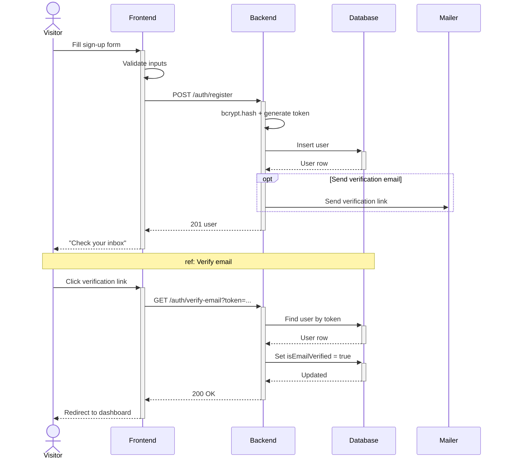
```mermaid
sequenceDiagram
    actor Visitor
    participant FE as Frontend
    participant API as Backend
    participant DB as Database
    participant Mail as Mailer

    Visitor->>+FE: Fill sign-up form
    FE->>FE: Validate inputs
    FE->>+API: POST /auth/register
    API->>API: bcrypt.hash + generate token
    API->>+DB: Insert user
    DB-->>-API: User row

    opt Send verification email
        API->>Mail: Send verification link
    end

    API-->>-FE: 201 user
    FE-->>-Visitor: "Check your inbox"

    Note over Visitor,DB: ref: Verify email

    Visitor->>+FE: Click verification link
    FE->>+API: GET /auth/verify-email?token=...
    API->>+DB: Find user by token
    DB-->>-API: User row
    API->>+DB: Set isEmailVerified = true
    DB-->>-API: Updated
    API-->>-FE: 200 OK
    FE-->>-Visitor: Redirect to dashboard
```

### 4.2. Sign in (with optional 2FA)

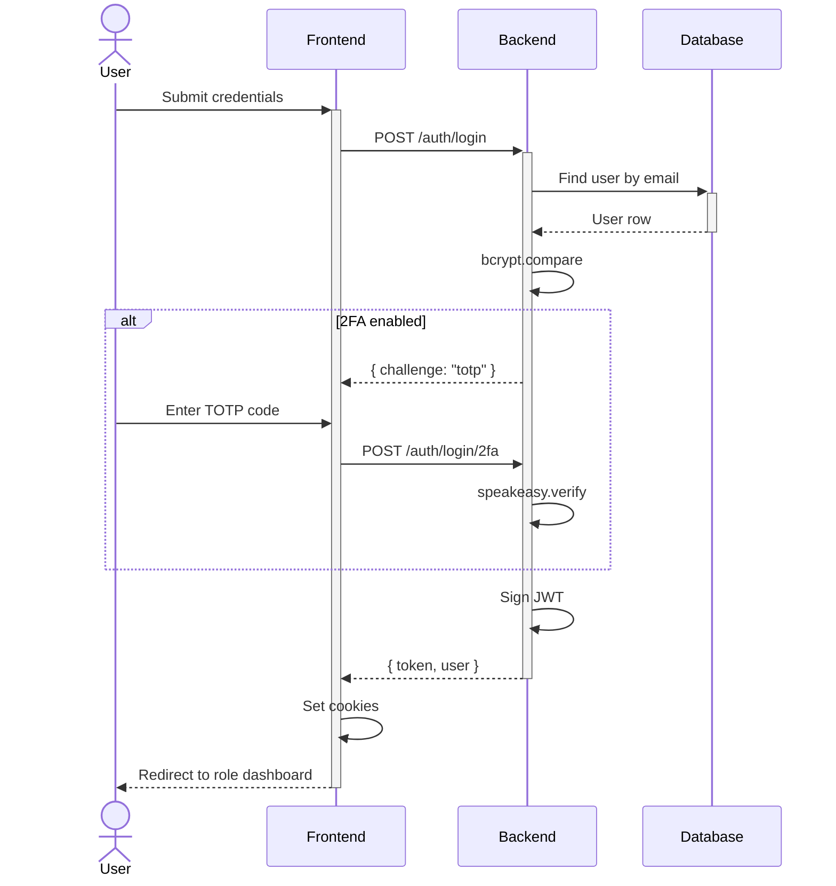
```mermaid
sequenceDiagram
    actor User
    participant FE as Frontend
    participant API as Backend
    participant DB as Database

    User->>+FE: Submit credentials
    FE->>+API: POST /auth/login
    API->>+DB: Find user by email
    DB-->>-API: User row
    API->>API: bcrypt.compare

    alt 2FA enabled
        API-->>FE: { challenge: "totp" }
        User->>FE: Enter TOTP code
        FE->>API: POST /auth/login/2fa
        API->>API: speakeasy.verify
    end

    API->>API: Sign JWT
    API-->>-FE: { token, user }
    FE->>FE: Set cookies
    FE-->>-User: Redirect to role dashboard
```

### 4.3. Generate personalized roadmap

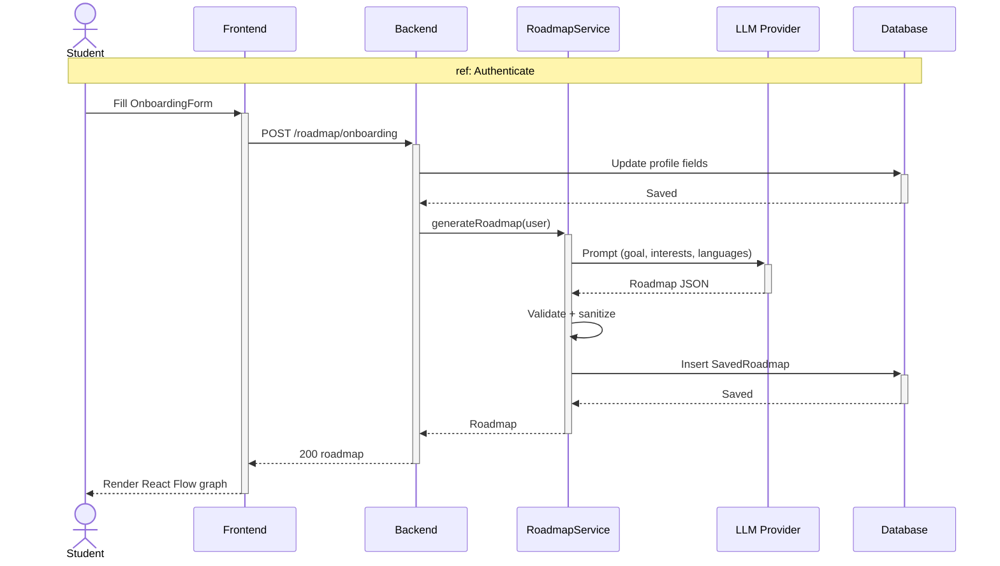
```mermaid
sequenceDiagram
    actor Student
    participant FE as Frontend
    participant API as Backend
    participant Svc as RoadmapService
    participant LLM as LLM Provider
    participant DB as Database

    Note over Student,DB: ref: Authenticate

    Student->>+FE: Fill OnboardingForm
    FE->>+API: POST /roadmap/onboarding
    API->>+DB: Update profile fields
    DB-->>-API: Saved
    API->>+Svc: generateRoadmap(user)
    Svc->>+LLM: Prompt (goal, interests, languages)
    LLM-->>-Svc: Roadmap JSON
    Svc->>Svc: Validate + sanitize
    Svc->>+DB: Insert SavedRoadmap
    DB-->>-Svc: Saved
    Svc-->>-API: Roadmap
    API-->>-FE: 200 roadmap
    FE-->>-Student: Render React Flow graph
```

### 4.4. Solve a problem (run + submit)

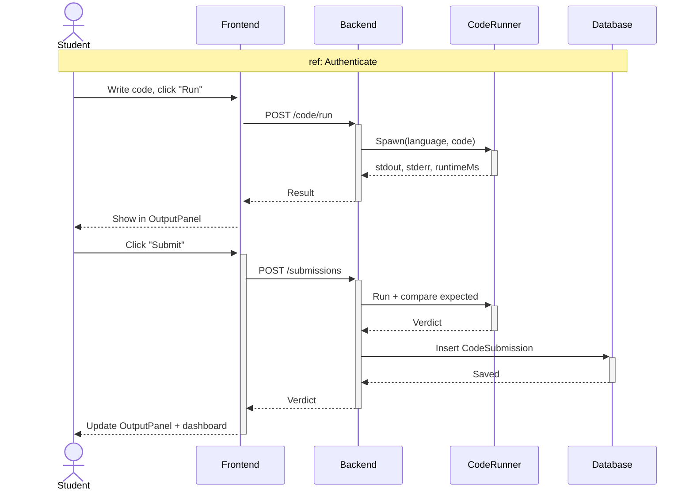
```mermaid
sequenceDiagram
    actor Student
    participant FE as Frontend
    participant API as Backend
    participant Sandbox as CodeRunner
    participant DB as Database

    Note over Student,DB: ref: Authenticate

    Student->>+FE: Write code, click "Run"
    FE->>+API: POST /code/run
    API->>+Sandbox: Spawn(language, code)
    Sandbox-->>-API: stdout, stderr, runtimeMs
    API-->>-FE: Result
    FE-->>Student: Show in OutputPanel

    Student->>+FE: Click "Submit"
    FE->>+API: POST /submissions
    API->>+Sandbox: Run + compare expected
    Sandbox-->>-API: Verdict
    API->>+DB: Insert CodeSubmission
    DB-->>-API: Saved
    API-->>-FE: Verdict
    FE-->>-Student: Update OutputPanel + dashboard
```

### 4.5. Ask the PDF assistant (RAG)

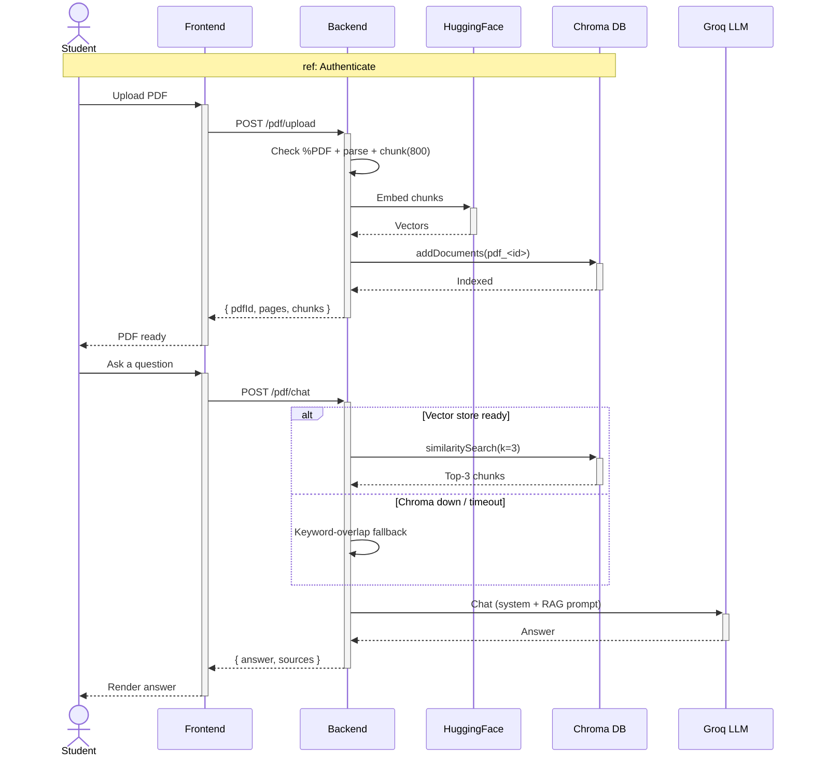
```mermaid
sequenceDiagram
    actor Student
    participant FE as Frontend
    participant API as Backend
    participant HF as HuggingFace
    participant VS as Chroma DB
    participant LLM as Groq LLM

    Note over Student,VS: ref: Authenticate

    Student->>+FE: Upload PDF
    FE->>+API: POST /pdf/upload
    API->>API: Check %PDF + parse + chunk(800)
    API->>+HF: Embed chunks
    HF-->>-API: Vectors
    API->>+VS: addDocuments(pdf_<id>)
    VS-->>-API: Indexed
    API-->>-FE: { pdfId, pages, chunks }
    FE-->>-Student: PDF ready

    Student->>+FE: Ask a question
    FE->>+API: POST /pdf/chat

    alt Vector store ready
        API->>+VS: similaritySearch(k=3)
        VS-->>-API: Top-3 chunks
    else Chroma down / timeout
        API->>API: Keyword-overlap fallback
    end

    API->>+LLM: Chat (system + RAG prompt)
    LLM-->>-API: Answer
    API-->>-FE: { answer, sources }
    FE-->>-Student: Render answer
```

> Full deep-dive (C4 levels 1-4, numerical defaults, failure modes, and the
> rest of the AI surfaces) lives in
> [08_chapitre6_sprint4.md §V](./08_chapitre6_sprint4.md#v-implementation).

### 4.6. Join a classroom

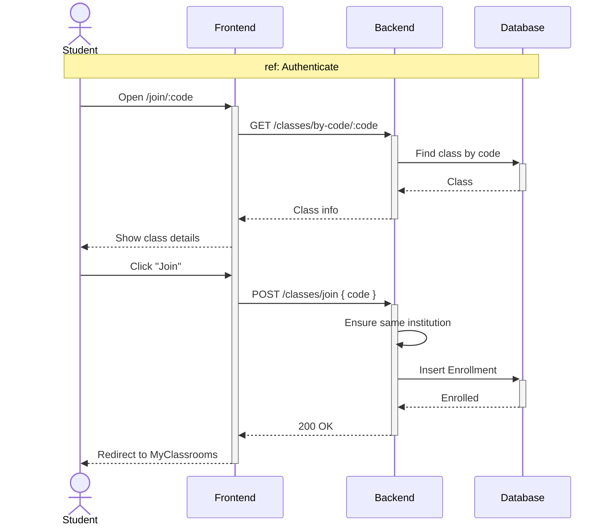
```mermaid
sequenceDiagram
    actor Student
    participant FE as Frontend
    participant API as Backend
    participant DB as Database

    Note over Student,DB: ref: Authenticate

    Student->>+FE: Open /join/:code
    FE->>+API: GET /classes/by-code/:code
    API->>+DB: Find class by code
    DB-->>-API: Class
    API-->>-FE: Class info
    FE-->>Student: Show class details

    Student->>FE: Click "Join"
    FE->>+API: POST /classes/join { code }
    API->>API: Ensure same institution
    API->>+DB: Insert Enrollment
    DB-->>-API: Enrolled
    API-->>-FE: 200 OK
    FE-->>-Student: Redirect to MyClassrooms
```

### 4.7. Real-time messaging

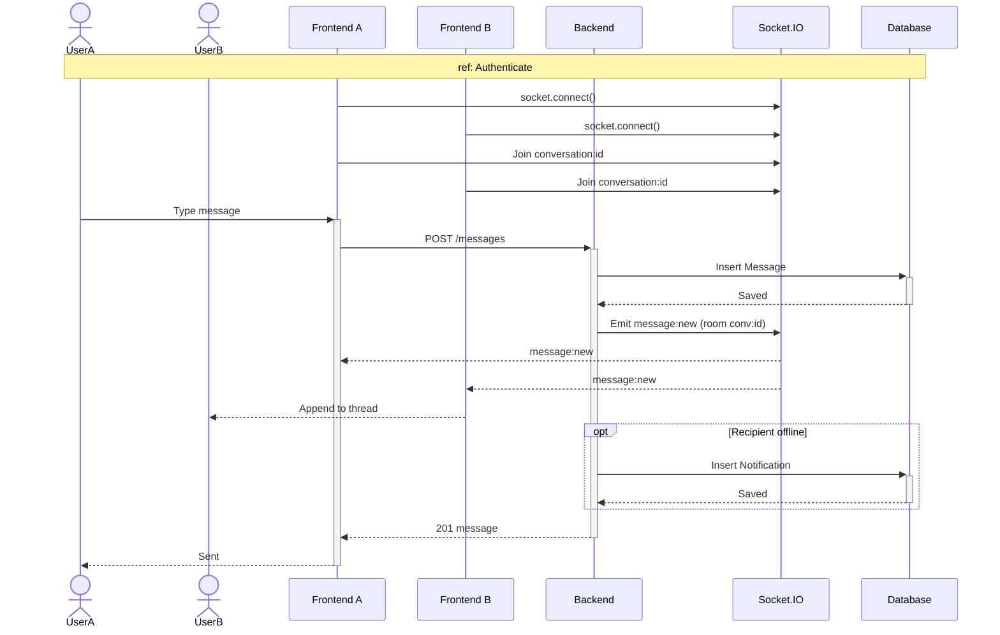
```mermaid
sequenceDiagram
    actor UserA
    actor UserB
    participant FE_A as Frontend A
    participant FE_B as Frontend B
    participant API as Backend
    participant Hub as Socket.IO
    participant DB as Database

    Note over UserA,DB: ref: Authenticate

    FE_A->>Hub: socket.connect()
    FE_B->>Hub: socket.connect()
    FE_A->>Hub: Join conversation:id
    FE_B->>Hub: Join conversation:id

    UserA->>+FE_A: Type message
    FE_A->>+API: POST /messages
    API->>+DB: Insert Message
    DB-->>-API: Saved
    API->>Hub: Emit message:new (room conv:id)
    Hub-->>FE_A: message:new
    Hub-->>FE_B: message:new
    FE_B-->>UserB: Append to thread

    opt Recipient offline
        API->>+DB: Insert Notification
        DB-->>-API: Saved
    end

    API-->>-FE_A: 201 message
    FE_A-->>-UserA: Sent
```

### 4.8. Onboard institution after Stripe checkout

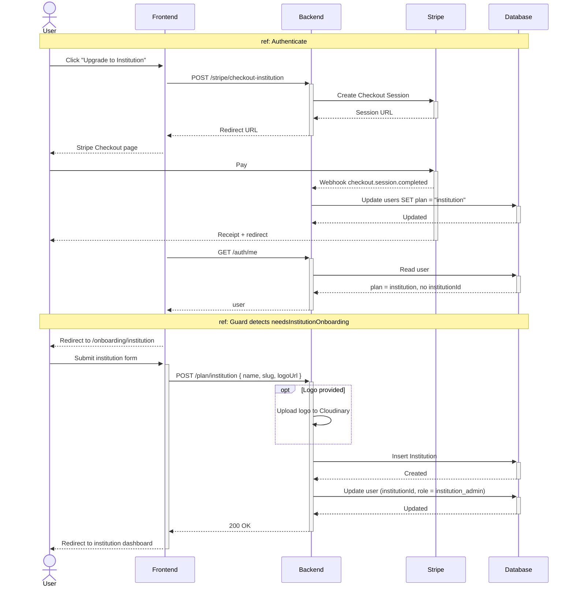
```mermaid
sequenceDiagram
    actor User
    participant FE as Frontend
    participant API as Backend
    participant Stripe as Stripe
    participant DB as Database

    Note over User,DB: ref: Authenticate

    User->>+FE: Click "Upgrade to Institution"
    FE->>+API: POST /stripe/checkout-institution
    API->>+Stripe: Create Checkout Session
    Stripe-->>-API: Session URL
    API-->>-FE: Redirect URL
    FE-->>User: Stripe Checkout page

    User->>+Stripe: Pay
    Stripe-->>API: Webhook checkout.session.completed
    API->>+DB: Update users SET plan = "institution"
    DB-->>-API: Updated
    Stripe-->>-User: Receipt + redirect

    FE->>+API: GET /auth/me
    API->>+DB: Read user
    DB-->>-API: plan = institution, no institutionId
    API-->>-FE: user

    Note over User,DB: ref: Guard detects needsInstitutionOnboarding

    FE-->>User: Redirect to /onboarding/institution
    User->>+FE: Submit institution form
    FE->>+API: POST /plan/institution { name, slug, logoUrl }

    opt Logo provided
        API->>API: Upload logo to Cloudinary
    end

    API->>+DB: Insert Institution
    DB-->>-API: Created
    API->>+DB: Update user (institutionId, role = institution_admin)
    DB-->>-API: Updated
    API-->>-FE: 200 OK
    FE-->>-User: Redirect to institution dashboard
```

### 4.9. Reset password (forgot + set new)

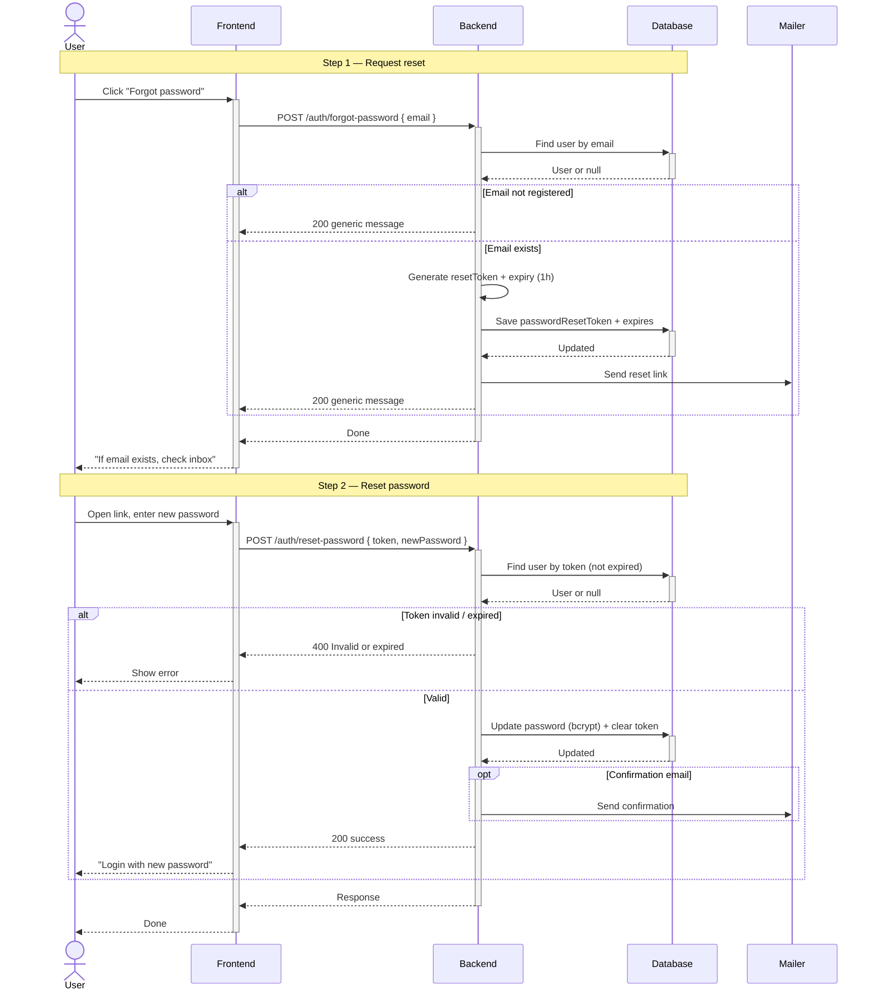
```mermaid
sequenceDiagram
    actor User
    participant FE as Frontend
    participant API as Backend
    participant DB as Database
    participant Mail as Mailer

    Note over User,DB: Step 1 — Request reset

    User->>+FE: Click "Forgot password"
    FE->>+API: POST /auth/forgot-password { email }
    API->>+DB: Find user by email
    DB-->>-API: User or null

    alt Email not registered
        API-->>FE: 200 generic message
    else Email exists
        API->>API: Generate resetToken + expiry (1h)
        API->>+DB: Save passwordResetToken + expires
        DB-->>-API: Updated
        API->>Mail: Send reset link
        API-->>FE: 200 generic message
    end

    API-->>-FE: Done
    FE-->>-User: "If email exists, check inbox"

    Note over User,DB: Step 2 — Reset password

    User->>+FE: Open link, enter new password
    FE->>+API: POST /auth/reset-password { token, newPassword }
    API->>+DB: Find user by token (not expired)
    DB-->>-API: User or null

    alt Token invalid / expired
        API-->>FE: 400 Invalid or expired
        FE-->>User: Show error
    else Valid
        API->>+DB: Update password (bcrypt) + clear token
        DB-->>-API: Updated
        opt Confirmation email
            API->>Mail: Send confirmation
        end
        API-->>FE: 200 success
        FE-->>User: "Login with new password"
    end

    API-->>-FE: Response
    FE-->>-User: Done
```

---

## 5. Activity diagrams

### 5.1. Profile completeness gate (`Guard`)

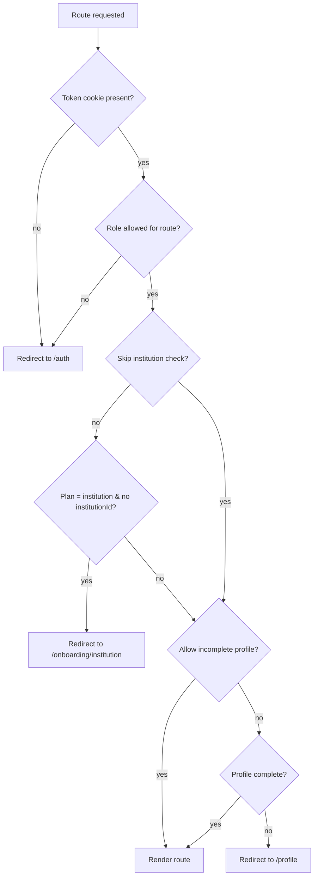
```mermaid
flowchart TD
  A[Route requested] --> B{Token cookie present?}
  B -- no --> L[Redirect to /auth]
  B -- yes --> C{Role allowed for route?}
  C -- no --> L
  C -- yes --> D{Skip institution check?}
  D -- no --> E{Plan = institution & no institutionId?}
  E -- yes --> M[Redirect to /onboarding/institution]
  E -- no --> F{Allow incomplete profile?}
  D -- yes --> F
  F -- yes --> R[Render route]
  F -- no --> G{Profile complete?}
  G -- yes --> R
  G -- no --> N[Redirect to /profile]
```

### 5.2. Toggle problem as Free-tier (Super Admin)

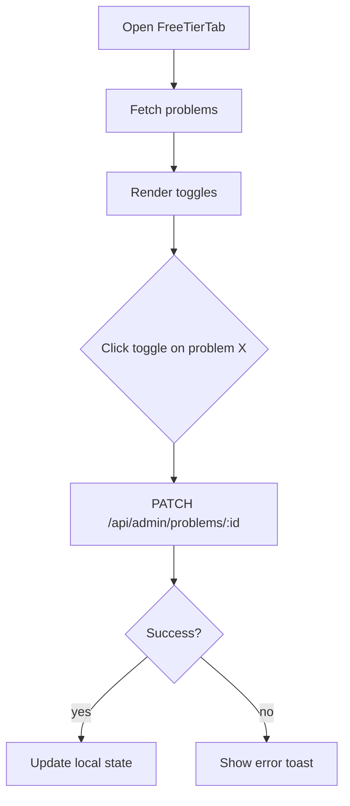
```mermaid
flowchart TD
  A[Open FreeTierTab] --> B[Fetch problems]
  B --> C[Render toggles]
  C --> D{Click toggle on problem X}
  D --> E[PATCH /api/admin/problems/:id]
  E --> F{Success?}
  F -- yes --> G[Update local state]
  F -- no --> H[Show error toast]
```

### 5.3. Ban a user

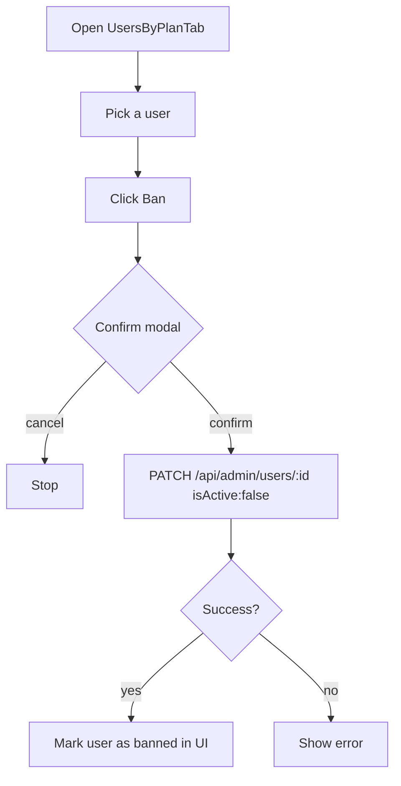
```mermaid
flowchart TD
  A[Open UsersByPlanTab] --> B[Pick a user]
  B --> C[Click Ban]
  C --> D{Confirm modal}
  D -- cancel --> E[Stop]
  D -- confirm --> F[PATCH /api/admin/users/:id isActive:false]
  F --> G{Success?}
  G -- yes --> H[Mark user as banned in UI]
  G -- no --> I[Show error]
```

### 5.4. Generate certificate at 100% roadmap progress

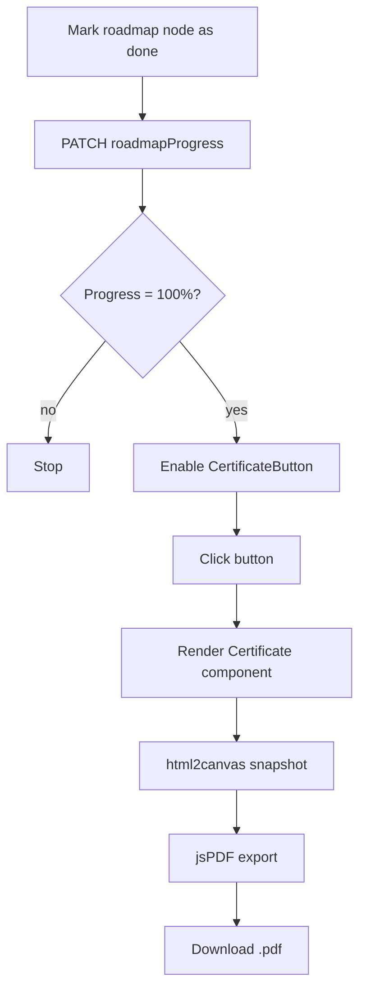
```mermaid
flowchart TD
  A[Mark roadmap node as done] --> B[PATCH roadmapProgress]
  B --> C{Progress = 100%?}
  C -- no --> D[Stop]
  C -- yes --> E[Enable CertificateButton]
  E --> F[Click button]
  F --> G[Render Certificate component]
  G --> H[html2canvas snapshot]
  H --> I[jsPDF export]
  I --> J[Download .pdf]
```

---

## 6. State machines

### 6.1. CodeSubmission lifecycle

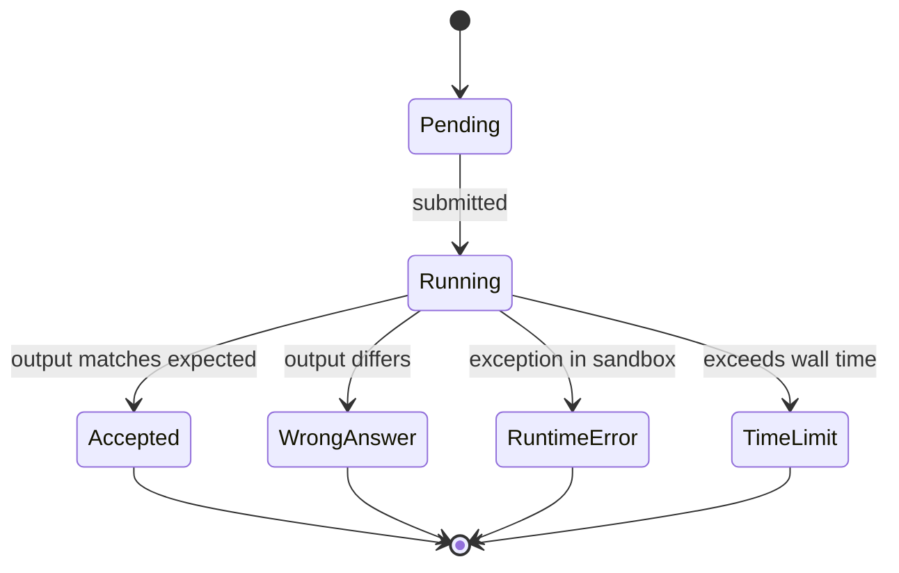
```mermaid
stateDiagram-v2
  [*] --> Pending
  Pending --> Running : submitted
  Running --> Accepted : output matches expected
  Running --> WrongAnswer : output differs
  Running --> RuntimeError : exception in sandbox
  Running --> TimeLimit : exceeds wall time
  Accepted --> [*]
  WrongAnswer --> [*]
  RuntimeError --> [*]
  TimeLimit --> [*]
```

### 6.2. User plan lifecycle

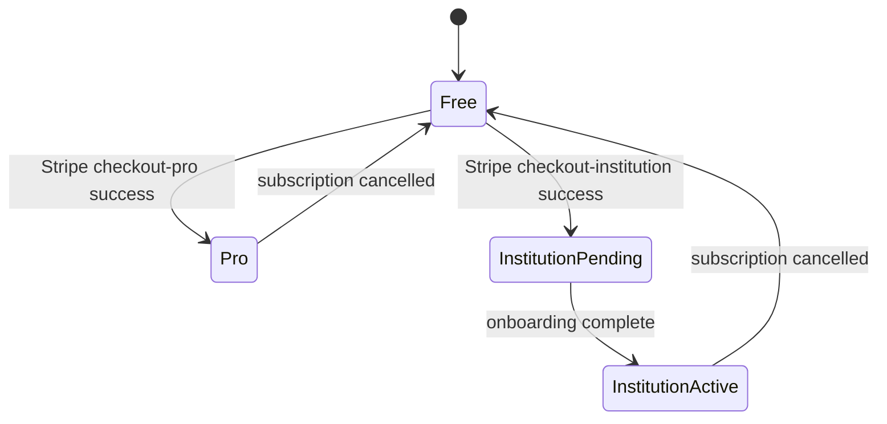
```mermaid
stateDiagram-v2
  [*] --> Free
  Free --> Pro : Stripe checkout-pro success
  Free --> InstitutionPending : Stripe checkout-institution success
  InstitutionPending --> InstitutionActive : onboarding complete
  Pro --> Free : subscription cancelled
  InstitutionActive --> Free : subscription cancelled
```

### 6.3. InviteLink lifecycle

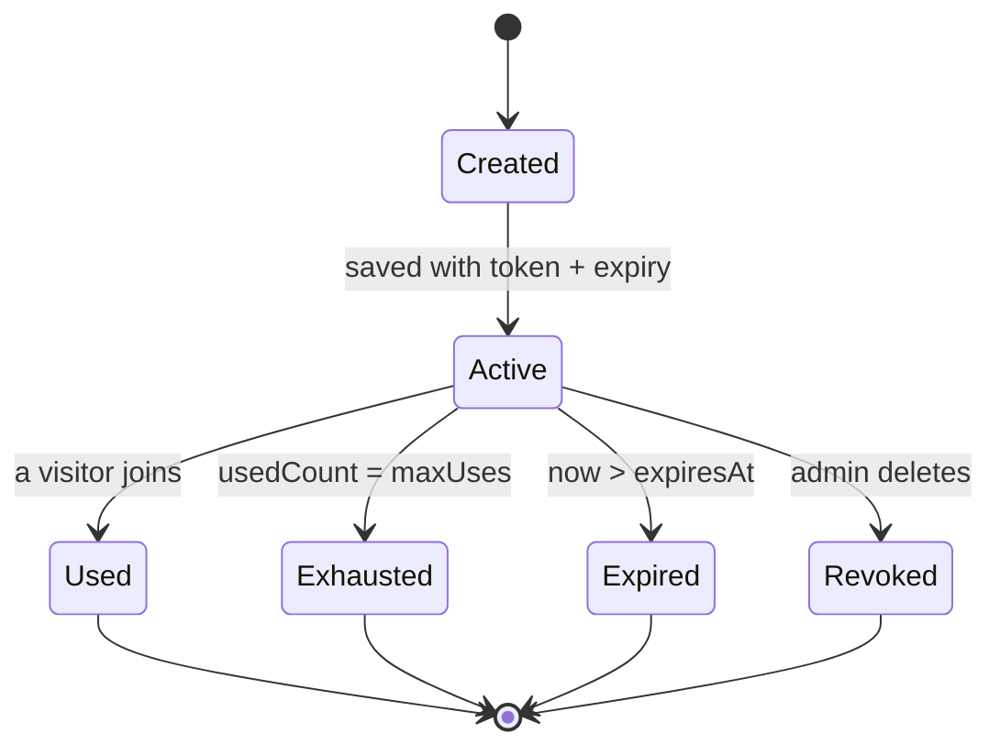
```mermaid
stateDiagram-v2
  [*] --> Created
  Created --> Active : saved with token + expiry
  Active --> Used : a visitor joins
  Active --> Exhausted : usedCount = maxUses
  Active --> Expired : now > expiresAt
  Active --> Revoked : admin deletes
  Used --> [*]
  Exhausted --> [*]
  Expired --> [*]
  Revoked --> [*]
```

---

## 7. Component diagram — Client folder structure

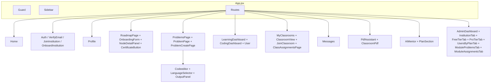
```mermaid
flowchart TB
  subgraph App["App.jsx"]
    Guard["Guard"]
    Sidebar["Sidebar"]
    Routes["Routes"]
  end

  Home["Home"]
  Auth["Auth / VerifyEmail / JoinInstitution / OnboardInstitution"]
  Profile["Profile"]
  Roadmap["RoadmapPage + OnboardingForm + NodeDetailPanel + CertificateButton"]
  Problems["ProblemsPage + ProblemPage + ProblemCreatePage"]
  Editor["Codeeditor + LanguageSelector + OutputPanel"]
  Dashboard["LearningDashboard + CodingDashboard + User"]
  Classroom["MyClassrooms + ClassroomView + JoinClassroom + ClassAssignmentsPage"]
  Messages["Messages"]
  PDF["PdfAssistant + ClassroomPdf"]
  AI["AIMentor + PlanSection"]
  Admin["AdminDashboard + InstitutionTab + FreeTierTab + ProTierTab + UsersByPlanTab + ModuleProblemsTab + ModuleAssignmentsTab"]

  Routes --> Home
  Routes --> Auth
  Routes --> Profile
  Routes --> Roadmap
  Routes --> Problems
  Problems --> Editor
  Routes --> Dashboard
  Routes --> Classroom
  Routes --> Messages
  Routes --> PDF
  Routes --> AI
  Routes --> Admin
```

