# Flows and Diagrams

This file gathers — in one place — the **flowcharts**, **sequence diagrams**, **activity diagrams**, **use-case diagrams** and **class diagrams** that describe OmniLearn end-to-end. The diagrams below are written in **Mermaid** so they can be rendered directly in any Markdown viewer that supports Mermaid (GitHub, VS Code, Obsidian, etc.).

---

## 1. High-level system architecture

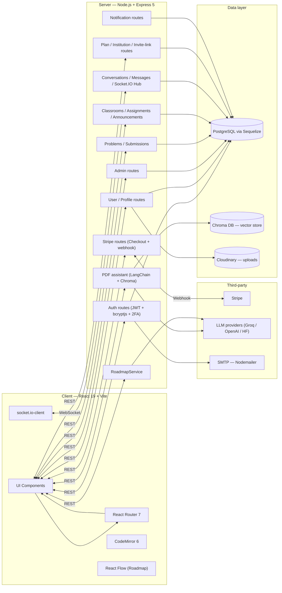
```mermaid
flowchart LR
  subgraph Client["Client — React 19 + Vite"]
    UI["UI Components"]
    Router["React Router 7"]
    Socket["socket.io-client"]
    Editor["CodeMirror 6"]
    Flow["React Flow (Roadmap)"]
  end

  subgraph Server["Server — Node.js + Express 5"]
    Auth["Auth routes (JWT + bcryptjs + 2FA)"]
    UserAPI["User / Profile routes"]
    AdminAPI["Admin routes"]
    Problems["Problems / Submissions"]
    Classroom["Classrooms / Assignments / Announcements"]
    Messaging["Conversations / Messages / Socket.IO Hub"]
    PDFAI["PDF assistant (LangChain + Chroma)"]
    RoadmapAI["RoadmapService"]
    Plan["Plan / Institution / Invite-link routes"]
    StripeAPI["Stripe routes (Checkout + webhook)"]
    Notif["Notification routes"]
  end

  subgraph Data["Data layer"]
    PG[("PostgreSQL via Sequelize")]
    Chroma[("Chroma DB — vector store")]
    Cloud[("Cloudinary — uploads")]
  end

  subgraph Third["Third-party"]
    StripeSvc["Stripe"]
    LLM["LLM providers (Groq / OpenAI / HF)"]
    SMTP["SMTP — Nodemailer"]
  end

  UI --> Router
  Router --> UI
  UI <-->|REST| Auth
  UI <-->|REST| UserAPI
  UI <-->|REST| AdminAPI
  UI <-->|REST| Problems
  UI <-->|REST| Classroom
  UI <-->|REST| PDFAI
  UI <-->|REST| RoadmapAI
  UI <-->|REST| Plan
  UI <-->|REST| StripeAPI
  Socket <-->|WebSocket| Messaging

  Auth --> PG
  UserAPI --> PG
  AdminAPI --> PG
  Problems --> PG
  Classroom --> PG
  Messaging --> PG
  Plan --> PG
  Notif --> PG
  PDFAI --> Chroma
  PDFAI --> LLM
  RoadmapAI --> LLM
  UserAPI --> Cloud
  StripeAPI <-->|Webhook| StripeSvc
  Auth --> SMTP
```

---

## 2. Global use-case diagram


```mermaid
flowchart LR
  Visitor((Visitor))
  Student((Student))
  Teacher((Teacher))
  InstAdmin((Institution Admin))
  SuperAdmin((Super Admin))

  Visitor --> SignUp["Sign up"]
  Visitor --> Verify["Verify email"]
  Visitor --> Login["Sign in"]

  Student --> Profile["Manage profile + 2FA"]
  Student --> Onboard["Roadmap onboarding"]
  Student --> Roadmap["View / progress roadmap"]
  Student --> Cert["Download certificate"]
  Student --> Problems["Browse problems"]
  Student --> Solve["Solve a problem (Editor + Submit)"]
  Student --> Dashboard["Coding dashboard"]
  Student --> JoinClass["Join classroom (code or invite)"]
  Student --> Class["View classroom + announcements + assignments"]
  Student --> SubmitAssn["Submit assignment"]
  Student --> Msg["Real-time messaging"]
  Student --> PDF["Ask PDF assistant"]
  Student --> Mentor["Ask AI Mentor"]
  Student --> LearnTags["Use learning tags (/ai, /stack-overflow, /youtube)"]

  Teacher --> CreateClass["Create class + invite code"]
  Teacher --> CreateCourse["Create course / module / lesson"]
  Teacher --> CreateAssn["Create assignment + attach problems"]
  Teacher --> Grade["Review + grade submissions"]
  Teacher --> Announce["Post announcement"]
  Teacher --> PDFUpload["Upload lesson PDF"]
  Teacher --> Msg

  InstAdmin --> OnboardInst["Onboard institution"]
  InstAdmin --> Invites["Generate / revoke invite links"]
  InstAdmin --> Curriculum["Manage Grades / Specialities / Levels"]
  InstAdmin --> Directory["Manage member directory"]
  InstAdmin --> Assign["Assign teachers to classes"]

  SuperAdmin --> Insts["Manage institutions"]
  SuperAdmin --> ProbsAdmin["Manage problem catalogue"]
  SuperAdmin --> FreeTier["Toggle Free-tier"]
  SuperAdmin --> ProTier["Toggle Pro-tier"]
  SuperAdmin --> Ban["Ban / unban users"]
  SuperAdmin --> Stats["View global statistics"]
```

---

## 3. End-to-end class diagram (data model)

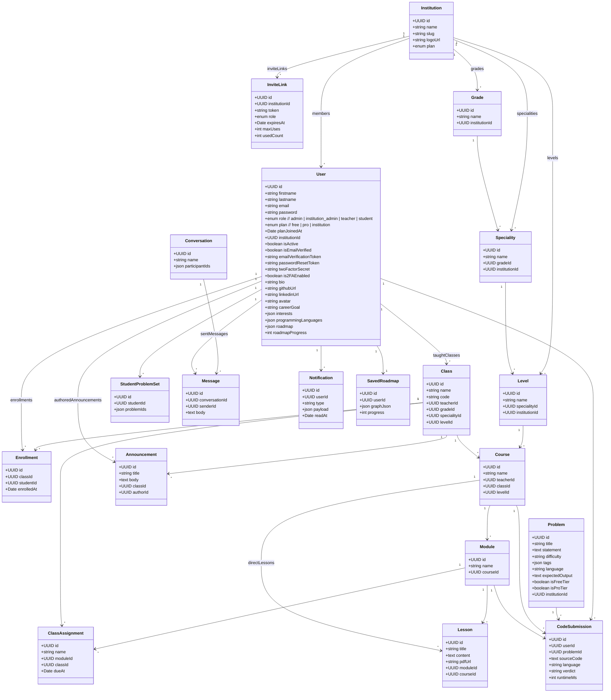
```mermaid
classDiagram
  class User {
    +UUID id
    +string firstname
    +string lastname
    +string email
    +string password
    +enum role  // admin | institution_admin | teacher | student
    +enum plan  // free | pro | institution
    +Date planJoinedAt
    +UUID institutionId
    +boolean isActive
    +boolean isEmailVerified
    +string emailVerificationToken
    +string passwordResetToken
    +string twoFactorSecret
    +boolean is2FAEnabled
    +string bio
    +string githubUrl
    +string linkedinUrl
    +string avatar
    +string careerGoal
    +json interests
    +json programmingLanguages
    +json roadmap
    +int roadmapProgress
  }

  class Institution {
    +UUID id
    +string name
    +string slug
    +string logoUrl
    +enum plan
  }

  class InviteLink {
    +UUID id
    +UUID institutionId
    +string token
    +enum role
    +Date expiresAt
    +int maxUses
    +int usedCount
  }

  class Grade {
    +UUID id
    +string name
    +UUID institutionId
  }
  class Speciality {
    +UUID id
    +string name
    +UUID gradeId
    +UUID institutionId
  }
  class Level {
    +UUID id
    +string name
    +UUID specialityId
    +UUID institutionId
  }

  class Class {
    +UUID id
    +string name
    +string code
    +UUID teacherId
    +UUID gradeId
    +UUID specialityId
    +UUID levelId
  }
  class Enrollment {
    +UUID id
    +UUID classId
    +UUID studentId
    +Date enrolledAt
  }
  class Course {
    +UUID id
    +string name
    +UUID teacherId
    +UUID classId
    +UUID levelId
  }
  class Module {
    +UUID id
    +string name
    +UUID courseId
  }
  class Lesson {
    +UUID id
    +string title
    +text content
    +string pdfUrl
    +UUID moduleId
    +UUID courseId
  }
  class ClassAssignment {
    +UUID id
    +string name
    +UUID moduleId
    +UUID classId
    +Date dueAt
  }
  class Announcement {
    +UUID id
    +string title
    +text body
    +UUID classId
    +UUID authorId
  }
  class Problem {
    +UUID id
    +string title
    +text statement
    +string difficulty
    +json tags
    +string language
    +text expectedOutput
    +boolean isFreeTier
    +boolean isProTier
    +UUID institutionId
  }
  class CodeSubmission {
    +UUID id
    +UUID userId
    +UUID problemId
    +text sourceCode
    +string language
    +string verdict
    +int runtimeMs
  }
  class StudentProblemSet {
    +UUID id
    +UUID studentId
    +json problemIds
  }
  class Conversation {
    +UUID id
    +string name
    +json participantIds
  }
  class Message {
    +UUID id
    +UUID conversationId
    +UUID senderId
    +text body
  }
  class Notification {
    +UUID id
    +UUID userId
    +string type
    +json payload
    +Date readAt
  }
  class SavedRoadmap {
    +UUID id
    +UUID userId
    +json graphJson
    +int progress
  }

  Institution "1" --> "*" User : members
  Institution "1" --> "*" InviteLink : inviteLinks
  Institution "1" --> "*" Grade : grades
  Institution "1" --> "*" Speciality : specialities
  Institution "1" --> "*" Level : levels

  Grade "1" --> "*" Speciality
  Speciality "1" --> "*" Level
  Level "1" --> "*" Course

  User "1" --> "*" Class : taughtClasses
  Class "1" --> "*" Enrollment
  User "1" --> "*" Enrollment : enrollments
  Class "1" --> "*" Course
  Course "1" --> "*" Module
  Module "1" --> "*" Lesson
  Course "1" --> "*" Lesson : directLessons
  Module "1" --> "*" ClassAssignment
  Class "1" --> "*" ClassAssignment
  Class "1" --> "*" Announcement
  User "1" --> "*" Announcement : authoredAnnouncements
  User "1" --> "*" CodeSubmission
  Problem "1" --> "*" CodeSubmission
  Course "1" --> "*" CodeSubmission
  Module "1" --> "*" CodeSubmission
  User "1" --> "*" StudentProblemSet
  Conversation "1" --> "*" Message
  User "1" --> "*" Message : sentMessages
  User "1" --> "*" Notification
  User "1" --> "1" SavedRoadmap
```

---

## 4. Sequence diagrams

### 4.1. Sign up + email verification

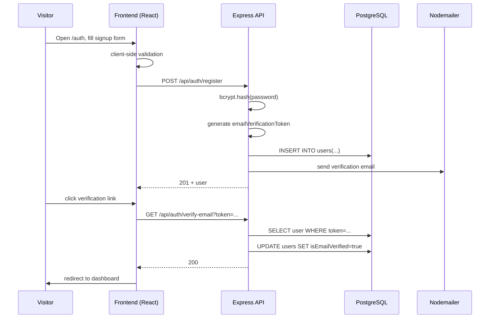
```mermaid
sequenceDiagram
  participant V as Visitor
  participant FE as Frontend (React)
  participant API as Express API
  participant DB as PostgreSQL
  participant SMTP as Nodemailer

  V->>FE: Open /auth, fill signup form
  FE->>FE: client-side validation
  FE->>API: POST /api/auth/register
  API->>API: bcrypt.hash(password)
  API->>API: generate emailVerificationToken
  API->>DB: INSERT INTO users(...)
  API->>SMTP: send verification email
  API-->>FE: 201 + user
  V->>FE: click verification link
  FE->>API: GET /api/auth/verify-email?token=...
  API->>DB: SELECT user WHERE token=...
  API->>DB: UPDATE users SET isEmailVerified=true
  API-->>FE: 200
  FE->>V: redirect to dashboard
```

### 4.2. Sign in (with optional 2FA)

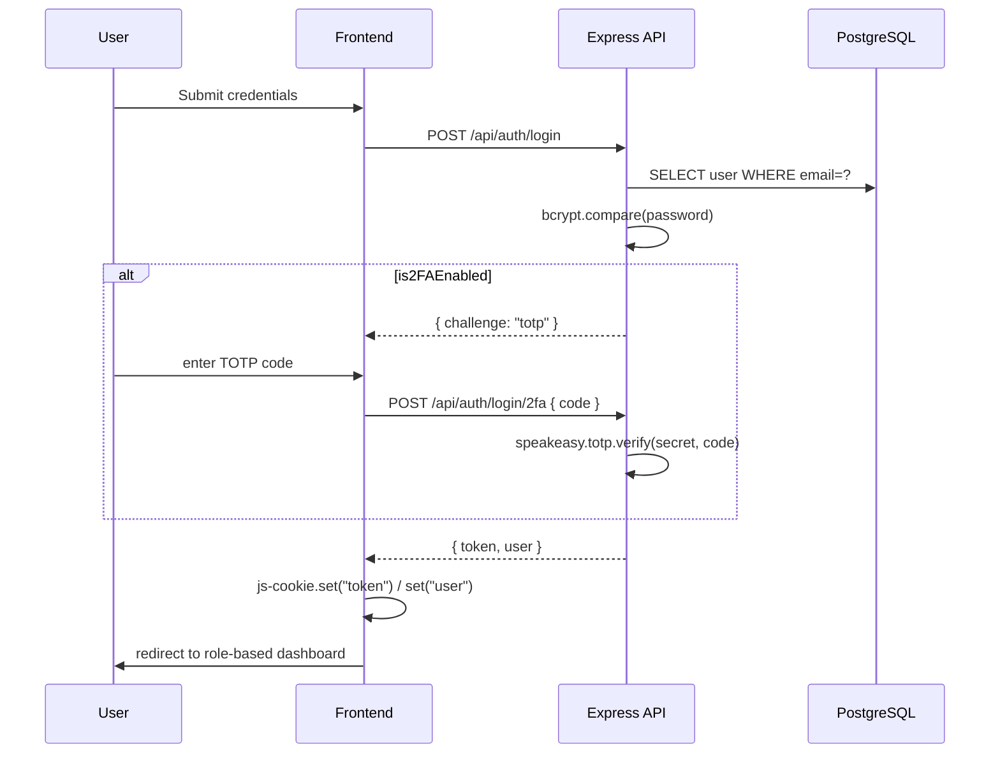
```mermaid
sequenceDiagram
  participant U as User
  participant FE as Frontend
  participant API as Express API
  participant DB as PostgreSQL

  U->>FE: Submit credentials
  FE->>API: POST /api/auth/login
  API->>DB: SELECT user WHERE email=?
  API->>API: bcrypt.compare(password)
  alt is2FAEnabled
    API-->>FE: { challenge: "totp" }
    U->>FE: enter TOTP code
    FE->>API: POST /api/auth/login/2fa { code }
    API->>API: speakeasy.totp.verify(secret, code)
  end
  API-->>FE: { token, user }
  FE->>FE: js-cookie.set("token") / set("user")
  FE->>U: redirect to role-based dashboard
```

### 4.3. Generate personalized roadmap

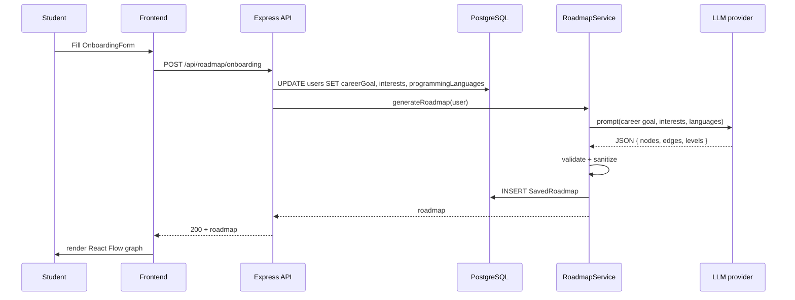
```mermaid
sequenceDiagram
  participant S as Student
  participant FE as Frontend
  participant API as Express API
  participant DB as PostgreSQL
  participant SVC as RoadmapService
  participant LLM as LLM provider

  S->>FE: Fill OnboardingForm
  FE->>API: POST /api/roadmap/onboarding
  API->>DB: UPDATE users SET careerGoal, interests, programmingLanguages
  API->>SVC: generateRoadmap(user)
  SVC->>LLM: prompt(career goal, interests, languages)
  LLM-->>SVC: JSON { nodes, edges, levels }
  SVC->>SVC: validate + sanitize
  SVC->>DB: INSERT SavedRoadmap
  SVC-->>API: roadmap
  API-->>FE: 200 + roadmap
  FE->>S: render React Flow graph
```

### 4.4. Solve a problem (run + submit)

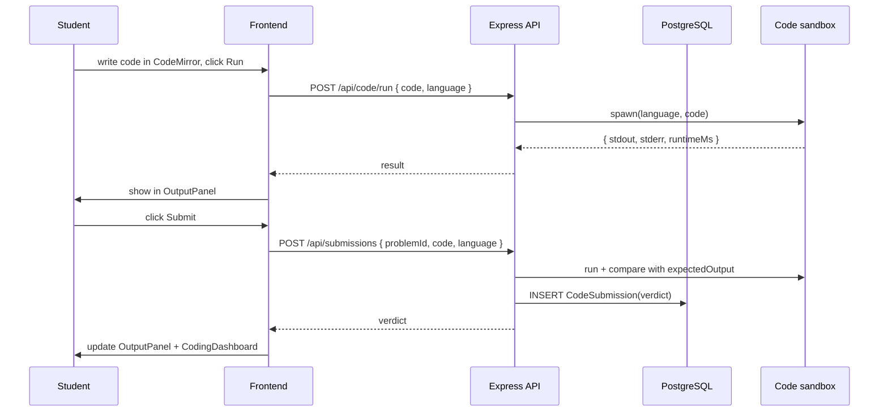
```mermaid
sequenceDiagram
  participant S as Student
  participant FE as Frontend
  participant API as Express API
  participant DB as PostgreSQL
  participant SBX as Code sandbox

  S->>FE: write code in CodeMirror, click Run
  FE->>API: POST /api/code/run { code, language }
  API->>SBX: spawn(language, code)
  SBX-->>API: { stdout, stderr, runtimeMs }
  API-->>FE: result
  FE->>S: show in OutputPanel
  S->>FE: click Submit
  FE->>API: POST /api/submissions { problemId, code, language }
  API->>SBX: run + compare with expectedOutput
  API->>DB: INSERT CodeSubmission(verdict)
  API-->>FE: verdict
  FE->>S: update OutputPanel + CodingDashboard
```

### 4.5. Ask the PDF assistant (RAG)

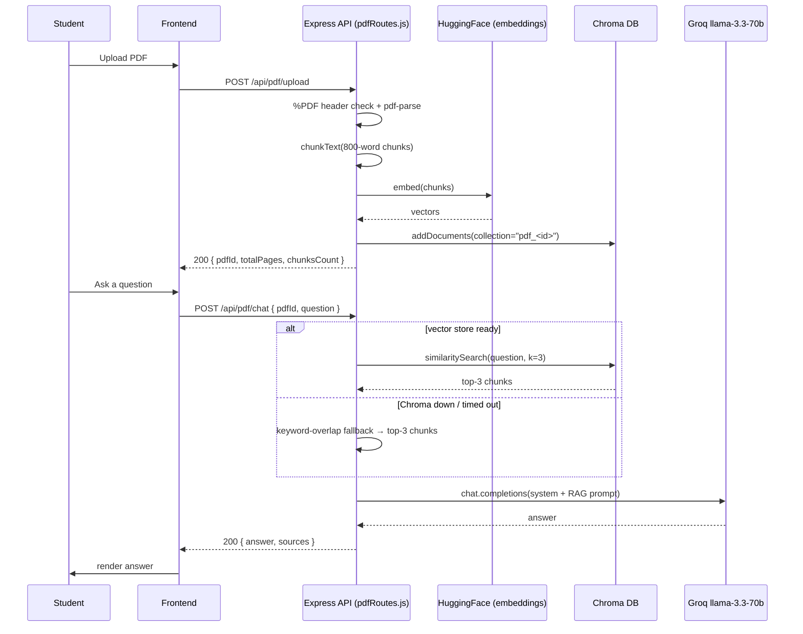
```mermaid
sequenceDiagram
  participant S as Student
  participant FE as Frontend
  participant API as Express API (pdfRoutes.js)
  participant HF as HuggingFace (embeddings)
  participant VS as Chroma DB
  participant LLM as Groq llama-3.3-70b

  S->>FE: Upload PDF
  FE->>API: POST /api/pdf/upload
  API->>API: %PDF header check + pdf-parse
  API->>API: chunkText(800-word chunks)
  API->>HF: embed(chunks)
  HF-->>API: vectors
  API->>VS: addDocuments(collection="pdf_<id>")
  API-->>FE: 200 { pdfId, totalPages, chunksCount }

  S->>FE: Ask a question
  FE->>API: POST /api/pdf/chat { pdfId, question }
  alt vector store ready
    API->>VS: similaritySearch(question, k=3)
    VS-->>API: top-3 chunks
  else Chroma down / timed out
    API->>API: keyword-overlap fallback → top-3 chunks
  end
  API->>LLM: chat.completions(system + RAG prompt)
  LLM-->>API: answer
  API-->>FE: 200 { answer, sources }
  FE->>S: render answer
```

> Full deep-dive (with C4 levels 1-4 and every numerical default) lives in
> [ai_features_and_rag.md](./ai_features_and_rag.md).

### 4.6. Join a classroom

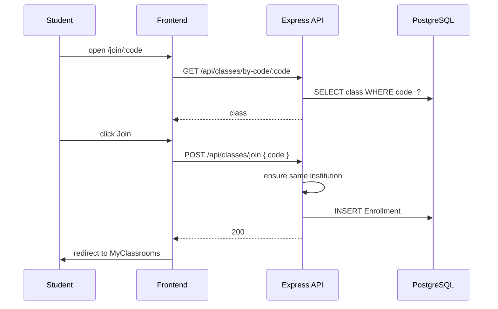
```mermaid
sequenceDiagram
  participant S as Student
  participant FE as Frontend
  participant API as Express API
  participant DB as PostgreSQL

  S->>FE: open /join/:code
  FE->>API: GET /api/classes/by-code/:code
  API->>DB: SELECT class WHERE code=?
  API-->>FE: class
  S->>FE: click Join
  FE->>API: POST /api/classes/join { code }
  API->>API: ensure same institution
  API->>DB: INSERT Enrollment
  API-->>FE: 200
  FE->>S: redirect to MyClassrooms
```

### 4.7. Real-time messaging

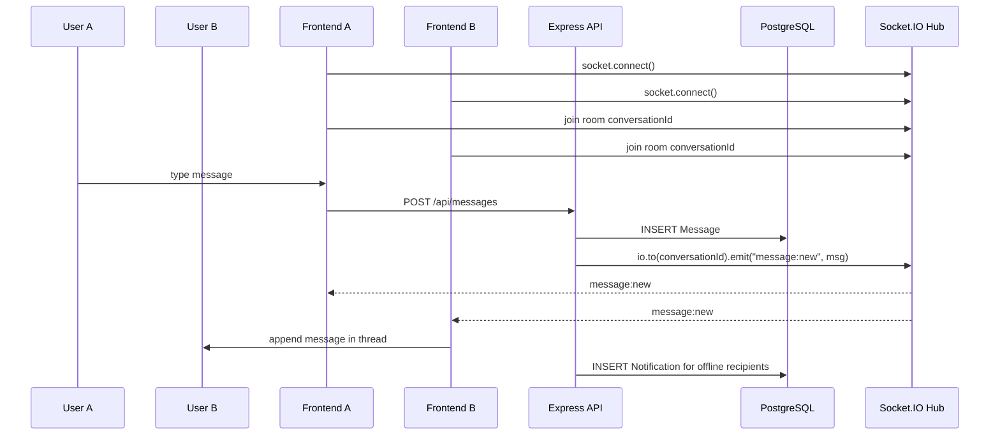
```mermaid
sequenceDiagram
  participant A as User A
  participant B as User B
  participant FE_A as Frontend A
  participant FE_B as Frontend B
  participant API as Express API
  participant DB as PostgreSQL
  participant IO as Socket.IO Hub

  FE_A->>IO: socket.connect()
  FE_B->>IO: socket.connect()
  FE_A->>IO: join room conversationId
  FE_B->>IO: join room conversationId
  A->>FE_A: type message
  FE_A->>API: POST /api/messages
  API->>DB: INSERT Message
  API->>IO: io.to(conversationId).emit("message:new", msg)
  IO-->>FE_A: message:new
  IO-->>FE_B: message:new
  FE_B->>B: append message in thread
  API->>DB: INSERT Notification for offline recipients
```

### 4.8. Onboard institution after Stripe checkout

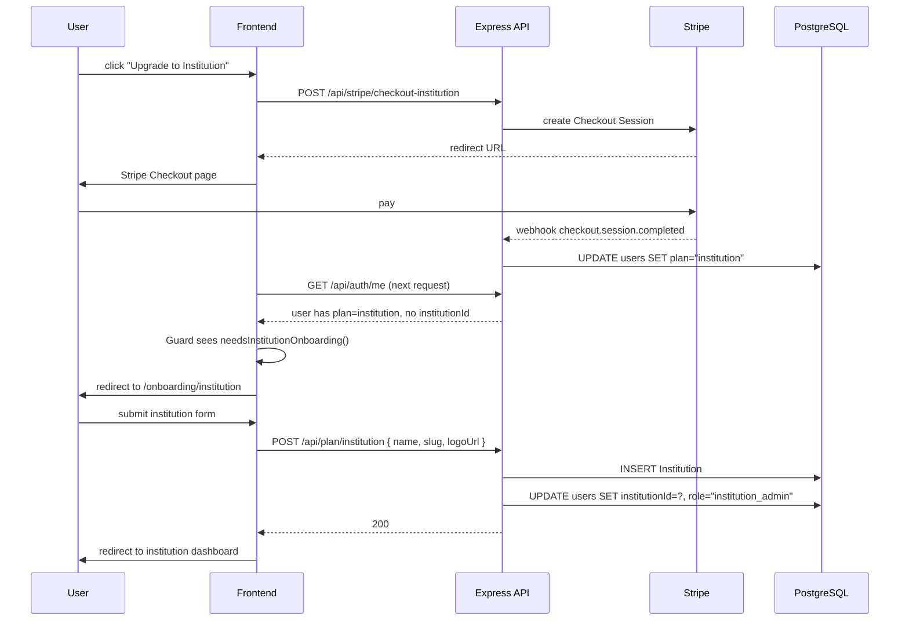
```mermaid
sequenceDiagram
  participant U as User
  participant FE as Frontend
  participant API as Express API
  participant Stripe
  participant DB as PostgreSQL

  U->>FE: click "Upgrade to Institution"
  FE->>API: POST /api/stripe/checkout-institution
  API->>Stripe: create Checkout Session
  Stripe-->>FE: redirect URL
  FE->>U: Stripe Checkout page
  U->>Stripe: pay
  Stripe-->>API: webhook checkout.session.completed
  API->>DB: UPDATE users SET plan="institution"
  FE->>API: GET /api/auth/me (next request)
  API-->>FE: user has plan=institution, no institutionId
  FE->>FE: Guard sees needsInstitutionOnboarding()
  FE->>U: redirect to /onboarding/institution
  U->>FE: submit institution form
  FE->>API: POST /api/plan/institution { name, slug, logoUrl }
  API->>DB: INSERT Institution
  API->>DB: UPDATE users SET institutionId=?, role="institution_admin"
  API-->>FE: 200
  FE->>U: redirect to institution dashboard
```

---

## 5. Activity diagrams

### 5.1. Profile completeness gate (`Guard`)

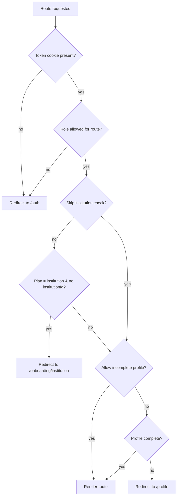
```mermaid
flowchart TD
  A[Route requested] --> B{Token cookie present?}
  B -- no --> L[Redirect to /auth]
  B -- yes --> C{Role allowed for route?}
  C -- no --> L
  C -- yes --> D{Skip institution check?}
  D -- no --> E{Plan = institution & no institutionId?}
  E -- yes --> M[Redirect to /onboarding/institution]
  E -- no --> F{Allow incomplete profile?}
  D -- yes --> F
  F -- yes --> R[Render route]
  F -- no --> G{Profile complete?}
  G -- yes --> R
  G -- no --> N[Redirect to /profile]
```

### 5.2. Toggle problem as Free-tier (Super Admin)

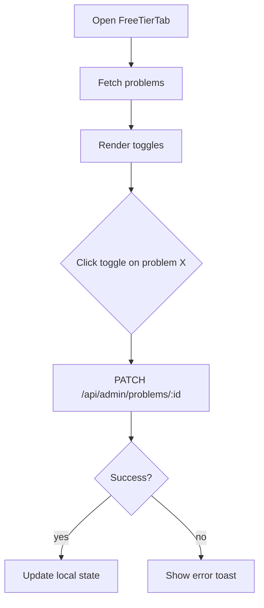
```mermaid
flowchart TD
  A[Open FreeTierTab] --> B[Fetch problems]
  B --> C[Render toggles]
  C --> D{Click toggle on problem X}
  D --> E[PATCH /api/admin/problems/:id]
  E --> F{Success?}
  F -- yes --> G[Update local state]
  F -- no --> H[Show error toast]
```

### 5.3. Ban a user

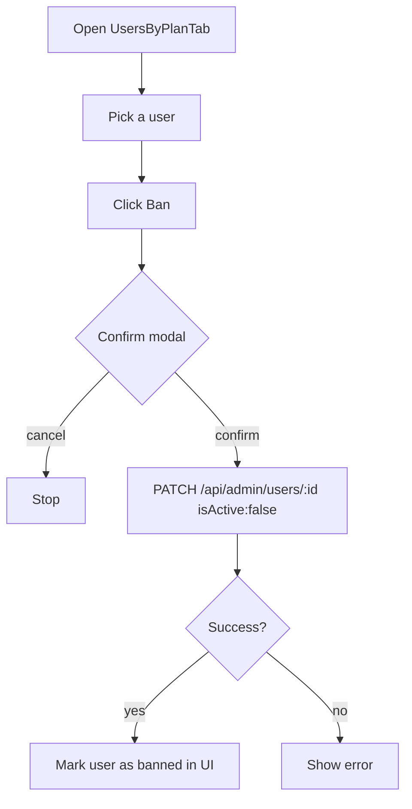
```mermaid
flowchart TD
  A[Open UsersByPlanTab] --> B[Pick a user]
  B --> C[Click Ban]
  C --> D{Confirm modal}
  D -- cancel --> E[Stop]
  D -- confirm --> F[PATCH /api/admin/users/:id isActive:false]
  F --> G{Success?}
  G -- yes --> H[Mark user as banned in UI]
  G -- no --> I[Show error]
```

### 5.4. Generate certificate at 100% roadmap progress

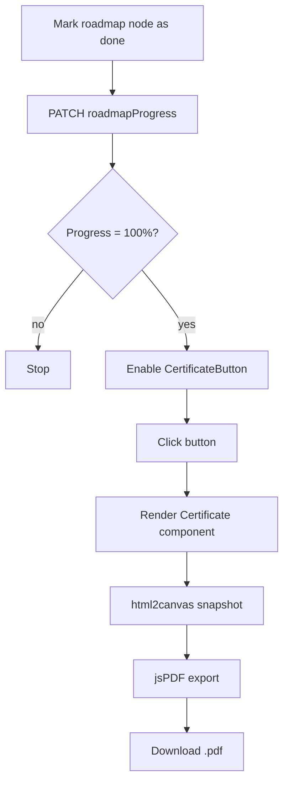
```mermaid
flowchart TD
  A[Mark roadmap node as done] --> B[PATCH roadmapProgress]
  B --> C{Progress = 100%?}
  C -- no --> D[Stop]
  C -- yes --> E[Enable CertificateButton]
  E --> F[Click button]
  F --> G[Render Certificate component]
  G --> H[html2canvas snapshot]
  H --> I[jsPDF export]
  I --> J[Download .pdf]
```

---

## 6. State machines

### 6.1. CodeSubmission lifecycle

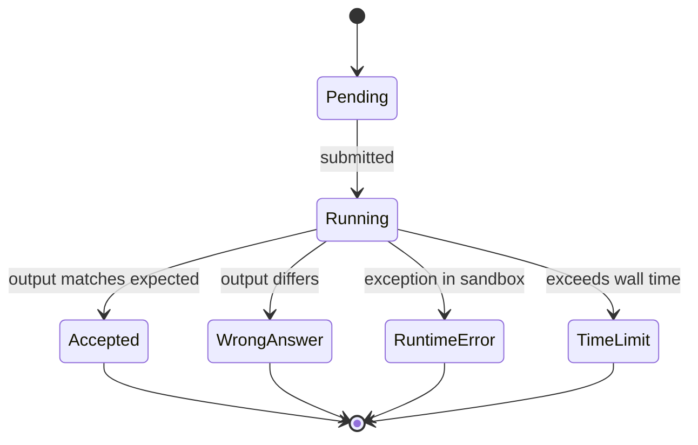
```mermaid
stateDiagram-v2
  [*] --> Pending
  Pending --> Running : submitted
  Running --> Accepted : output matches expected
  Running --> WrongAnswer : output differs
  Running --> RuntimeError : exception in sandbox
  Running --> TimeLimit : exceeds wall time
  Accepted --> [*]
  WrongAnswer --> [*]
  RuntimeError --> [*]
  TimeLimit --> [*]
```

### 6.2. User plan lifecycle

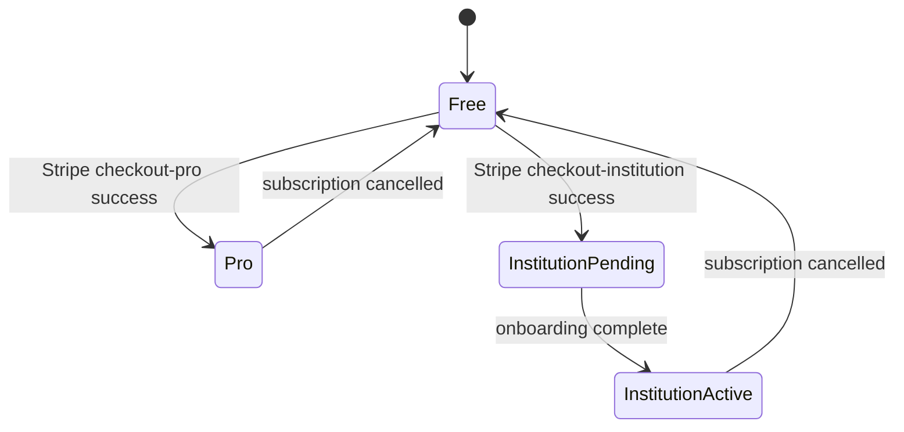
```mermaid
stateDiagram-v2
  [*] --> Free
  Free --> Pro : Stripe checkout-pro success
  Free --> InstitutionPending : Stripe checkout-institution success
  InstitutionPending --> InstitutionActive : onboarding complete
  Pro --> Free : subscription cancelled
  InstitutionActive --> Free : subscription cancelled
```

### 6.3. InviteLink lifecycle

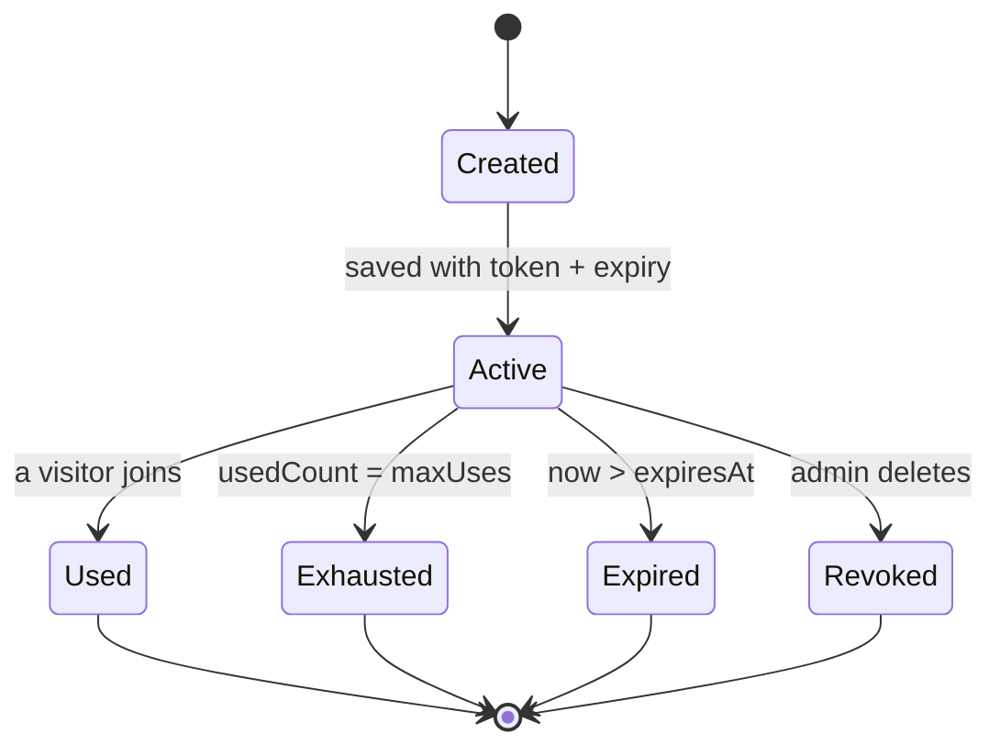
```mermaid
stateDiagram-v2
  [*] --> Created
  Created --> Active : saved with token + expiry
  Active --> Used : a visitor joins
  Active --> Exhausted : usedCount = maxUses
  Active --> Expired : now > expiresAt
  Active --> Revoked : admin deletes
  Used --> [*]
  Exhausted --> [*]
  Expired --> [*]
  Revoked --> [*]
```

---

## 7. Component diagram — Client folder structure

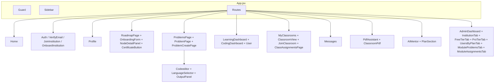
```mermaid
flowchart TB
  subgraph App["App.jsx"]
    Guard["Guard"]
    Sidebar["Sidebar"]
    Routes["Routes"]
  end

  Home["Home"]
  Auth["Auth / VerifyEmail / JoinInstitution / OnboardInstitution"]
  Profile["Profile"]
  Roadmap["RoadmapPage + OnboardingForm + NodeDetailPanel + CertificateButton"]
  Problems["ProblemsPage + ProblemPage + ProblemCreatePage"]
  Editor["Codeeditor + LanguageSelector + OutputPanel"]
  Dashboard["LearningDashboard + CodingDashboard + User"]
  Classroom["MyClassrooms + ClassroomView + JoinClassroom + ClassAssignmentsPage"]
  Messages["Messages"]
  PDF["PdfAssistant + ClassroomPdf"]
  AI["AIMentor + PlanSection"]
  Admin["AdminDashboard + InstitutionTab + FreeTierTab + ProTierTab + UsersByPlanTab + ModuleProblemsTab + ModuleAssignmentsTab"]

  Routes --> Home
  Routes --> Auth
  Routes --> Profile
  Routes --> Roadmap
  Routes --> Problems
  Problems --> Editor
  Routes --> Dashboard
  Routes --> Classroom
  Routes --> Messages
  Routes --> PDF
  Routes --> AI
  Routes --> Admin
```

---

## 8. RAG architecture (C4 model)

This section is a compact "in-place" version of the longer write-up in
[ai_features_and_rag.md](./ai_features_and_rag.md). It gives the four
canonical C4 levels for the PDF assistant's RAG pipeline.

### 8.1. Level 1 — System Context

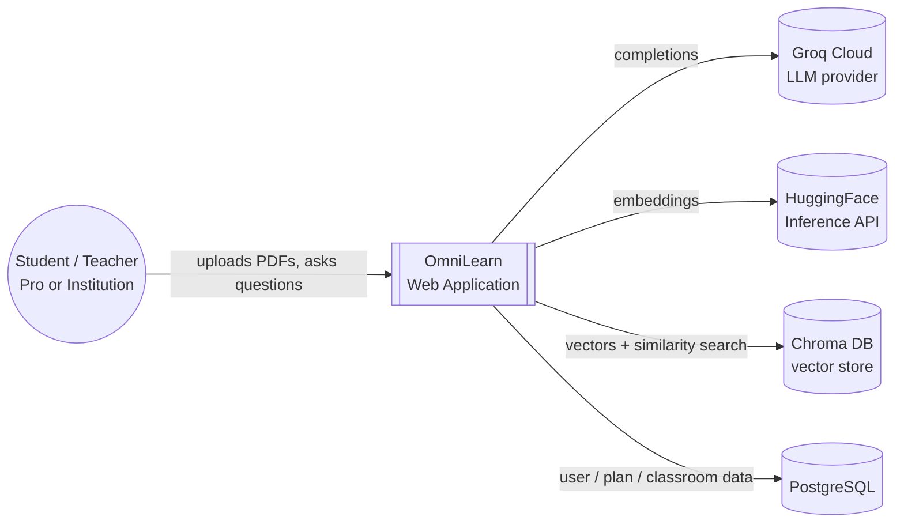
```mermaid
flowchart LR
  Student((Student / Teacher\nPro or Institution))
  OmniLearn[["OmniLearn\nWeb Application"]]
  Groq[("Groq Cloud\nLLM provider")]
  HF[("HuggingFace\nInference API")]
  Chroma[("Chroma DB\nvector store")]
  PG[("PostgreSQL")]

  Student -- "uploads PDFs, asks questions" --> OmniLearn
  OmniLearn -- "completions" --> Groq
  OmniLearn -- "embeddings" --> HF
  OmniLearn -- "vectors + similarity search" --> Chroma
  OmniLearn -- "user / plan / classroom data" --> PG
```

### 8.2. Level 2 — Containers

```mermaid
flowchart TB
  subgraph Browser["Browser — React 19 SPA"]
    PdfUI["PdfAssistant.jsx /\nClassroomPdf.jsx"]
  end

  subgraph Server["Node.js / Express 5 API"]
    PdfRouter["pdfRoutes.js\n/api/pdf/*"]
    AuthMW["Authmiddleware.js\nauthenticate + requirePro"]
  end

  subgraph Data["Data plane"]
    Disk[("uploads/*.pdf\n+ index.json")]
    Chroma[("Chroma DB")]
  end

  subgraph AI["AI plane"]
    HF[("HuggingFace\nall-MiniLM-L6-v2")]
    Groq[("Groq\nllama-3.3-70b-versatile")]
  end

  PdfUI -- "HTTPS / JSON\nmultipart" --> AuthMW --> PdfRouter
  PdfRouter -- "fs" --> Disk
  PdfRouter -- "embed" --> HF
  PdfRouter -- "addDocuments /\nsimilaritySearch" --> Chroma
  PdfRouter -- "chat.completions" --> Groq
```

### 8.3. Level 3 — Components inside `pdfRoutes.js`

```mermaid
flowchart TB
  subgraph PDF["Component view of pdfRoutes.js"]
    Upload["upload handler\n(multer + %PDF check + pdf-parse)"]
    Chunker["chunkText()\n800-word chunker"]
    Embed["HuggingFaceInferenceEmbeddings"]
    Vector["Chroma vector store"]
    Cache["pdfCache (Map)\n+ index.json"]
    Loader["loadPdfData() /\nloadPdfTextOnly()"]
    Retriever["similaritySearch(q, k)"]
    Keyword["keyword fallback\n(word overlap)"]
    Prompt["RAG prompt builder"]
    Groq2["groq.chat.completions"]
    Highlights["highlights /\nbookmarks (Map)"]
  end

  Upload --> Chunker --> Embed --> Vector
  Upload --> Cache --> Loader
  Loader --> Retriever
  Retriever -. "Chroma down / timeout" .-> Keyword
  Retriever --> Prompt --> Groq2
  Keyword --> Prompt
```

### 8.4. Level 4 — Code paths

**Ingestion** (`POST /api/pdf/upload`):

```
multer.diskStorage          → uploads/<ts>-<safeName>.pdf
%PDF header check           → 400 if not a real PDF
pdfParse(buffer)            → { text, numpages }
chunkText(text, 800)        → string[]
chunks.map(new Document(…)) → LangChain Document[]
Promise.race(
  Chroma.fromDocuments(docs, embeddings, {
    collectionName: "pdf_<sanitised pdfId>",
    persistDirectory: CHROMA_PERSIST_DIR,
    url: CHROMA_URL,
  }),
  8s
)                            → vectorStore | null
pdfCache.set(pdfId, payload)
writeIndex([...])
```

**Query** (`POST /api/pdf/chat`):

```
loadPdfData(pdfId)
context = vectorStore
  ? vectorStore.similaritySearch(q, 3).map(r => r.pageContent).join("\n\n")
  : top-3 chunks by word-overlap score
groq.chat.completions({
  model: "llama-3.3-70b-versatile",
  messages: [system, `Context:\n${context}\n\nQuestion: ${q}`],
})
```

### 8.5. Numerical defaults

| Constant | Value |
|---|---|
| Max PDF size | 50 MB |
| Chunk size | 800 words |
| Top-k (chat) | 3 |
| Top-k (smart-search) | 5 |
| Upload Chroma timeout | 8 s |
| Read Chroma timeout | 5 s |
| Embedding model | `sentence-transformers/all-MiniLM-L6-v2` |
| Completion model | `llama-3.3-70b-versatile` |

---

## 9. Other AI feature sequences

### 9.1. AI Mentor (Socratic streaming tutor)

```mermaid
sequenceDiagram
  participant S as Student
  participant FE as AIMentor.jsx
  participant API as /api/ai/ai/mentor
  participant LLM as Groq

  S->>FE: type question (or click a quick-action)
  FE->>API: POST { code, language, problemTitle, question, history[] }
  API->>API: build system prompt (Socratic rules) + context blocks
  API->>LLM: chat.completions({ stream: true })
  loop tokens
    LLM-->>API: delta.content
    API-->>FE: data: { text }   (SSE frame)
    FE-->>S: append to bubble + pulsing cursor
  end
  LLM-->>API: end of stream
  API-->>FE: data: [DONE]
```

### 9.2. AI Code Correction (Pro only)

```mermaid
sequenceDiagram
  participant S as Student
  participant FE as ProblemPage.jsx
  participant Auth as authenticate + requirePro
  participant API as /api/ai/ai/correct-code
  participant LLM as Groq

  S->>FE: click "Corriger avec IA" after a failed run
  FE->>Auth: POST with JWT cookie
  alt plan == free
    Auth-->>FE: 402 Upgrade required
    FE-->>S: show PlanSection upsell
  else plan ∈ pro|institution
    Auth->>API: forward
    API->>LLM: chat.completions(response_format = json_object)
    LLM-->>API: { correctedCode, changes[], summary }
    API-->>FE: 200 JSON
    FE-->>S: render side-by-side diff
  end
```

### 9.3. Personalized Roadmap (15-node pyramid + enrichment)

```mermaid
sequenceDiagram
  participant S as Student
  participant FE as Onboarding form
  participant API as /api/roadmap/onboarding
  participant SVC as RoadmapService.js
  participant LLM as Groq
  participant SO as Stack Exchange API
  participant YT as YouTube Data API
  participant DB as PostgreSQL

  S->>FE: career goal + interests + langs + weaknesses
  FE->>API: POST profile
  API->>DB: UPDATE users SET ...
  API->>SVC: generateRoadmapGraph(profile)
  SVC->>LLM: prompt (15-node pyramid spec)
  LLM-->>SVC: JSON { nodes[15], edges }
  SVC->>SVC: layered layout (depth → x, y)
  loop batches of 5 nodes
    par for each node
      SVC->>SO: fetchStackOverflow(query)
      SO-->>SVC: top-5 questions
    and
      SVC->>YT: fetchYouTube(query)
      YT-->>SVC: 3 videos
    and
      SVC->>LLM: fetchDocs(title)
      LLM-->>SVC: 3 docs URLs
    and
      SVC->>LLM: generateQuiz(title)
      LLM-->>SVC: 5 MCQs
    end
  end
  SVC->>DB: INSERT SavedRoadmap(graph, progress=0)
  API-->>FE: roadmap
  FE-->>S: render React Flow pyramid + node panels
```

### 9.4. Messenger slash commands

```mermaid
sequenceDiagram
  participant U as User
  participant FE as Messages.jsx
  participant API as Express API
  participant LLM as Groq
  participant SO as Stack Exchange
  participant YT as YouTube

  alt /ai &lt;question&gt;
    U->>FE: type "/ai how does TCP slow start work?"
    FE->>API: POST /api/ai/ai/chat { prompt }
    API->>LLM: chat.completions
    LLM-->>API: answer
    API-->>FE: { answer }
  else /stackoverflow &lt;query&gt;
    FE->>SO: GET search/advanced (votes desc)
    SO-->>FE: top 5 questions
  else /video &lt;query&gt;
    FE->>YT: GET search (viewCount desc)
    YT-->>FE: 3 videos
  end
  FE->>FE: persist as a bot message in the conversation
```

### 9.5. Workspace code AI (analyze / summarize / quiz)

```mermaid
sequenceDiagram
  participant U as User
  participant FE as LearningDashboard.jsx
  participant API as /api/workspace/code/*
  participant FS as uploads/workspace.json
  participant LLM as Groq

  U->>FE: paste / upload code, click Analyze
  FE->>API: POST /code/analyze { itemId? content?, history?, question? }
  API->>FS: load + ownership check
  API->>API: truncate to 12 000 chars if needed
  API->>LLM: chat.completions(system prompt embeds file + replays history)
  LLM-->>API: Markdown answer
  API-->>FE: { answer, truncated }
  FE-->>U: render with code highlighting
```

---
