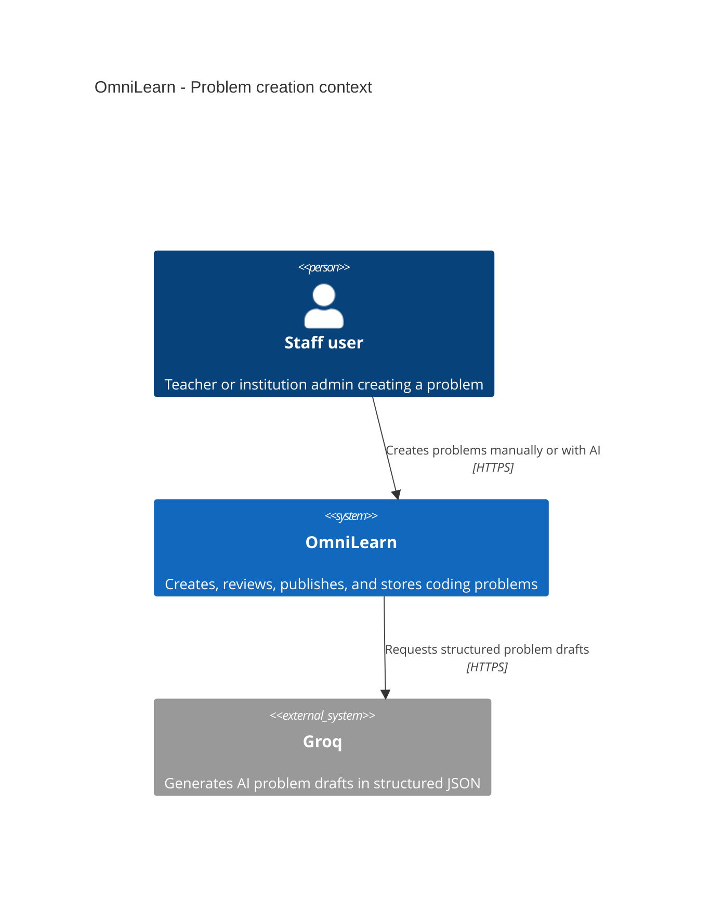
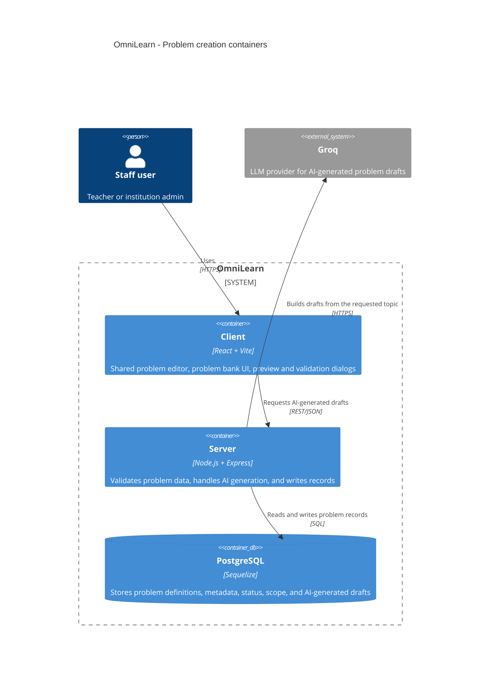
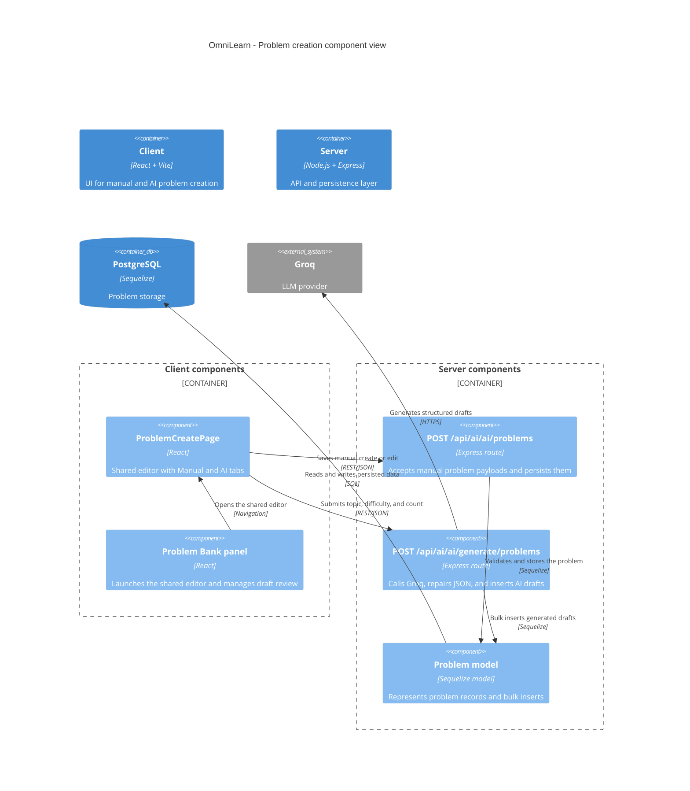

# C4 Diagram - Problem Creation (Manual and AI)

This document describes how OmniLearn creates a coding problem through two supported paths:
manual authoring and AI-assisted generation. It focuses on the shared problem editor used by staff users and on the server-side AI pipeline that turns a topic into structured problem drafts.

## Scope

- Primary users: teacher, institution admin, and other staff users allowed to access the shared problem editor.
- Main entry point: the shared problem creation page.
- Manual path: form-based creation and editing.
- AI path: topic-driven draft generation, review, and save.
- Persistence: PostgreSQL through Sequelize.
- AI provider: Groq.

## 1. C4 Context View

## 2. C4 Container View

## 3. C4 Component View

## 4. Creation Flow Summary

- Manual flow: the staff user opens the shared editor, fills the form, previews the problem, validates examples and expected output, then submits it to the server for persistence.
- AI flow: the staff user chooses the AI tab, provides a topic and difficulty constraints, the server asks Groq for a strict JSON response, repairs invalid JSON when needed, stores the generated drafts, and returns them for review before publication.
- Both flows converge on the same persistence layer so the final problem lifecycle remains consistent: draft, review, published, or archived.