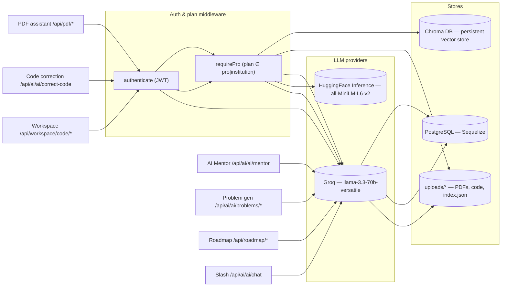
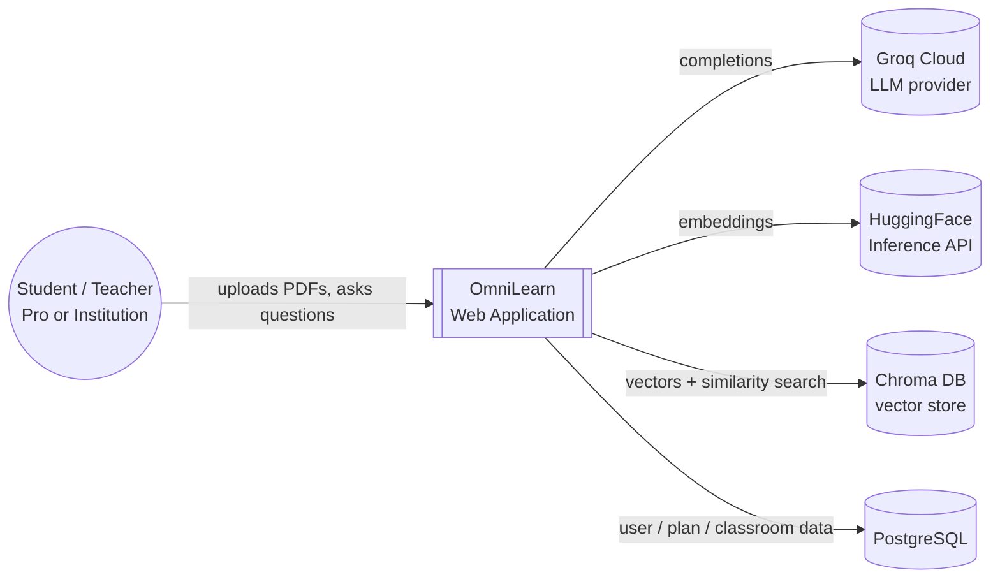
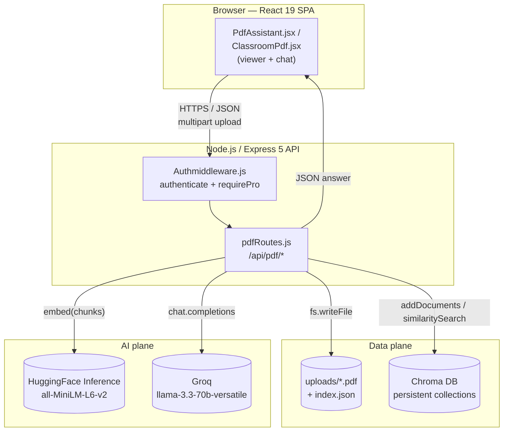
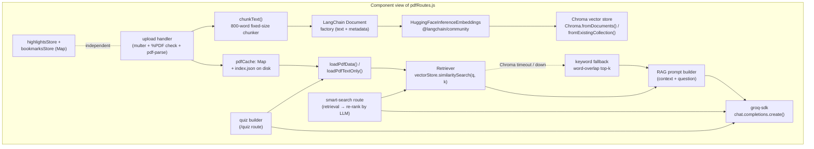
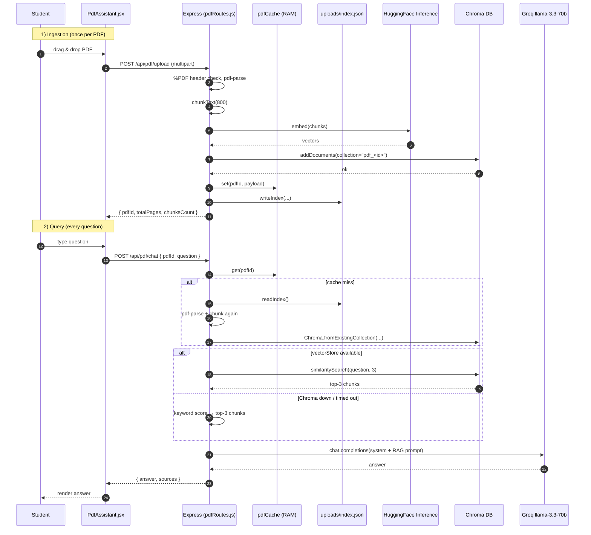
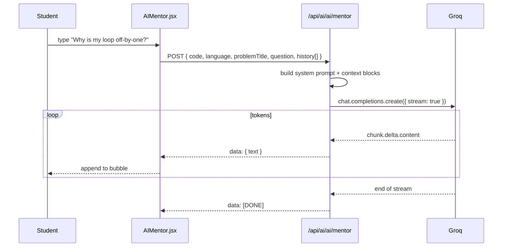
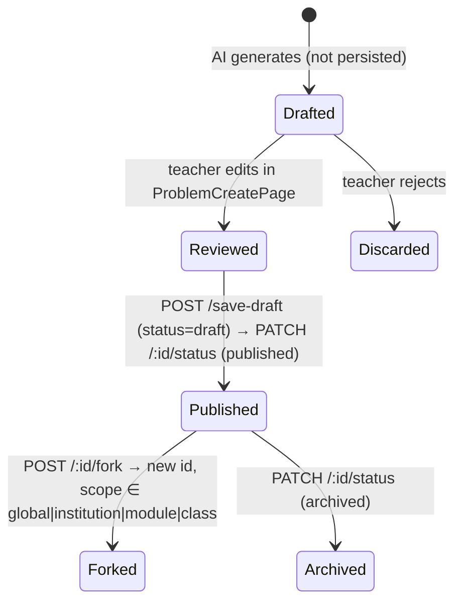

# OmniLearn — AI Features & RAG Deep Dive

This document is the single source of truth for **every AI-powered capability**
of OmniLearn. It explains what each feature does, how it is wired end-to-end,
which provider and model it calls, and how it is gated by the plan / role
matrix. The longest section is reserved for the **Retrieval-Augmented
Generation (RAG)** pipeline that powers the PDF assistant — it is documented
with the **C4 model** (Context → Container → Component → Code) plus a runtime
sequence diagram.

Every diagram below is in **Mermaid**, so it renders directly on GitHub, in
VS Code with the Mermaid extension, or in any Markdown viewer that supports
Mermaid.

---

## 1. Map of AI features

OmniLearn currently exposes **seven** distinct AI surfaces. They share one
common LLM provider (Groq → `llama-3.3-70b-versatile`) but they live in
different routers, have different plan gates, and use different prompting
strategies.

| # | Feature | Server entry | Frontend entry | Plan gate | Streaming |
|---|---|---|---|---|---|
| 1 | PDF assistant (RAG) | [pdfRoutes.js](../Server/src/routes/pdfRoutes.js) | [PdfAssistant.jsx](../Client/src/components/PdfAssistant.jsx), [ClassroomPdf.jsx](../Client/src/ClassroomPdf/ClassroomPdf.jsx) | Pro / Institution | no |
| 2 | AI Mentor (Socratic tutor) | [Ai.js](../Server/src/ai/Ai.js) `POST /ai/mentor` | [AIMentor.jsx](../Client/src/components/AIMentor.jsx) | Free+ | **yes (SSE)** |
| 3 | AI code correction | [Ai.js](../Server/src/ai/Ai.js) `POST /ai/correct-code` | [ProblemPage.jsx](../Client/src/Problems/ProblemPage.jsx) | Pro / Institution | no |
| 4 | AI problem generation | [Ai.js](../Server/src/ai/Ai.js) `POST /ai/problems/generate-draft` | [ProblemCreatePage.jsx](../Client/src/Problems/ProblemCreatePage.jsx) | Staff (teacher / admin) | no |
| 5 | Personalized roadmap | [RoadmapService.js](../Server/src/ai/RoadmapService.js) | [RoadmapPage](../Client/src/Roadmap/), Onboarding form | Free+ | no |
| 6 | Workspace code AI (analyze / summarize / quiz) | [workspaceRoutes.js](../Server/src/routes/workspaceRoutes.js) | [LearningDashboard.jsx](../Client/src/Dashbord/LearningDashboard.jsx) | Free (3 items) / Pro+ (200) | no |
| 7 | Messenger slash commands (`/ai`, `/stackoverflow`, `/video`) | [Ai.js](../Server/src/ai/Ai.js) `POST /ai/chat` | [Messages.jsx](../Client/src/Messaging/Messages.jsx) | Free+ | no |

The PDF assistant additionally hits a second AI provider:
**HuggingFace Inference** (model `sentence-transformers/all-MiniLM-L6-v2`)
to compute embeddings before they are written to Chroma DB.

---

## 2. Shared building blocks



Two design rules apply to every AI call in the codebase:

1. **Strict JSON contracts.** Every prompt that asks the LLM to return
   structured data appends explicit JSON rules (no markdown fences, no
   trailing commas, escape rules), and the route then strips fences and
   extracts the first balanced `{...}` or `[...]` substring before parsing.
   Two endpoints (`/ai/generate/problems`, `/ai/correct-code`) additionally
   implement a **JSON-repair fallback** — on first parse failure they re-ask
   the same model to "fix this malformed JSON" with `temperature: 0.1`.
2. **Time-boxed external calls.** Anything that talks to Chroma or
   HuggingFace is wrapped in `Promise.race(call, timeout)` so a hanging
   embeddings call or a down Chroma server never blocks the response.
   The PDF upload races against 8 s, the chat path against 5 s, and falls
   back to keyword search when the timeout fires.

---

## 3. RAG — the PDF assistant

### 3.1. What it does

A student (Pro or Institution plan) uploads a PDF (≤ 50 MB). OmniLearn
extracts the text, splits it into 800-word chunks, embeds each chunk with
HuggingFace, and writes the vectors into Chroma DB under a collection named
`pdf_<pdfId>`. Once indexed, the student can:

- **Ask free-form questions** (`POST /api/pdf/chat`) — the system retrieves
  the top-3 semantically closest chunks and passes them as context to Groq.
- **Highlight text and ask "explain"** (`POST /api/pdf/explain`) — direct
  LLM call, no retrieval.
- **Summarize the document** (`POST /api/pdf/summarize`) — first 5 chunks
  → 3-5 bullet points.
- **Generate a quiz** (`POST /api/pdf/quiz`) — 10 or 20 MCQs, optionally
  scoped to a page range.
- **Run a semantic concept search** (`POST /api/pdf/smart-search`) — top-5
  hits, then the LLM rewrites them as `{ excerpt, relevance }` cards.
- **Save highlights and bookmarks** — in-memory, per `pdfId`.

The RAG path degrades gracefully: when the Chroma server is unreachable or
the HuggingFace key is invalid, the chat and smart-search routes silently
fall back to **keyword scoring** over the same chunks (word-overlap count,
top-3 by score). The user still gets an answer; the answer is just less
precise.

### 3.2. C4 — Level 1: System Context



**Reading the diagram.** OmniLearn is the central system. The student
interacts only with OmniLearn — never directly with Groq, HuggingFace, or
Chroma. Two managed services (Groq, HuggingFace) and one self-hosted store
(Chroma) are the only external dependencies of the RAG feature.

### 3.3. C4 — Level 2: Containers



**Reading the diagram.** The PDF router is the only server-side component
involved. It owns three outbound clients (HF, Chroma, Groq), and it persists
PDFs to disk plus a lightweight `index.json` so the server can rebuild the
in-memory cache after a restart (see `loadPdfData()` in
[pdfRoutes.js](../Server/src/routes/pdfRoutes.js)).

### 3.4. C4 — Level 3: Components inside `pdfRoutes.js`



**Why this layout matters.**
- `chunkText()` is intentionally *fixed-size* (no sentence-aware splitter)
  because the prompt always re-injects the chunk verbatim — a slightly
  ragged sentence boundary costs zero quality and saves a dependency.
- `pdfCache` is the hot path. Cold restarts repopulate it from `index.json`
  via `loadPdfData()` so the user does not need to re-upload.
- The retriever has a **two-tier strategy**: vector search if the store was
  built successfully, keyword scoring otherwise. The two share the same
  downstream prompt, so the UI never knows which one fired.
- `loadPdfTextOnly()` exists specifically for `/summarize` and `/quiz`,
  which do not need similarity search — it skips the Chroma round-trip.

### 3.5. C4 — Level 4: Code paths

For the **ingestion** path (`POST /api/pdf/upload`):

```
multer.diskStorage           → uploads/<ts>-<safeName>.pdf
%PDF header check            → 400 if not a real PDF
pdfParse(buffer)             → { text, numpages }  (best-effort)
chunkText(text, 800)         → string[]
chunks.map(new Document(…))  → LangChain Document[]
Promise.race(
  Chroma.fromDocuments(docs, embeddings, {
    collectionName: "pdf_<sanitised pdfId>",
    persistDirectory: process.env.CHROMA_PERSIST_DIR || "./chroma_db",
    url: process.env.CHROMA_URL || "http://127.0.0.1:8000",
  }),
  8s-timeout
)                            → vectorStore | null
pdfCache.set(pdfId, payload)
writeIndex([{ pdfId, filename, storedName, fileUrl, … }, …])
```

For the **query** path (`POST /api/pdf/chat`):

```
loadPdfData(pdfId)                          → payload (cache or disk)
if payload.vectorStore:
    results = await vectorStore.similaritySearch(question, 3)
    context = results.map(r => r.pageContent).join("\n\n")
else:
    score each chunk by word-overlap with `question`
    context = top-3 chunks joined with "\n\n"
groq.chat.completions.create({
  model: "llama-3.3-70b-versatile",
  messages: [
    { role: "system", content: "Answer based on the provided PDF context …" },
    { role: "user",   content: `Context from PDF:\n${context}\n\nQuestion: ${question}` },
  ],
  temperature: 0.7, max_tokens: 1000,
})                                          → answer
res.json({ answer, sources: results.length })
```

### 3.6. Runtime sequence — "Ask a question to the PDF"



### 3.7. Numerical defaults

| Constant | Value | Where |
|---|---|---|
| Max PDF size | **50 MB** | `multer` `limits.fileSize` |
| Chunk size | **800 words** | `chunkText(text, maxWords = 800)` |
| Top-k retrieved chunks (chat) | **3** | `similaritySearch(q, 3)` |
| Top-k retrieved chunks (smart search) | **5** | `similaritySearch(q, 5)` |
| Chroma upload timeout | **8 s** | `Promise.race` in `/upload` |
| Chroma read timeout | **5 s** | `Promise.race` in `loadPdfData` |
| Quiz max context chars | **12 000** | `quizContext.slice(0, 12000)` |
| Summary context | **first 5 chunks** | `chunks.slice(0, 5).join(...)` |
| Embedding model | `sentence-transformers/all-MiniLM-L6-v2` | `HuggingFaceInferenceEmbeddings` |
| Completion model | `llama-3.3-70b-versatile` | `groq.chat.completions.create` |
| Plan gate | `authenticate` + `requirePro` | top of `pdfRoutes.js` |

### 3.8. Failure modes & how the code handles them

| Failure | Symptom | Behaviour |
|---|---|---|
| Uploaded file isn't a real PDF | bytes don't start with `%PDF` | 400, file deleted |
| `pdf-parse` throws on a weird-but-valid PDF | empty text | upload still succeeds, `textExtracted: false`, AI text features degrade |
| HuggingFace API key invalid / rate-limited | embedding call hangs | 8 s timeout, `vectorStore` stays `null`, keyword fallback fires on query |
| Chroma server down | `fromDocuments` hangs | same as above |
| LLM returns invalid JSON (problem generation, quiz, smart search) | `JSON.parse` throws | catch + regex-extract `{…}`/`[…]` + retry with `temperature: 0.1` |
| LLM returns empty content | `summary` is `undefined` | 502 "AI returned an empty summary" |

---

## 4. AI Mentor (Socratic streaming tutor)

**Route:** `POST /api/ai/ai/mentor` ([Ai.js:993](../Server/src/ai/Ai.js))
**Transport:** Server-Sent Events (SSE) — `text/event-stream`, `data: {text}` frames, terminated by `data: [DONE]`.
**Frontend:** [AIMentor.jsx](../Client/src/components/AIMentor.jsx) — sidebar inside [ProblemPage.jsx](../Client/src/Problems/ProblemPage.jsx).

### What makes it different from `/ai/chat`

The system prompt is the design. It forbids the model from ever handing
back a working solution:

> 1. NEVER give a complete solution or write the full corrected code.
> 2. Always teach the WHY behind concepts and bugs.
> 3. Ask a guiding reflective question at the end of each response.
> …

The endpoint accepts `{ code, language, question, problemTitle, history }`,
injects the (optionally truncated to 2 000 chars) current code as a fenced
block, replays the last 10 turns of `history`, and streams tokens with
`stream: true`. The frontend renders the tokens with a pulsing cursor
glyph until it sees `[DONE]`.



The mentor also exposes five **quick actions** in the UI ("Explain this",
"Why wrong?", "Give a hint", "Improve it", "What concept?") that simply
prefill the prompt — the server still sees them as normal user questions.

---

## 5. AI Code Correction (Pro only)

**Route:** `POST /api/ai/ai/correct-code` ([Ai.js:970](../Server/src/ai/Ai.js))
**Gate:** `authenticate` + `requirePro` — Free users get a `402 Upgrade required` (handled by `PlanSection.jsx`).
**Frontend:** triggered from the Codeeditor's output panel via [ProblemPage.jsx](../Client/src/Problems/ProblemPage.jsx) (line 268).

The endpoint takes the student's failing code, the language, the problem
statement, and the **actual stdout** the code currently produces. It runs
a Groq completion with `response_format: { type: "json_object" }` and a
prompt that pins eight strict rules — three of them critical:

- It must **preserve** every `print` / test invocation at the bottom of the
  file. Never delete them.
- It must keep the *original test inputs* unless those inputs cannot produce
  the expected output, in which case it should adopt the inputs from the
  problem's `examples`.
- It must produce stdout that, after trimming each line and ignoring blank
  lines & case, **matches the problem's `expectedOutput` exactly**.

Output is a JSON object that the UI uses to drive a side-by-side diff:

```jsonc
{
  "correctedCode": "...full file...",
  "changes": [
    { "lineNumber": 12, "type": "fix", "description": "off-by-one in loop", "oldCode": "...", "newCode": "..." }
  ],
  "summary": "Fixed loop bound and switched test inputs to match Example 2."
}
```

---

## 6. AI Problem Generation

**Routes** ([Ai.js](../Server/src/ai/Ai.js)):

- `POST /ai/ai/generate/roadmaps` — short topic → list of step labels (legacy roadmap).
- `POST /ai/ai/generate/problem-roadmap` — a single problem → a structured learning roadmap (theory → practice → implementation → optimization → final).
- `POST /ai/ai/generate/problems` — topic → **5 distinct problems** persisted to the DB.
- `POST /ai/ai/problems/generate-draft` — topic + difficulty + `count ∈ {1,3,5}` → **non-persisted draft(s)**, each with its own roadmap.
- `POST /ai/ai/problems/save-draft` — save a draft after the teacher edits it.
- `POST /ai/ai/problems/:id/fork` — fork a problem into a `global / institution / module / class` scope.

The generator prompts pin a strict JSON schema (title, difficulty, category,
description.text, description.notes, examples[], constraints[], hints[],
starterCode.{javascript,python,java}, expectedOutput.{...}, roadmap{...}).
After parsing, every roadmap is normalised via `normalizeRoadmap()` and
**auto-backfilled** with `generateProblemRoadmap()` if the model skipped it.

A safety net runs when JSON parsing throws: the route re-asks the same
model to *"fix this malformed JSON"* at `temperature: 0.1` before giving
up. In practice this rescues ~95% of the failures observed with the larger
`count: 5` batches.

### Lifecycle



The fork model is what powers the **"Forked by &lt;teacher name&gt;"** label
in the problems list: the route stamps `createdBy` and `forkedFrom` on the
new row, and the list endpoint joins them back to the `User` table.

---

## 7. Personalized Roadmap

**Service:** [RoadmapService.js](../Server/src/ai/RoadmapService.js)
**Router:** [roadmapRoutes.js](../Server/src/routes/roadmapRoutes.js) (`/api/roadmap/*`)
**Frontend:** [RoadmapPage](../Client/src/Roadmap/), [Onboarding form](../Client/src/Auth/) (career goal, interests, languages, weaknesses)

The student fills an onboarding form. The service then calls Groq with a
prompt that pins a **15-node, 5-level pyramid** structure:

```
Level 1 (foundations)     1 node    n1
Level 2 (core skills)     2 nodes   n2, n3
Level 3 (applied)         3 nodes   n4, n5, n6
Level 4 (integration)     4 nodes   n7..n10
Level 5 (advanced)        5 nodes   n11..n15
```

Each node has a `type` from `{ concept, debugging, challenge, project, stackoverflow, youtube }`
plus a `stackoverflowQuery` and a `youtubeQuery`.

The graph is then **enriched in batches of 5** with four parallel
out-of-LLM calls per node:

1. `fetchStackOverflow(query, 5)` — Stack Exchange `search/advanced`,
   ordered by votes, no API key required.
2. `fetchYouTube(query, 3)` — YouTube Data API v3 ordered by `viewCount`,
   keyed by `YOUTUBE_API_KEY`. Falls back to `[]` if the key is missing.
3. `fetchDocs(title, youtubeQuery)` — Groq prompt that returns 3 **real**
   official-docs URLs (MDN / docs.python.org / react.dev / …). The prompt
   forbids the model from inventing URLs.
4. `generateQuiz(title, description)` — 5 MCQs per node with letter-answer
   format and a `passingScore` of **80**.

Each user can keep multiple roadmaps (`SavedRoadmap` model, `isActive` flag
for the current one). When `roadmapProgress` hits 100% the certificate
button unlocks in the UI (`Certificate.jsx` → html2canvas → jsPDF).

---

## 8. Workspace Code AI

**Router:** [workspaceRoutes.js](../Server/src/routes/workspaceRoutes.js) — `/api/workspace/*`
**Frontend:** [LearningDashboard.jsx](../Client/src/Dashbord/LearningDashboard.jsx)
**Gate:** `authenticate` (everyone). Plan-based **storage caps**: Free = 3 PDFs + 3 code files; Pro = 200; Institution = unlimited.

The workspace is a per-user "scratchpad" of saved PDFs and pasted code.
On top of plain CRUD it exposes three AI endpoints that all share a small
helper, `loadCodeForUser()`, which fetches the item, validates ownership
and truncates to **12 000 chars** if needed:

| Route | Purpose | Model output |
|---|---|---|
| `POST /workspace/code/analyze` | Multi-turn code-review chat — the file goes into the system prompt once, then `history` replays user/assistant turns. Default first turn returns a 4-section overview (What it does / Key parts / Possible issues / Suggestions). | Markdown |
| `POST /workspace/code/summarize` | Single-shot summary with fixed sections (Purpose / Main pieces / How it works / Notable details), capped at 250 words. | Markdown |
| `POST /workspace/code/quiz` | 1–20 MCQs with letter-coded answers (`{question, options[4], answer: "A"}`). Falls back to a JSON-substring extraction if the model wraps the array in prose. | JSON array |

A **study history** is also kept on disk (`history.json`, 50 entries
per user max) — every quiz attempt and every PDF "explain" call is appended
so the dashboard can show recent activity.

---

## 9. Messenger slash commands

**Routes:** [Ai.js:66](../Server/src/ai/Ai.js) (`POST /ai/ai/chat`), plus client-side calls to public APIs for SO and YouTube.
**Frontend:** [Messages.jsx](../Client/src/Messaging/Messages.jsx) — composer autocomplete (typing `/` opens a dropdown).

| Command | What it does | Server / API |
|---|---|---|
| `/ai <question>` | Single-shot LLM answer rendered as a "bot" bubble in the conversation. | `POST /api/ai/ai/chat` → Groq |
| `/stackoverflow <query>` | Fetches top 5 answered SO questions by votes, renders as a cards list. | Stack Exchange `search/advanced` (no key) |
| `/video <query>` | Fetches 3 YouTube videos ordered by `viewCount`. | YouTube Data API v3 (needs `YOUTUBE_API_KEY`) |

The bot messages are persisted to the conversation just like normal
messages so a teacher can see what the student asked the AI.

---

## 10. Environment variables

| Variable | Used by | Default if missing |
|---|---|---|
| `GROQ_API_KEY` | every feature | hard-coded fallback key in source (replace for production) |
| `HF_API_KEY` | PDF assistant embeddings | hard-coded fallback key in source |
| `CHROMA_URL` | PDF assistant | `http://127.0.0.1:8000` |
| `CHROMA_PERSIST_DIR` | PDF assistant | `./chroma_db` |
| `YOUTUBE_API_KEY` | `/video` slash, roadmap enrichment | feature returns `[]` silently |

> **Security note.** The Groq and HuggingFace fallback keys committed in
> the source are placeholders that should be **rotated and moved to `.env`
> before any production deployment**. Both providers expose chargeable APIs.

---

## 11. Running RAG locally

The PDF assistant needs Chroma running. The easiest path is Docker:

```bash
docker run -d --name omnilearn-chroma -p 8000:8000 \
  -v $(pwd)/Server/src/chroma_db:/chroma/chroma \
  chromadb/chroma
```

Then start the API normally (`cd Server && npm run dev`). The route will
race against an 8 s timeout when uploading a PDF; if Chroma is unreachable
you will see this warning in the server logs:

```
Chroma/embeddings unavailable, vector search disabled for this PDF: <reason>
```

…and the chat route will silently use the keyword fallback. The user-facing
behaviour is the same; the answer quality is just lower.

---

## 12. Cross-references

- High-level architecture, use-cases, classroom flows: [11_flows_and_diagrams.md](./11_flows_and_diagrams.md)
- Sprint 4 narrative (AI tutor + multi-tenant admin): [08_chapitre6_sprint4.md](./08_chapitre6_sprint4.md)
- Plain-English RAG primer with worked example: [../PDF_ASSISTANT_GUIDE.md](../PDF_ASSISTANT_GUIDE.md)
- Live-session enhancements (permissions, playlists, identity, post-session): [session-enhancements.md](./session-enhancements.md)
