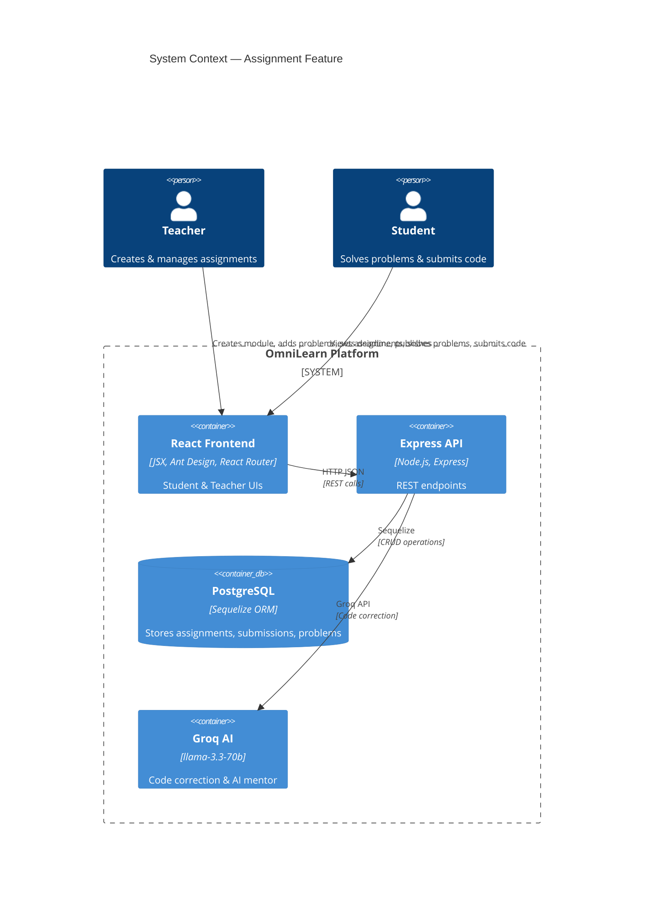
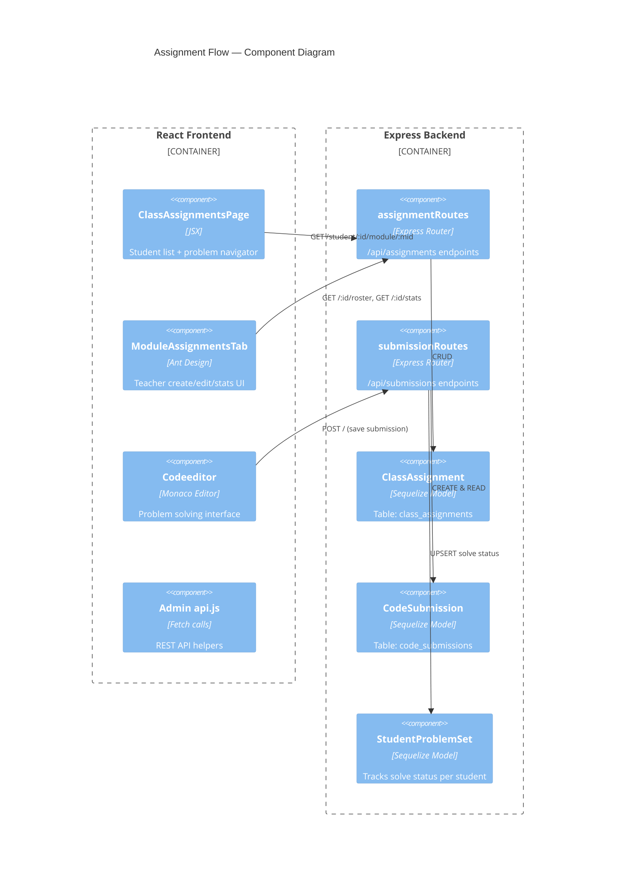

# Assignment Feature — Explained Simply

## What is an Assignment?

An **assignment** is a teacher-created task that groups **problems** (coding exercises) and attaches them to a **module** within a **classroom**. Students solve problems in the code editor, submit their code, and the teacher tracks progress.

---

## C4 Diagram — Container Level



---

## How It Works (Front ↔ Back)

### 1. Teacher creates a Module → `POST /api/admin/classrooms/:id/modules`

**Front-end**: Admin panel form → creates module inside a classroom  
**Back-end**: Saves to DB table `Module`, returns the module

### 2. Teacher creates an Assignment → `POST /api/assignments`

**Server function** — `assignmentRoutes.js:10`:

```js
router.post("/", requireAdminOrTeacher, async (req, res) => {
  try {
    const { moduleId, classId, title, problemIds, dueDate, maxAttempts, language, lockCorrect, lockMentor } = req.body;
    if (!title || !problemIds?.length) {
      return res.status(400).json({ error: "title and problemIds are required" });
    }
    const assignment = await ClassAssignment.create({
      moduleId: moduleId || null, classId: classId || null, title,
      problemIds, dueDate: dueDate || null, maxAttempts: maxAttempts || null,
      language: language || null, lockCorrect: !!lockCorrect, lockMentor: !!lockMentor,
      isPublished: false,  // always starts as DRAFT
    });
    res.status(201).json(assignment);
  } catch (err) {
    res.status(500).json({ error: err.message });
  }
});
```

**Client call** — `ClassAssignmentsPage.jsx:145-175`:

```js
const handleCreate = async () => {
  if (!newTitle.trim() || selectedPids.length === 0) {
    toast.error("Title and at least one problem are required"); return;
  }
  const res = await fetch(`${API}/assignments`, {
    method: "POST",
    headers: authHeaders(),
    body: JSON.stringify({
      moduleId, classId: classId || null,
      title: newTitle, problemIds: selectedPids,
      dueDate: dueDate || null, maxAttempts: maxAttempts ? Number(maxAttempts) : null,
    }),
  });
  const created = await res.json();
  setAssignments((prev) => [...prev, created]);
  // reset form ...
  toast.success("Draft created — click Publish to notify students");
};
```

**Key points**:
- Always saved as draft (`isPublished: false`)
- `problemIds` is a JSON array of problem UUIDs stored in a JSONB column
- `lockCorrect` / `lockMentor` let teachers disable AI features per assignment

### 3. Teacher publishes the Assignment → `PUT /api/assignments/:id/publish`

**Server function** — `assignmentRoutes.js:100-124`:

```js
router.put("/:id/publish", requireAdminOrTeacher, async (req, res) => {
  const a = await ClassAssignment.findByPk(req.params.id);
  if (!a) return res.status(404).json({ error: "Not found" });
  const wasPublished = a.isPublished;
  await a.update({ isPublished: !wasPublished });

  if (!wasPublished && a.classId) {  // first time publishing → notify students
    const io = req.app.get("io");
    const enrollments = await Enrollment.findAll({ where: { classId: a.classId } });
    for (const e of enrollments) {
      const notif = await Notification.create({
        userId: e.studentId, type: "assignment",
        title: "New assignment", message: `New assignment published: "${a.title}"`,
      });
      emitNotification(io, e.studentId, notif);
    }
  }
  res.json(a);
});
```

**Key points**:
- Toggles `isPublished` on/off
- On first publish (`wasPublished === false`), creates a real-time notification for every enrolled student via Socket.IO

### 4. Student views assignments → `GET /api/assignments/student/:studentId/module/:moduleId`

**Server function** — `assignmentRoutes.js:50-76`:

```js
router.get("/student/:studentId/module/:moduleId", async (req, res) => {
  const { studentId, moduleId } = req.params;
  const [assignments, solvedRecords] = await Promise.all([
    ClassAssignment.findAll({ where: { moduleId, isPublished: true }, order: [["createdAt", "ASC"]] }),
    StudentProblemSet.findAll({ where: { studentId, status: "solved" } }),
  ]);
  const solvedSet = new Set(solvedRecords.map((r) => r.problemId));
  const result = assignments.map((a) => ({
    id: a.id, title: a.title, problemIds: a.problemIds,
    dueDate: a.dueDate, maxAttempts: a.maxAttempts,
    language: a.language, lockCorrect: a.lockCorrect, lockMentor: a.lockMentor,
    solvedIds: a.problemIds.filter((pid) => solvedSet.has(pid)),
    solved: a.problemIds.filter((pid) => solvedSet.has(pid)).length,
    total: a.problemIds.length,
  }));
  res.json(result);
});
```

**Client** — `ClassAssignmentsPage.jsx` loads this data and renders a progress bar for each assignment with per-problem navigation circle buttons. A "Start →" button opens the problem navigator view.

### 5. Student solves a problem & submits → `POST /api/submissions`

**Server function** — `submissionRoutes.js:10-56`:

```js
router.post("/", async (req, res) => {
  const { userId, problemId, userCode, language, status, score, isCorrect } = req.body;
  if (!userId || !userCode || !language) {
    return res.status(400).json({ error: "userId, userCode, and language are required" });
  }
  const prevCount = await CodeSubmission.count({
    where: { userId, exerciseTitle: problemId || "unknown" },
  });
  // Save the submission
  const submission = await CodeSubmission.create({
    userId, exerciseTitle: problemId || "unknown", userCode, language,
    status: status || "passed", score: score || 0, isCorrect: isCorrect || false,
    attemptNumber: prevCount + 1,
  });
  // Upsert the problem tracking record
  const [record, created] = await StudentProblemSet.findOrCreate({
    where: { studentId: userId, problemId: problemId || "unknown" },
    defaults: { status: isCorrect ? "solved" : "attempted", bestScore: score || 0, attempts: 1, lastAttemptAt: new Date() },
  });
  if (!created) {
    await record.update({
      status: isCorrect ? "solved" : record.status,
      bestScore: Math.max(record.bestScore, score || 0),
      attempts: record.attempts + 1, lastAttemptAt: new Date(),
    });
  }
  res.json({ submission, problemRecord: record });
});
```

**Key points**:
- Each submission increments `attemptNumber` automatically
- `StudentProblemSet` tracks whether a problem is "solved" or "attempted" — updates only upgrade status, never downgrades
- `bestScore` uses `Math.max` so it's always the highest

### 6. Teacher views stats → `GET /api/assignments/:id/stats`

**Server function** — `assignmentRoutes.js:204-220`:

```js
router.get("/:id/stats", requireAdminOrTeacher, async (req, res) => {
  const assignment = await ClassAssignment.findByPk(req.params.id);
  if (!assignment) return res.status(404).json({ error: "Not found" });
  const records = await StudentProblemSet.findAll({
    where: { problemId: assignment.problemIds, status: "solved" },
  });
  const countByProblem = {};
  for (const pid of assignment.problemIds) countByProblem[pid] = 0;
  for (const r of records) {
    if (countByProblem[r.problemId] !== undefined) countByProblem[r.problemId]++;
  }
  res.json({ assignmentId: assignment.id, countByProblem });
});
```

### 7. Teacher views per-student roster → `GET /api/assignments/:id/roster`

**Server function** — `assignmentRoutes.js:127-161`:

```js
router.get("/:id/roster", requireAdminOrTeacher, async (req, res) => {
  const assignment = await ClassAssignment.findByPk(req.params.id);
  const enrollments = await Enrollment.findAll({
    where: { classId: assignment.classId },
    include: [{ model: User, as: "student", attributes: ["id", "firstname", "lastname", "email"] }],
  });
  const solved = await StudentProblemSet.findAll({
    where: { studentId: studentIds, problemId: assignment.problemIds, status: "solved" },
  });
  // Build a solvedMap: studentId → Set(problemIds)
  const solvedMap = {};
  for (const r of solved) {
    if (!solvedMap[r.studentId]) solvedMap[r.studentId] = new Set();
    solvedMap[r.studentId].add(r.problemId);
  }
  const students = enrollments.map((e) => ({
    id: e.student.id, name: `${e.student.firstname} ${e.student.lastname}`,
    email: e.student.email,
    solvedIds: assignment.problemIds.filter((pid) => solvedMap[e.studentId]?.has(pid)),
  }));
  res.json({ students, total: enrollments.length });
});
```

---

## C4 Diagram — Component Level (Assignment Flow)



---

## Key Database Tables

| Table | Column Highlights | Purpose |
|---|---|---|
| `Module` | `id`, `courseId`, `title` | Groups assignments within a classroom |
| `ClassAssignment` | `id`, `moduleId`, `classId`, `title`, `problemIds` (JSONB), `dueDate`, `maxAttempts`, `isPublished`, `language`, `lockCorrect`, `lockMentor` | One assignment (title, due date, problems) |
| `CodeSubmission` | `id`, `userId`, `exerciseTitle`, `userCode`, `language`, `status`, `score`, `isCorrect`, `attemptNumber` | One student's submitted code for a problem |
| `StudentProblemSet` | `id`, `studentId`, `problemId`, `status` (solved/attempted), `bestScore`, `attempts`, `lastAttemptAt` | Lightweight tracking of per-student problem completion |

## ClassAssignment Model — Full Schema

`ClassAssignment.js:4-22`:

```js
const ClassAssignment = sequelize.define("ClassAssignment", {
  id: { type: DataTypes.UUID, defaultValue: DataTypes.UUIDV4, primaryKey: true },
  moduleId: { type: DataTypes.UUID, allowNull: true },
  classId: { type: DataTypes.UUID, allowNull: true },
  title: { type: DataTypes.STRING(200), allowNull: false },
  problemIds: { type: DataTypes.JSONB, defaultValue: [] },
  dueDate: { type: DataTypes.DATE, allowNull: true },
  maxAttempts: { type: DataTypes.INTEGER, allowNull: true },
  isPublished: { type: DataTypes.BOOLEAN, defaultValue: false },
  language: { type: DataTypes.STRING(30), allowNull: true },
  lockCorrect: { type: DataTypes.BOOLEAN, defaultValue: false },
  lockMentor: { type: DataTypes.BOOLEAN, defaultValue: false },
}, { tableName: "class_assignments", timestamps: true });
```

## Client Files

| File | Lines | Purpose |
|---|---|---|
| `ClassAssignmentsPage.jsx` | 717 | Student view: drill-down (class → course → module → assignments), problem navigator, solve buttons. Teacher view: create form, publish/edit/delete, roster modal |
| `ModuleAssignmentsTab.jsx` | 306 | Teacher admin panel: Ant Design-based create modal with difficulty auto-pick, stats modal with progress bars per problem |
| `Codeeditor.jsx` | — | The actual coding environment where student writes and submits code |
| `Admin/api.js` | — | API helper functions for admin operations |

## Server Files

| File | Lines | Purpose |
|---|---|---|
| `Server/src/routes/assignmentRoutes.js` | 234 | All 7 `/api/assignments` endpoints (create, list, student-enriched, edit, publish, roster, stats, delete) |
| `Server/src/routes/submissionRoutes.js` | 125 | Save submission + retrieve per-student stats (solved/attempted count, language breakdown, difficulty breakdown) |
| `Server/src/models/ClassAssignment.js` | 22 | ClassAssignment model schema |
| `Server/src/models/CodeSubmission.js` | — | CodeSubmission model |
| `Server/src/models/StudentProblemSet.js` | — | Problem tracking model |
