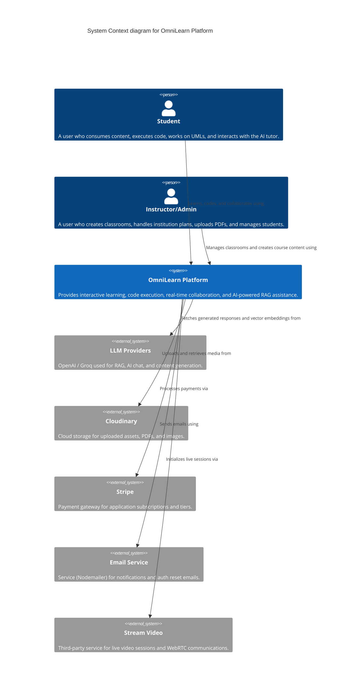
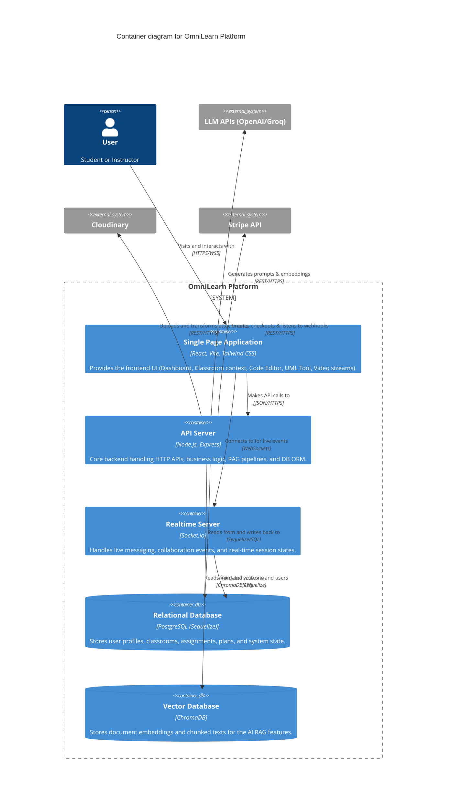
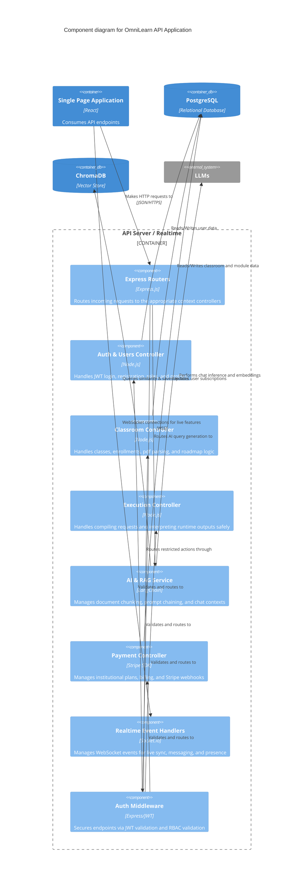

# OmniLearn Platform Architecture - C4 Model

This document outlines the architecture of the OmniLearn platform using the **C4 model** (Context, Container, and Component levels) to provide a clear, hierarchical view of the system's technical design.

## Level 1: System Context Diagram

The System Context diagram provides a high-level view of the OmniLearn platform and how it interacts with external users and third-party systems.

## Level 2: Container Diagram

The Container diagram illustrates the high-level technical architecture, showing the major applications and data stores that make up OmniLearn.

## Level 3: Component Diagram (Backend API)

The Component diagram dives into the Node.js Backend API Application to show how the system is structured internally.

