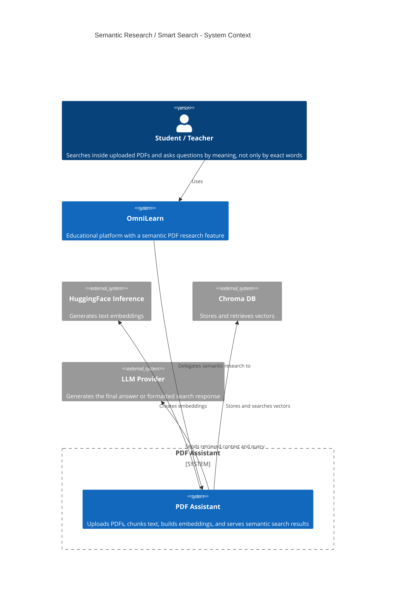
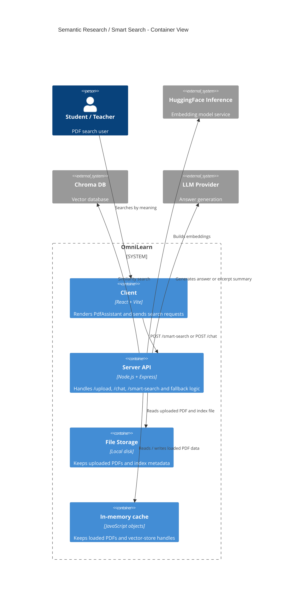
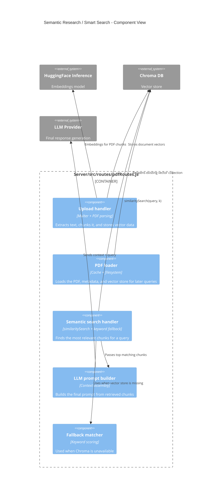

# C4 Diagram - Semantic Research / Smart Search

This document explains the semantic research flow used by OmniLearn's PDF assistant. In the codebase, this feature is implemented as a retrieval-augmented generation path: the client sends a query, the server tries semantic retrieval with embeddings and Chroma, and the AI formats the final answer.

Main code paths:
- [Client/src/components/PdfAssistant.jsx](../Client/src/components/PdfAssistant.jsx)
- [Server/src/routes/pdfRoutes.js](../Server/src/routes/pdfRoutes.js)

## Level 1 - System Context



## Level 2 - Container View



## Level 3 - Component View



## Level 4 - Code View

```mermaid
flowchart LR
  A[PdfAssistant.jsx] -->|POST /smart-search| B[pdfRoutes.js]
  B --> C{vectorStore exists?}
  C -->|Yes| D[Chroma.similaritySearch(query, 5)]
  C -->|No| E[keyword scoring fallback]
  D --> F[Top matching chunks]
  E --> F
  F --> G[Build prompt]
  G --> H[LLM response]
  H --> I[Search results shown in UI]
```

## How the semantic research works

1. The user enters a question or concept in the PDF assistant UI.
2. The client sends the request to the server route.
3. The server loads the PDF data and tries semantic retrieval first.
4. If the vector store is ready, Chroma compares the meaning of the query against stored chunks.
5. If Chroma is unavailable, the code falls back to keyword scoring so the feature still works.
6. The retrieved chunks are sent to the LLM, which produces the final answer or search result.

## Why this is a semantic feature

The search is not based only on exact word matching. It uses embeddings to map text into vectors so the system can retrieve passages that are conceptually close to the user's query, even when the wording is different.
