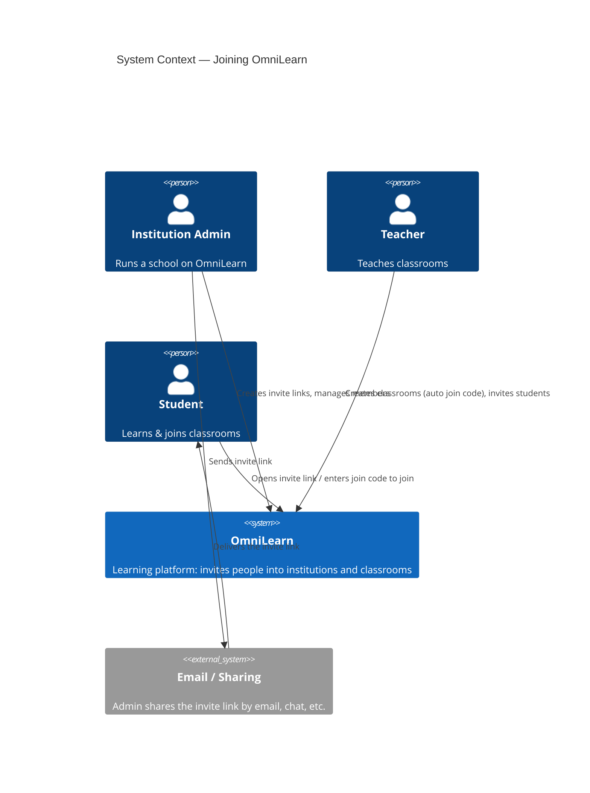
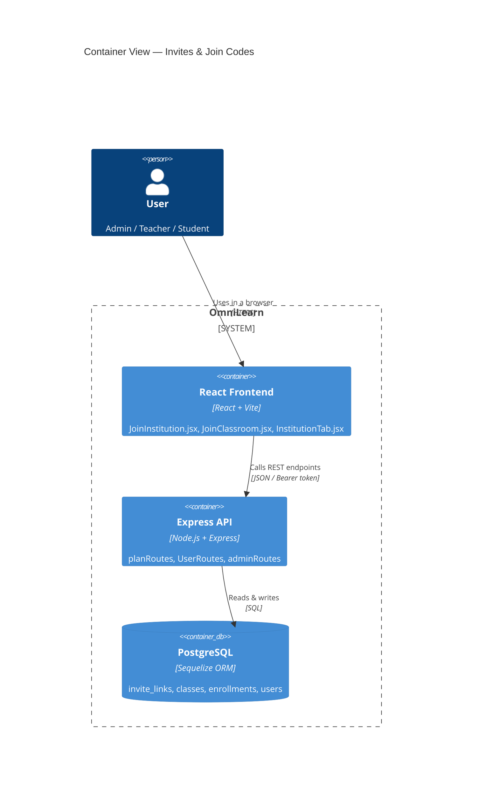
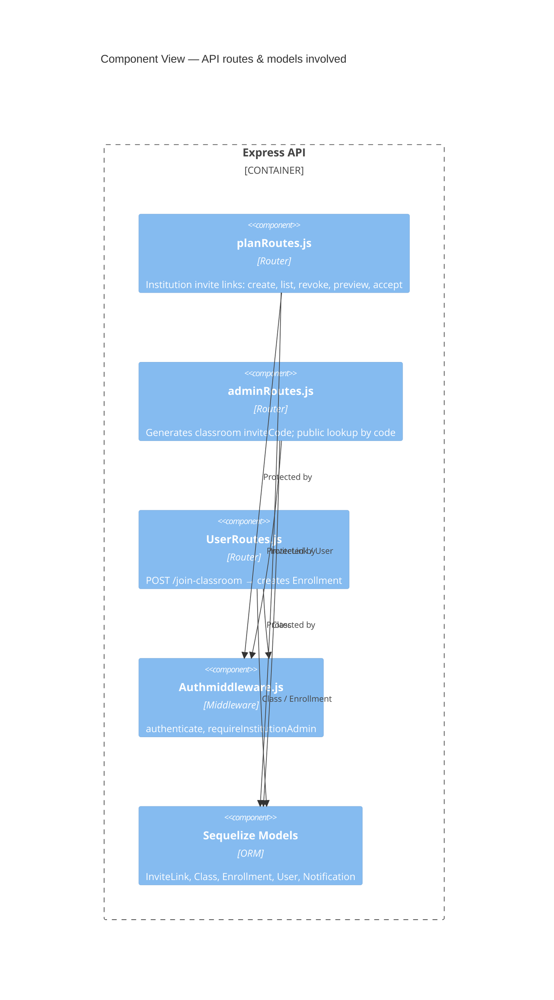
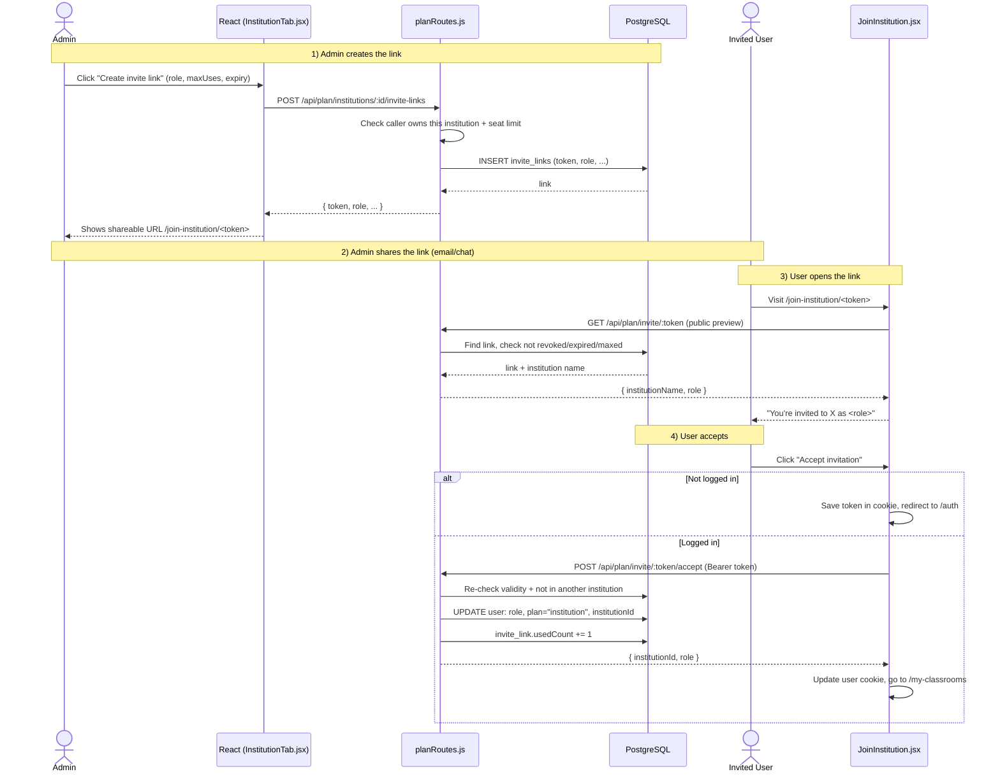
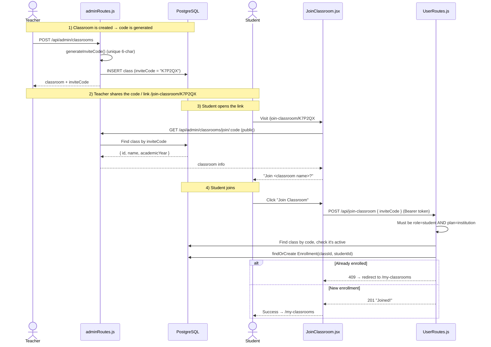

# OmniLearn — Invite Links & Join Codes Explained

OmniLearn has **two different ways** to bring people in. They look similar but solve
different problems, so it's important not to mix them up.

| | **Institution Invite Link** | **Classroom Join Code** |
|---|---|---|
| Purpose | Add a **teacher or student** into an **institution** (a whole school) | Let an existing student enroll into **one specific classroom** |
| Who creates it | Institution admin (or super admin) | Created automatically when a teacher makes a classroom |
| What it looks like | Long random token, e.g. `a1b2c3d4e5f6...` (32 hex chars) | Short human-typeable code, e.g. `K7P2QX` (6 characters) |
| Where it lives | `invite_links` table ([InviteLink.js](../Server/src/models/InviteLink.js)) | `inviteCode` column on the `classes` table ([Class.js](../Server/src/models/Class.js)) |
| URL on the frontend | `/join-institution/:token` | `/join-classroom/:code` |
| Effect when accepted | Sets your **role** + **plan = institution** + **institutionId** | Creates an **Enrollment** linking you to that class |
| Backend route | `POST /api/plan/invite/:token/accept` | `POST /api/join-classroom` |

> **Mental model:** the **invite link** is the key to the *building* (the school).
> The **join code** is the key to a *room inside* the building (one classroom).
> You normally use the invite link first to get in, then join codes to enter rooms.

---

## Part 1 — C4 Diagrams

C4 is a way to draw software at 4 zoom levels: **Context** (big picture) → **Container**
(apps/databases) → **Component** (parts inside an app) → **Code**. Below are Context and
Container views, plus the step-by-step flows. The diagrams are written in **Mermaid**
(GitHub and most IDEs render them automatically).

### Level 1 — System Context

Who uses the system and what it talks to.



### Level 2 — Containers

The moving parts that actually run.



### Level 3 — Components (inside the Express API)

The specific route files and what each owns.



---

## Part 2 — How the Institution Invite Link works

An invite link onboards someone into a **whole institution** with a chosen **role**.

### The data behind it — [InviteLink.js](../Server/src/models/InviteLink.js)

| Field | Meaning |
|---|---|
| `token` | The random string in the URL (primary key) |
| `institutionId` | Which school this link joins you to |
| `createdBy` | Admin/teacher who made it |
| `role` | `teacher` or `student` — what you become |
| `usedCount` / `maxUses` | How many times used / max allowed (`0` = unlimited) |
| `expiresAt` | When it stops working (`null` = never) |
| `revoked` | Admin "off switch" without deleting it |
| `targetUserId` | If set, it's a **personal** invite to one specific user (+ in-app notification) |

The token is generated server-side with `crypto.randomBytes(16).toString("hex")`
(see `makeToken()` in [planRoutes.js](../Server/src/routes/planRoutes.js)) — 32 random
hex characters, so it can't be guessed.

### The full flow



### The endpoints involved (institution invites)

All live in [planRoutes.js](../Server/src/routes/planRoutes.js) and are wrapped by the
frontend in [planApi.js](../Client/src/Admin/planApi.js).

| Endpoint | Who | What it does | planApi.js |
|---|---|---|---|
| `POST /api/plan/institutions/:id/invite-links` | Inst. admin | Create a sharable link (checks seat limit + valid role) | `createInviteLink` |
| `POST /api/plan/institutions/:id/invite-user` | Inst. admin | Personal invite by email + in-app notification (`maxUses: 1`) | `inviteUserByEmail` |
| `GET /api/plan/institutions/:id/invite-links` | Inst. admin | List all links for the institution | `fetchInviteLinks` |
| `DELETE /api/plan/invite-links/:token` | Inst. admin | Revoke (sets `revoked = true`) | `revokeInviteLink` |
| `GET /api/plan/invite/:token` | **Public** | Preview the institution name + role before accepting | `fetchInvitePreview` |
| `POST /api/plan/invite/:token/accept` | Logged-in user | Apply the role + plan + institution to the user | `acceptInvite` |

### The validity checks (why a link can fail)

When previewing or accepting, the backend rejects the link if **any** of these are true:

- `revoked === true` → *"Invalid link"* (`404`)
- `expiresAt` is in the past → *"This link has expired"* (`410`)
- `maxUses > 0` and `usedCount >= maxUses` → *"used too many times"* (`410`)
- On accept: you already belong to a **different** institution → *conflict* (`409`)

Seat limit is also enforced at **creation** time: if the institution has a `seatLimit`
and it's already full, the admin can't make new links.

---

## Part 3 — How the Classroom Join Code works

A join code lets a student who is **already on the Institution plan** enroll into one
classroom. It's short on purpose so a teacher can read it out loud or put it on a slide.

### Where the code comes from — [adminRoutes.js](../Server/src/routes/adminRoutes.js)

When a teacher/admin creates a classroom (`POST /api/admin/classrooms`), the server calls
`generateInviteCode()`:

- Picks **6 characters** from `ABCDEFGHJKLMNPQRSTUVWXYZ23456789`.
- Notice there's **no `0/O`, `1/I`, etc.** — confusing look-alikes are removed so codes are
  easy to type.
- It loops until it finds a code not already used, guaranteeing uniqueness.

The code is stored as `inviteCode` on the `Class` row.

### The full flow



### The endpoints involved (classroom join)

| Endpoint | Who | What it does | Frontend |
|---|---|---|---|
| `GET /api/admin/classrooms/join/:code` | **Public** | Look up a classroom by its code (name + year) | [JoinClassroom.jsx](../Client/src/Classroom/JoinClassroom.jsx) |
| `POST /api/join-classroom` | Logged-in **student** | Validate plan + code, create an `Enrollment` | [JoinClassroom.jsx](../Client/src/Classroom/JoinClassroom.jsx) |

### The rules that can block a join

Inside `POST /api/join-classroom` ([UserRoutes.js](../Server/src/routes/UserRoutes.js)):

- Caller must be a **student** → otherwise `403`.
- Caller's plan must be **institution** → otherwise `402 Upgrade required` (classrooms are
  an Institution-plan feature).
- Code must match an existing classroom → otherwise `404 Invalid invite code`.
- Classroom must be **active** → otherwise `403`.
- If already enrolled → `409` (the UI just sends them to *My Classrooms*).

> **There's also a third path:** a teacher can invite specific students from inside the app
> (`POST /api/admin/classrooms/:id/students`). That doesn't use a code — it sends a
> `classroom-invite` **notification**, which the student accepts via
> `POST /api/notifications/:id/accept` to create the same `Enrollment`.
> See [api-endpoints.md](api-endpoints.md) sections 3 and 10.

---

## Part 4 — Side-by-side summary (ASCII)

In case the Mermaid diagrams don't render, here's the same idea in plain text.

```
INSTITUTION INVITE LINK (join the school)
=========================================
 Admin ──create──▶ invite_links(token, role, institutionId)
                         │
                  share /join-institution/<token>
                         │
 User ──preview──▶ GET  /api/plan/invite/:token        (public)
 User ──accept───▶ POST /api/plan/invite/:token/accept (login)
                         │
                         ▼
        user.role = teacher|student
        user.plan = "institution"
        user.institutionId = <that school>


CLASSROOM JOIN CODE (enter one room)
====================================
 Teacher ─create class─▶ classes(inviteCode = "K7P2QX")   (6 chars)
                         │
                  share /join-classroom/K7P2QX
                         │
 Student ─lookup──▶ GET  /api/admin/classrooms/join/:code (public)
 Student ─join────▶ POST /api/join-classroom { inviteCode } (login)
                         │   requires role=student + plan=institution
                         ▼
        new Enrollment(classId, studentId)
```

---

## Part 5 — FAQ

**Q: Why two systems instead of one?**
The invite link grants *membership + a paid plan + a role* (a big, account-level change).
The join code only adds you to *one classroom* and assumes you're already a member. Different
scope, different security needs.

**Q: Can a student join a classroom with just a code if they're on the free plan?**
No. `POST /api/join-classroom` returns `402 Upgrade required`. They first need the
Institution plan (usually obtained by accepting an institution invite link).

**Q: Are the codes safe to share publicly?**
The **invite-link token** is long and random (32 hex chars) — safe to email. The **classroom
join code** is short (6 chars) and meant for a known audience; it only reveals a classroom's
name and still requires a logged-in Institution student to actually enroll.

**Q: How do I turn off a leaked link?**
For institution links: `DELETE /api/plan/invite-links/:token` (revoke). For classroom codes:
archive/deactivate the classroom, or there's no per-code revoke — the join is also gated by
the active flag and plan checks.

---

*Related docs:* [api-endpoints.md](api-endpoints.md) lists every endpoint; this file zooms
into just the invite/join flows.
</content>
