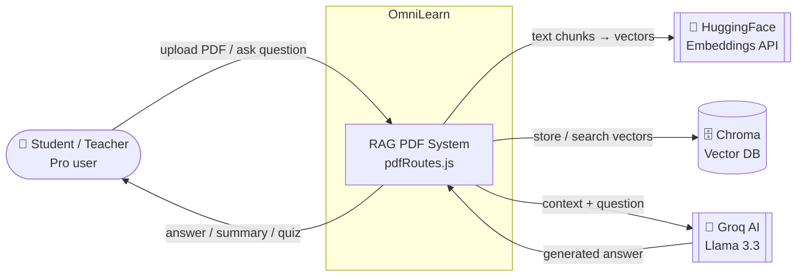
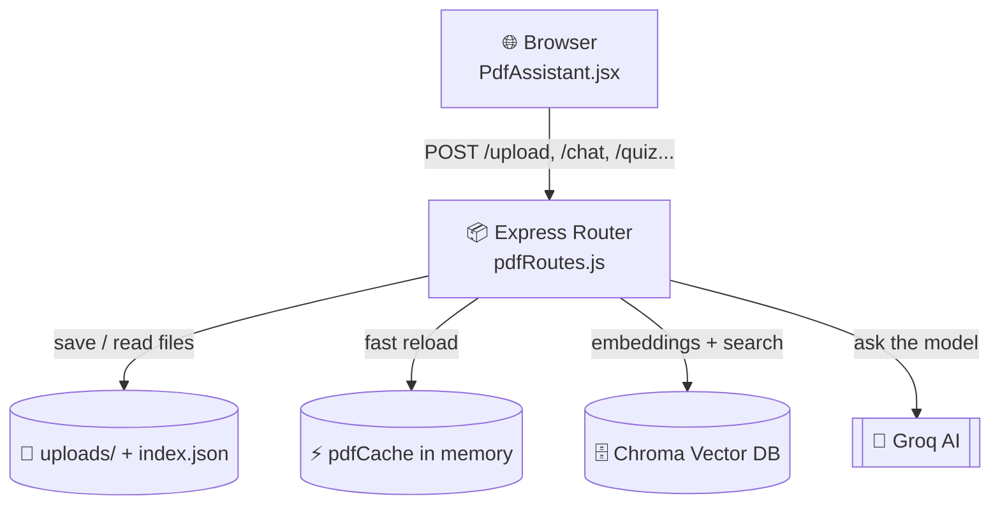
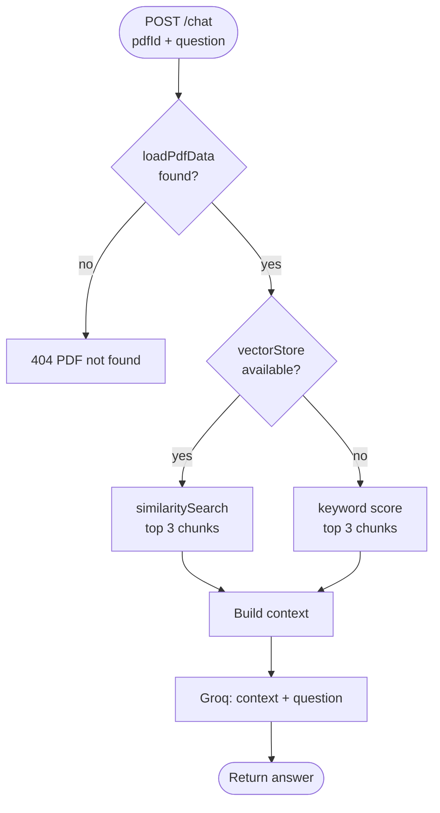

# RAG System Explained — `pdfRoutes.js`

> **File:** [Server/src/routes/pdfRoutes.js](../Server/src/routes/pdfRoutes.js)
> This is the heart of OmniLearn's **RAG** (Retrieval-Augmented Generation) feature.
> It lets a user **upload a PDF** and then **chat with it**, get a **summary**, generate a **quiz**, or **search** inside it — all powered by AI.

---

## 1. What is RAG? (super simple)

**RAG = Retrieval + Generation.**

The AI (Groq / Llama) does **not** read the whole PDF. PDFs are too big. Instead:

1. **Retrieval** → We first *find* the few paragraphs of the PDF that are most related to the question.
2. **Generation** → We give *only those paragraphs* to the AI and ask it to write the answer.

So the AI always answers using the real content of *your* PDF, not from random memory.

```
Question ──▶ Find best matching chunks ──▶ Send chunks + question to AI ──▶ Answer
              (Retrieval)                       (Generation)
```

---

## 2. The big picture (how a PDF travels through the system)

```
UPLOAD                          ASK A QUESTION
──────                          ──────────────
PDF file                        "What is photosynthesis?"
   │                                   │
   ▼                                   ▼
Extract text (pdf-parse)        Load PDF chunks from cache/disk
   │                                   │
   ▼                                   ▼
Split into chunks (800 words)   Search best 3 chunks
   │                              (vector OR keyword)
   ▼                                   │
Make embeddings (HuggingFace)          ▼
   │                            Send chunks + question to Groq AI
   ▼                                   │
Store in Chroma vector DB              ▼
   │                              Answer back to user
   ▼
Save record in index.json
```

---

## 3. The tools used (the imports)

| Line | Code | Simple meaning |
|------|------|----------------|
| 3 | `multer` | Receives the uploaded file from the browser. |
| 6 | `pdf-parse` | Reads a PDF and gives back its raw **text**. |
| 7 | `Groq` | The AI brain (runs the Llama model) that writes answers. |
| 18 | `HuggingFaceInferenceEmbeddings` | Turns text into **numbers (vectors)** so we can compare meaning. |
| 20 | `Chroma` | A **vector database** that stores those numbers and finds similar ones. |
| 22 | `Document` | A LangChain box that holds one chunk of text + its info (metadata). |

> **Embedding = a list of numbers that represents the *meaning* of a text.**
> Two texts about the same idea get *similar* numbers, even if the words differ.

---

## 4. Setup code (lines 9–44)

| Lines | What it does (simple) |
|-------|------------------------|
| 12–14 | **Security gate.** `authenticate` = you must be logged in. `requirePro` = you must have a Pro/Institution plan. Applied to *every* route in this file. |
| 24–25 | Address of the Chroma database (`CHROMA_URL`) and where it saves data on disk. |
| 29–32 | Create the **embeddings engine** using the model `all-MiniLM-L6-v2` (fast + good quality). |
| 35–37 | Create the **Groq AI** client with the API key. |
| 39–40 | Folder where uploaded PDFs are saved + path of `index.json` (the list of all PDFs). |
| 42–44 | If the upload folder does not exist, create it. |

---

## 5. The helper functions

### `readIndex()` — lines 46–55
Reads `index.json` (the list of all uploaded PDFs) and returns it as an array.
If the file is missing or broken, it safely returns `[]` (empty list).

> **Input:** nothing → **Output:** array of PDF records.

### `writeIndex(items)` — lines 57–59
Saves the updated list of PDFs back to `index.json`.

> **Input:** array of PDF records → **Output:** file saved on disk.

### `loadPdfData(pdfId)` — lines 61–116  ⭐ (used for chat & search)
Loads everything needed to **answer questions** about one PDF.

Step by step:
1. **Line 62–63** → If this PDF is already in memory (`pdfCache`), return it instantly (fast).
2. **Line 65–67** → Otherwise look it up in `index.json`. Not found → return `null`.
3. **Line 69–73** → Find the file on disk and read it.
4. **Line 74–80** → Extract text with `pdf-parse`.
5. **Line 81** → Split text into chunks of 800 words.
6. **Line 85–101** → Reconnect to the existing **Chroma collection** (the saved vectors). It races against a **5-second timeout** so it never hangs. If Chroma is down → `vectorStore = null` (we will use keyword search instead).
7. **Line 103–115** → Bundle it all (`filename`, `fullText`, `chunks`, `vectorStore`…), save to cache, return it.

> **Input:** a `pdfId` → **Output:** an object with text, chunks, and (maybe) a vector store.

### `loadPdfTextOnly(pdfId)` — lines 119–153  (used for summary & quiz)
Same idea as above, but **skips Chroma completely**. Summary and quiz don't need semantic search — they just need the text. This makes them faster and avoids depending on the vector database.

> **Input:** a `pdfId` → **Output:** object with `fullText`, `chunks`, `totalPages`.

### `chunkText(text, maxWords = 800)` — lines 712–724  ⭐
The core text-splitter.
- Splits the text into words.
- Groups them into blocks of 800 words each.
- Returns the list of blocks (chunks).

> **Input:** big text → **Output:** list of small text chunks.
> **Why chunk?** AI has a size limit, and small chunks make retrieval *precise*.

### `storage` / `upload` — lines 155–175
Configures **multer**:
- Where to save the file (`UPLOAD_DIR`).
- The saved name = `timestamp-filename.pdf` (unique).
- Only accept **PDF** files, max **50 MB**.

### Caches — lines 178–182
- `pdfCache` → keeps loaded PDFs in memory (so we don't re-read disk every time).
- `highlightsStore` → highlights per PDF.
- `bookmarksStore` → bookmarks per PDF.

---

## 6. The API routes (what the browser calls)

### 🟢 Route 1 — `POST /upload` (lines 185–297) ⭐ THE INDEXING STEP
This is where RAG **prepares** the PDF.

| Step | Lines | Simple meaning |
|------|-------|----------------|
| Check file exists | 188–190 | No file → error 400. |
| Build IDs & path | 192–195 | Make a unique `pdfId` and a public URL. |
| Verify real PDF | 198–203 | File must start with `%PDF`. If not → delete + error. |
| Extract text | 209–217 | Use `pdf-parse`. If it fails, **keep the file anyway** and store a warning (graceful). |
| Split into chunks | 220 | `chunkText(...)` → 800-word chunks. |
| Wrap as Documents | 224–232 | Each chunk becomes a `Document` with metadata (pdfId, filename, index). |
| Build vector store | 237–254 | `Chroma.fromDocuments(...)` turns chunks → embeddings → stores them. Races an **8-second timeout** so a broken key/server can't freeze the upload. Fails safely → `vectorStore = null`. |
| Save to cache | 257–267 | Keep it in memory. |
| Save to index.json | 269–278 | Record the PDF so it survives restarts. |
| Respond | 280–289 | Return `pdfId`, page count, chunk count, etc. |

> **Input:** a PDF file → **Output:** `pdfId` + the PDF is now searchable.

### 🟢 Route 2 — `GET /list` (lines 300–303)
Returns the list of all uploaded PDFs (from `index.json`).

### 🟢 Route 3 — `POST /explain` (lines 306–338)
User selects some text → AI explains it in simple words.
*(Not full RAG — it just sends the selected text directly to the AI.)*

> **Input:** `{ text }` → **Output:** `{ explanation }`.

### 🟢 Route 4 — `POST /chat` (lines 341–394) ⭐ THE MAIN RAG STEP
Ask a question about the PDF.

| Step | Lines | Simple meaning |
|------|-------|----------------|
| Validate | 345–347 | Need `pdfId` + `question`. |
| Load PDF | 350–353 | `loadPdfData(pdfId)`. |
| **Retrieval** | 357–368 | If vector store exists → `similaritySearch(question, 3)` finds the **3 most related chunks**. If not → **keyword fallback**: score chunks by how many question words they contain, take top 3. |
| **Generation** | 371–385 | Send those chunks **as context** + the question to Groq AI. |
| Respond | 387–389 | Return the AI `answer`. |

> **Input:** `{ pdfId, question }` → **Output:** `{ answer }`.
> ⚠️ Note: line 389 uses `results.length`, but `results` only exists inside the vector branch — this can throw when keyword fallback is used. (Worth fixing if you touch this file.)

### 🟢 Route 5 — `POST /summarize` (lines 397–446)
Summarize the PDF into 3–5 bullet points.
- Uses `loadPdfTextOnly` (no Chroma).
- Takes the **first 5 chunks** (to stay under token limits).
- Asks the AI to summarize.

> **Input:** `{ pdfId }` → **Output:** `{ summary }`.

### 🟢 Route 6 — `POST /quiz` (lines 449–553)
Generate a 10- or 20-question multiple-choice quiz.
- Loads text only.
- Optional **page range** (`pageFrom`/`pageTo`) → picks only the chunks for those pages (lines 486–491).
- Caps context at 12,000 characters (line 498).
- Asks the AI to return a **JSON array** of questions; line 524 extracts the JSON safely.

> **Input:** `{ pdfId, count, pageFrom, pageTo }` → **Output:** `{ questions[] }`.

### 🟢 Route 7 — Highlights (lines 556–598)
Save / get / delete text highlights (stored in memory per PDF).

### 🟢 Route 8 — Bookmarks (lines 601–641)
Save / get / delete page bookmarks (stored in memory per PDF).

### 🟢 Route 9 — `POST /smart-search` (lines 644–707) ⭐ RAG SEARCH
Find every section about a concept.
- **Retrieval:** `similaritySearch(query, 5)` (or keyword fallback) → top 5 chunks.
- **Generation:** AI formats them into JSON excerpts with a "why relevant" note.

> **Input:** `{ pdfId, query }` → **Output:** `{ results[] }`.

---

## 7. Vector search vs keyword fallback (important idea)

The file is **resilient**: if the Chroma vector database is unavailable, it does **not** crash. It quietly switches to a simpler keyword search.

| | Vector search (best) | Keyword fallback (backup) |
|---|---|---|
| How | Compares *meaning* using embeddings | Counts matching words |
| Finds | "car" when you ask about "vehicle" | Only exact word matches |
| Needs | Chroma + HuggingFace online | Nothing — pure JavaScript |
| Where | lines 358, 660 | lines 361–367, 663–669 |

---

## 8. C4 Diagrams

> C4 = a way to draw software at 4 zoom levels: **Context → Container → Component → Code.**
> Below are the diagrams in [Mermaid](https://mermaid.js.org) (renders on GitHub) plus an ASCII version.

### Level 1 — System Context (who talks to what)



### Level 2 — Container (the moving parts inside the feature)



### Level 3 — Component flow for `/chat` (the RAG question loop)



### Level 4 — Code / Function map (input ▶ output)

```
┌─────────────────────────────────────────────────────────────────────┐
│  FUNCTION                INPUT                 OUTPUT                 │
├─────────────────────────────────────────────────────────────────────┤
│  chunkText()             big text         ▶    list of 800-word      │
│                                                chunks                 │
│                                                                       │
│  readIndex()             (nothing)        ▶    array of PDF records   │
│  writeIndex(items)       PDF records      ▶    index.json saved       │
│                                                                       │
│  loadPdfData(id)         pdfId            ▶    { text, chunks,        │
│                                                  vectorStore }        │
│  loadPdfTextOnly(id)     pdfId            ▶    { text, chunks,        │
│                                                  totalPages }         │
│                                                                       │
│  POST /upload            PDF file         ▶    pdfId + indexed PDF    │
│  POST /chat              pdfId + question ▶    AI answer (RAG)        │
│  POST /summarize         pdfId            ▶    bullet summary         │
│  POST /quiz              pdfId + range    ▶    quiz questions[]       │
│  POST /smart-search      pdfId + query    ▶    relevant excerpts[]    │
│  POST /explain           text             ▶    simple explanation     │
└─────────────────────────────────────────────────────────────────────┘
```

---

## 9. One-line summary of the whole file

> **Upload a PDF → its text is chopped into chunks → each chunk becomes a vector stored in Chroma.
> When you ask something → we find the 3–5 most related chunks → we hand only those to the Groq AI → it writes an answer grounded in your document.**
