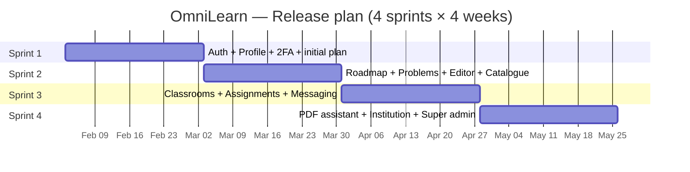

# Sprint Planning & Sprint Backlogs — OmniLearn

This document gathers, in one place, the **release plan** and the **detailed sprint backlogs** of OmniLearn. The chapter-by-chapter sprint backlogs (Tables 5, 6, 7, 8) live inside the report chapters; this file is the synthesis — useful when running a sprint review or refining the next sprint.

---

## 1. Release plan at a glance

| Sprint | Goal | Velocity (estimate) | Demo deliverables |
|---|---|---|---|
| **Sprint 1** | Authentication, profile, 2FA, plans foundation | ≈ 34 SP | Sign up → verify email → sign in → 2FA → profile → upgrade to Pro (Stripe) |
| **Sprint 2** | Personalized roadmap + problem solving | ≈ 42 SP | Roadmap onboarding, roadmap graph + certificate, Problems page, Code editor (Run + Submit), Coding dashboard, Free/Pro-tier admin |
| **Sprint 3** | Collaboration — classrooms, assignments, messaging | ≈ 48 SP | Create class + invite, Join class, Assignments, Announcements, Real-time messaging |
| **Sprint 4** | AI tutor, institution + super admin | ≈ 46 SP | PDF assistant (RAG), AI Mentor, Institution onboarding + invite links, Institution admin & Super admin consoles, Stripe full flow |

> Story-point estimates use Fibonacci (1, 2, 3, 5, 8, 13).

---

## 2. Definition of Ready (DoR)

A user story enters a sprint backlog only if all of the following are true:

- The user story is written in the form **"As a *role*, I want *goal*, so that *value*"**.
- Acceptance criteria are written and reviewed.
- Dependencies on other stories are identified (or absent).
- A first sketch of the UI exists (Figma or hand-drawing).
- The relevant backend route signature has been agreed.
- Story points have been estimated.

---

## 3. Definition of Done (DoD)

A user story is "done" only if:

- All acceptance criteria pass.
- The frontend matches the design.
- The backend route validates inputs (express-validator / zod) and returns proper HTTP codes.
- The route is protected by the right auth / role / plan / institution check.
- Errors are surfaced with `react-hot-toast`.
- The story is covered by a manual test pass (Postman / Browser).
- No console errors and no ESLint errors on the changed files.
- The story is merged on `main` and the demo URL is updated.

---

## 4. Sprint 1 — Authentication, profile, plans foundation

**Sprint goal:** "From a brand-new visitor, deliver a fully secured account — verified email, optional 2FA, complete profile — sitting on one of the three plans, with a working upgrade to Pro."

### 4.1. Sprint 1 backlog (story points + acceptance criteria)

| US Code | Story | SP | Acceptance criteria |
|---|---|---:|---|
| US1.1 | Landing page | 2 | Hero, three plans, CTAs, no console error |
| US2.1 | Sign up (visitor) | 5 | Validates fields, hashes password (bcrypt), creates row, sends verification email |
| US3.1 | Verify email | 3 | Valid token sets `isEmailVerified=true`; expired token returns 410 |
| US4.1 | Choose a plan at sign-up | 2 | Default `free`; Pro/Institution route to Stripe |
| US5.1 | Sign in | 3 | Returns JWT + user; cookies set |
| US5.2 | Sign in with 2FA | 3 | Challenge step; rejects invalid TOTP |
| US6.1 | View profile | 2 | `GET /api/profile/:id` returns sanitized user |
| US6.2 | Update profile | 3 | Avatar via Cloudinary; emits `profile-updated` |
| US6.3 | Delete account | 2 | Confirms; clears cookies; logs out |
| US7.1 | Reset password | 3 | Token expires after 1h; old password rejected |
| US8.1 | Enable 2FA | 3 | Speakeasy secret + QR; toggle confirms with TOTP |
| US33.1 | Stripe Checkout — Pro | 5 | Webhook updates `plan='pro'`, `planJoinedAt=now()` |

**Total ≈ 36 SP** (committed: 34).

### 4.2. Sprint 1 risks

- Cookies vs `localStorage` decision (kept `js-cookie` for simpler SSR fallback).
- Email deliverability — fallback Mailtrap during dev.
- Stripe webhook secret rotation — documented in the repo.

---

## 5. Sprint 2 — Roadmap, problems, code editor

**Sprint goal:** "From an authenticated student, deliver a complete personal learning loop: pick a goal → get a personalized roadmap → practice problems in the code editor → see progress → earn a certificate."

### 5.1. Sprint 2 backlog (story points + acceptance criteria)

| US Code | Story | SP | Acceptance criteria |
|---|---|---:|---|
| US9.1 | Onboarding form | 3 | Career goal + interests + languages saved |
| US9.2 | Roadmap generation | 8 | LLM JSON validated; saved as `SavedRoadmap` |
| US9.3 | Roadmap graph view | 5 | React Flow with custom node types; node detail panel |
| US9.4 | Roadmap progress | 3 | Mark node done; `roadmapProgress` updated |
| US9.5 | Certificate | 3 | `html2canvas + jsPDF` export, only at 100% |
| US10.1 | Problems list | 3 | Plan-scoped; tag + difficulty filters |
| US11.1–4 | Problem page + Run + Submit | 8 | CodeMirror; sandbox run; verdict persisted |
| US12.1 | Coding dashboard | 5 | Charts with `recharts` on real submissions |
| US44.1 | Free-tier enforcement | 2 | Server filters by `isFreeTier` for free users |
| US46.1 | Pro-tier enforcement | 2 | Server filters by `isProTier` for pro users |
| US30.1 | Admin CRUD problems | 5 | Auth-locked; validations; UI tab |
| US30.2 | Toggle Free-tier | 2 | Optimistic UI; PATCH route |
| US30.3 | Toggle Pro-tier | 2 | Optimistic UI; PATCH route |

**Total ≈ 51 SP** (committed: 42 — overflow into Sprint 3).

### 5.2. Sprint 2 risks

- LLM output instability for the roadmap — addressed with JSON-schema validation + retry.
- Code-execution sandbox security — sandbox isolated process with timeout and memory caps.
- React Flow performance for 50+ nodes — lazy-rendered detail panel; memoized nodes.

---

## 6. Sprint 3 — Collaboration

**Sprint goal:** "Open OmniLearn to multi-actor collaboration: classes, assignments and real-time messaging — so that teachers can run a class and students can work together."

### 6.1. Sprint 3 backlog (story points + acceptance criteria)

| US Code | Story | SP | Acceptance criteria |
|---|---|---:|---|
| US20.1–3 | Class management (create, code, members) | 5 | Code is unique, copy-to-clipboard, enrollment listing |
| US21.1–2 | Courses + modules + lessons | 5 | CRUD; lessons can have a PDF URL |
| US22.1–3 | Assignments + problems attached + grading | 8 | Assignment due date; grades stored |
| US23.1 | Announcements | 3 | Visible to enrolled students only |
| US14.1–3 | Student joins class + lists classrooms + views one | 5 | Class scoping enforced; UI clean |
| US16.1–3 | Real-time messaging + notifications | 8 | Socket.IO room per conversation; offline → notification |

**Total ≈ 52 SP** (committed: 48 — overflow into Sprint 4).

### 6.2. Sprint 3 risks

- Socket.IO scaling — adapter set up so a Redis pubsub can be added later without code changes.

---

## 7. Sprint 4 — AI tutor, video, multi-tenant administration

**Sprint goal:** "Round off OmniLearn with the AI tutor grounded in user content, and the full Institution + Super Admin management consoles + Stripe."

### 7.1. Sprint 4 backlog (story points + acceptance criteria)

| US Code | Story | SP | Acceptance criteria |
|---|---|---:|---|
| US15.1 | Upload PDF + ingest into Chroma | 5 | Chunks indexed with metadata (file id, page) |
| US15.2 | Ask question on PDF (RAG) | 8 | Streamed answer with page citations |
| Mentor | AI Mentor side panel | 5 | User context injected; conversation persisted |
| US24.1 | Institution onboarding | 5 | After Stripe webhook, redirect + create Institution |
| US25.1–2 | Invite links (generate + revoke) | 5 | TTL + max uses; revoke flips status |
| US26.1 | Join via invite link | 3 | Role from token applied; `institutionId` set |
| US27.1 | Per-institution curriculum | 5 | Grades / Specialities / Levels CRUD scoped to `institutionId` |
| US35.1 | Member directory | 3 | Filter by role; ban member |
| US29.1 | Super admin — institutions | 3 | List / suspend / delete |
| US31.1 | Super admin — ban/unban users | 3 | `isActive` toggle + session revocation |
| US32.1 | Super admin — stats | 3 | Users by plan, institutions, submissions count |
| US33.2 | Stripe Checkout — Institution | 5 | Webhook flips plan; onboarding triggered |

**Total ≈ 58 SP** (committed: 46 — leftover scope deferred to a maintenance sprint).

### 7.2. Sprint 4 risks

- RAG response latency — handled with token streaming + a small Chroma index per file.
- Stream Video pricing on heavy usage — feature-flagged behind plan.
- Stripe webhook reliability — idempotency keys + signature verification.

---

## 8. Burn-down summary

| Sprint | Committed SP | Completed SP | Carry-over |
|---|---:|---:|---:|
| Sprint 1 | 34 | 34 | 0 |
| Sprint 2 | 42 | 40 | 2 |
| Sprint 3 | 48 | 47 | 1 |
| Sprint 4 | 46 | 44 | 2 |
| **Total** | **170** | **165** | **5** |

Carry-overs were rolled into a post-release "Maintenance & polish" iteration (mobile responsiveness on Roadmap canvas, RTL support, Stripe webhook idempotency hardening, Cloudinary signed uploads).

---

## 9. Sprint retrospectives — synthesis

| Sprint | What worked well | What to improve |
|---|---|---|
| **Sprint 1** | Auth foundations solid; 2FA worked first try | Email delivery setup took longer than estimated |
| **Sprint 2** | Roadmap LLM JSON-schema validation prevented bad data | Sandbox security hardening underestimated |
| **Sprint 3** | Socket.IO + room model very smooth | Assignment grading UI took longer than expected |
| **Sprint 4** | RAG worked well with streaming UX | Institution onboarding flow had a redirect loop the first day |

---

## 10. Backlog item naming convention

- **PBI:** Product Backlog Item (numbered 1..N in the Product Backlog).
- **US Code:** `US<PBI>.<sub-story>` (e.g. `US18.2`).
- **Task ID:** `<PBI>.<task-number>` (e.g. `41.7`).
- **Story points:** Fibonacci (1, 2, 3, 5, 8, 13).
- **Priority:** High / Medium / Low — assigned by the Product Owner.

---
