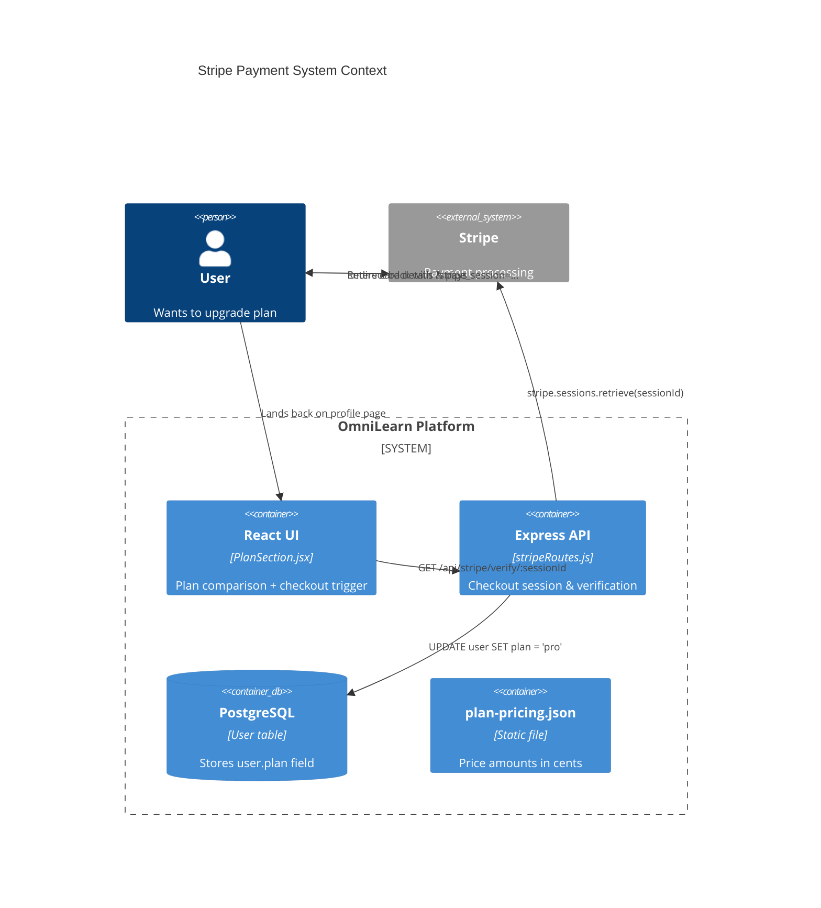
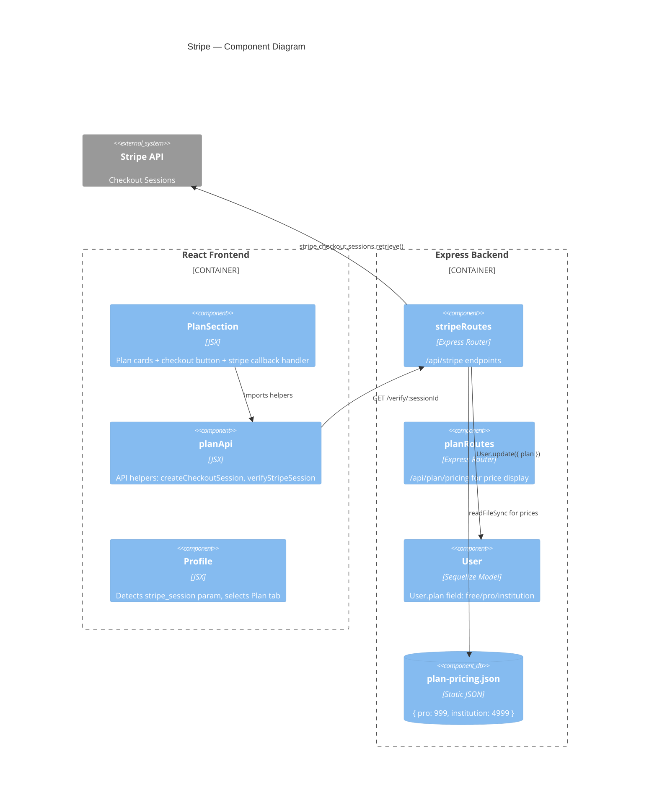
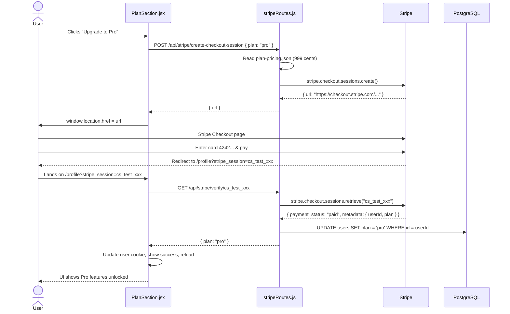

# Stripe Integration — Explained Simply

## What Does Stripe Do Here?

Stripe handles **one-time payments** for upgrading user plans:

| Plan | Price | What You Get |
|---|---|---|
| **Free** | $0 | Basic access: 3 PDFs, 3 code files, limited AI |
| **Pro** | $9.99 | 200 PDFs, 200 code files, full AI features, no limits |
| **Institution** | $49.99 | Everything in Pro + create/manage an institution |

> These are **one-time payments**, not subscriptions. Each payment permanently upgrades the account.

---

## C4 Diagram — Payment Flow



---

## How Payment Works (Step by Step)

### Step 1: User clicks "Upgrade"

**Client function** — `PlanSection.jsx:114-123`:

```js
const onCheckout = async (plan) => {
  setLoading(plan);
  const { url } = await createCheckoutSession(plan);
  window.location.href = url;  // redirect to Stripe
};
```

**API call** — `planApi.js:35-39`:

```js
export const createCheckoutSession = (plan) =>
  call(`/stripe/create-checkout-session`, {
    method: "POST",
    body: JSON.stringify({ plan }),
  });
```

---

### Step 2: Server creates a Stripe Checkout Session

**Server function** — `stripeRoutes.js:42-74`:

```js
router.post("/create-checkout-session", async (req, res) => {
  const { plan } = req.body;
  const planInfo = getPlan(plan);
  if (!planInfo) return res.status(400).json({ error: "Invalid plan" });
  if (req.user.plan === "institution") {
    return res.status(400).json({ error: "You already have institution plan" });
  }

  const session = await getStripe().checkout.sessions.create({
    mode: "payment",
    payment_method_types: ["card"],
    line_items: [{
      price_data: {
        currency: "usd",
        product_data: { name: planInfo.name },
        unit_amount: planInfo.amount,  // e.g. 999 = $9.99
      },
      quantity: 1,
    }],
    metadata: { userId: String(req.user.id), plan },
    success_url: `${CLIENT_URL}/profile?stripe_session={CHECKOUT_SESSION_ID}`,
    cancel_url: `${CLIENT_URL}/profile?stripe_cancelled=1`,
  });

  res.json({ url: session.url });
});
```

**Pricing helper** — `stripeRoutes.js:12-37`:

```js
const PRICING_FILE = path.join(__dirname, "..", "uploads", "plan-pricing.json");
function getamount() {
  try { return JSON.parse(fs.readFileSync(PRICING_FILE, "utf8")); }
  catch { return { pro: 999, institution: 4999 }; }
}

const PLAN_NAMES = { pro: "Pro Plan", institution: "Institution Plan" };
const getPlan = (key) => {
  const prices = getamount();
  if (!(key in PLAN_NAMES)) return null;
  return { name: PLAN_NAMES[key], amount: Number(prices[key]) };
};
```

**Lazy Stripe init** — `stripeRoutes.js:20-28`:

```js
let _stripe = null;
const getStripe = () => {
  if (!_stripe) {
    const key = process.env.STRIPE_SECRET_KEY;
    if (!key) throw new Error("STRIPE_SECRET_KEY is not set in .env");
    _stripe = Stripe(key);
  }
  return _stripe;
};
```

This delays Stripe initialization until the first API call, so missing credentials don't crash the server at boot.

**Key points**:
- `mode: "payment"` — one-time charge, not a subscription
- `metadata` stores `userId` + `plan` so the verify step knows who to upgrade
- `success_url` includes `{CHECKOUT_SESSION_ID}` which Stripe replaces with the real session ID
- Prices are read from `plan-pricing.json` so super admins can update them without code changes

---

### Step 3: User is redirected to Stripe

Stripe shows a hosted checkout page with the plan name, price, and card form. On success, Stripe redirects back to:
```
/profile?stripe_session=cs_test_abc123...
```
On cancel:
```
/profile?stripe_cancelled=1
```

---

### Step 4: App verifies the payment

**Client-side detection** — `PlanSection.jsx:89-111`:

```js
useEffect(() => {
  load();
  const params = new URLSearchParams(window.location.search);
  const sessionId = params.get("stripe_session");
  const cancelled = params.get("stripe_cancelled");

  if (sessionId) {
    verifyStripeSession(sessionId)
      .then((res) => {
        // Update user cookie with new plan
        const user = JSON.parse(Cookies.get("user") || "{}");
        Cookies.set("user", JSON.stringify({ ...user, plan: res.plan }));
        message.success(`Welcome to ${res.plan}!`);
        window.history.replaceState({}, "", window.location.pathname);

        // Institution plan → onboarding
        if (res.plan === "institution" && !user.institutionId) {
          window.location.href = "/onboarding/institution";
          return;
        }
        load();
        setTimeout(() => window.location.reload(), 800);
      })
      .catch((e) => message.error(e.message));
  } else if (cancelled) {
    message.info("Payment cancelled");
    window.history.replaceState({}, "", window.location.pathname);
  }
}, []);
```

**Server verification** — `stripeRoutes.js:77-98`:

```js
router.get("/verify/:sessionId", async (req, res) => {
  const session = await getStripe().checkout.sessions.retrieve(req.params.sessionId);

  if (session.payment_status !== "paid") {
    return res.status(400).json({ error: "Payment not completed" });
  }

  const userId = session.metadata?.userId;
  const plan = session.metadata?.plan;
  if (!userId || !PLAN_NAMES[plan]) {
    return res.status(400).json({ error: "Invalid session metadata" });
  }
  if (String(req.user.id) !== String(userId)) {
    return res.status(403).json({ error: "Session does not belong to you" });
  }

  await User.update({ plan }, { where: { id: userId } });
  res.json({ message: `Upgraded to ${plan}`, plan });
});
```

**Key points**:
- `stripe.checkout.sessions.retrieve()` fetches the session from Stripe API
- Must check `payment_status === "paid"` — Stripe creates the session before payment
- Verifies session belongs to the requesting user (security)
- Updates `User.plan` in the database
- Client then updates the user cookie to reflect the new plan immediately

---

### Step 5: UI updates

- Cookie is updated with `{ ...user, plan: res.plan }` 
- If plan is "institution" and user has no institution → redirect to `/onboarding/institution`
- Page reloads after 800ms → backend now sees the new plan, feature gates open

---

## C4 Diagram — Component Level



---

## Full Sequence Diagram



---

## Client-Side Files

| File | Lines | Purpose |
|---|---|---|
| `Client/src/components/PlanSection.jsx` | 397 | Plan comparison cards with feature lists, usage progress bars, checkout buttons, Stripe callback handler |
| `Client/src/Home/components/PlansSection.jsx` | — | Public landing page plans section (marketing only) |
| `Client/src/components/Profile.jsx` | — | Checks for `stripe_session` URL param to auto-select the Plan tab |
| `Client/src/Admin/planApi.js` | 146 | All plan/institution/stripe API helper functions |

## Server-Side Files

| File | Lines | Purpose |
|---|---|---|
| `Server/src/routes/stripeRoutes.js` | 113 | Stripe checkout session creation + payment verification |
| `Server/src/routes/planRoutes.js` | — | Plan management, pricing CRUD, institution management |
| `Server/src/uploads/plan-pricing.json` | — | `{ pro: 999, institution: 4999 }` — prices in USD cents |
| `Server/.env` | — | `STRIPE_SECRET_KEY=sk_test_...`, `CLIENT_URL=http://localhost:5173` |

## Environment Variables

From `.env.example`:
```
STRIPE_SECRET_KEY=sk_test_...
CLIENT_URL=http://localhost:5173
```

`CLIENT_URL` is used as the base for `success_url` and `cancel_url` in the Stripe session.

---

## Summary

| Step | Client | Server | Stripe |
|---|---|---|---|
| 1. Initiate | `onCheckout("pro")` | — | — |
| 2. Create session | — | `POST /create-checkout-session` | `sessions.create()` |
| 3. Pay | Redirected | — | Hosted checkout |
| 4. Verify | `verifyStripeSession(id)` | `GET /verify/:id` | `sessions.retrieve(id)` |
| 5. Update | Cookie + reload | `User.update({ plan })` | — |

## Testing

Use **Stripe test mode** (default with `sk_test_...` key). Test card numbers:
- `4242 4242 4242 4242` — success
- `4000 0000 0000 0002` — decline
- Any future expiry date, any CVC
