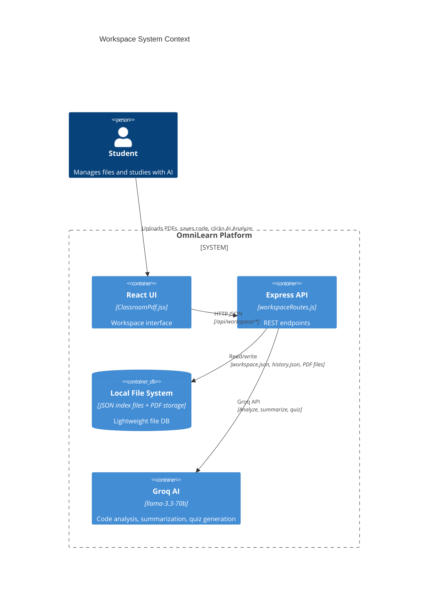
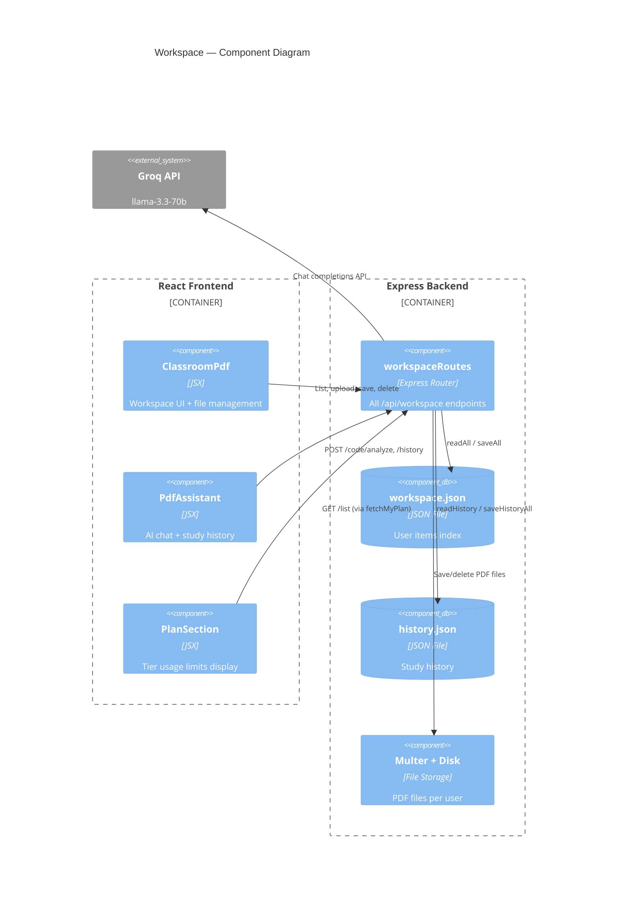
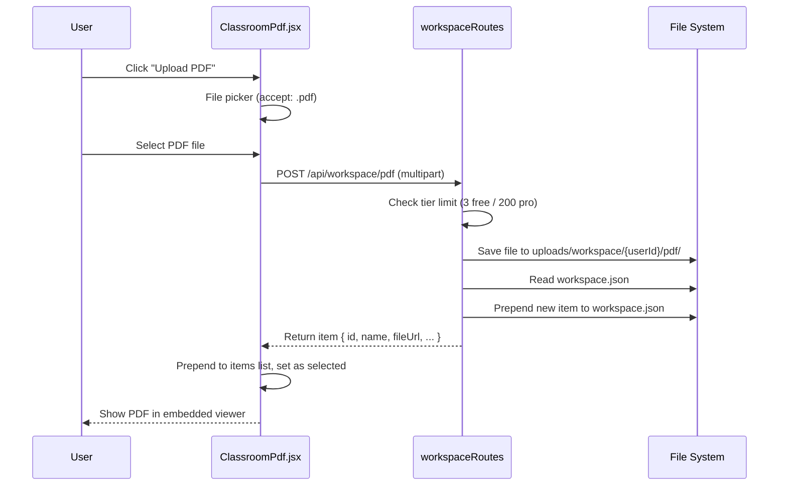
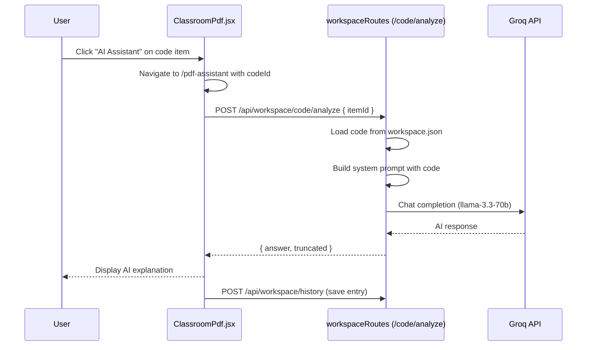

# Workspace Feature — Routes Explained (Front ↔ Back)

## What is the Workspace?

The **workspace** is a per-user file storage area where students can:
- Upload **PDF files** (lecture notes, books up to 50MB)
- Save **code snippets** (paste or drag-drop)
- Run **AI analysis** on code (explain, summarize, generate quizzes)
- Review **study history** (past quiz attempts & AI explanations)

Free tier: 3 PDFs + 3 code files. Pro/Institution tier: 200 each.

---

## C4 Diagram — System Context



---

## Server-Side Storage Architecture

The workspace uses **JSON files as a lightweight database**:

- `Server/src/uploads/workspace.json` — index of all user items (PDFs + code)
- `Server/src/uploads/history.json` — study history entries
- `Server/src/uploads/workspace/<userId>/pdf/` — physical PDF files

### JSON Index Helpers (`workspaceRoutes.js:26-48`):

```js
function readAll() {
  try { return JSON.parse(fs.readFileSync(INDEX_FILE, "utf8")); }
  catch (e) { return []; }
}
function saveAll(items) {
  fs.writeFileSync(INDEX_FILE, JSON.stringify(items, null, 2));
}
function readHistory() {
  try { return JSON.parse(fs.readFileSync(HISTORY_FILE, "utf8")); }
  catch (e) { return []; }
}
function saveHistoryAll(items) {
  fs.writeFileSync(HISTORY_FILE, JSON.stringify(items, null, 2));
}
```

---

## Server-Side Routes (`/api/workspace`)

### GET `/list` — List user's items

**Server function** — `workspaceRoutes.js:82-89`:

```js
router.get("/list", function (req, res) {
  const userId = String(req.user.id);
  const all = readAll();
  const mine = all.filter(function (item) {
    return String(item.userId) === userId;
  });
  res.json({ items: mine });
});
```

Filters the global JSON index to return only the current user's items.

---

### POST `/pdf` — Upload a PDF

**Server function** — `workspaceRoutes.js:103-153`:

```js
router.post("/pdf", handleUpload, function (req, res) {
  if (!req.file) {
    return res.status(400).json({ error: "No file received. Make sure you're uploading a .pdf file." });
  }
  const userId = String(req.user.id);

  // Tier limit checks
  if (req.user.plan === "free" && req.user.role !== "admin") {
    const count = all.filter(i => i.userId === userId && i.type === "pdf").length;
    if (count >= FREE_LIMIT) {  // FREE_LIMIT = 3
      fs.unlinkSync(req.file.path);
      return res.status(402).json({ error: "Free plan limit reached (3 PDFs). Upgrade to Pro.", limitReached: true });
    }
  }

  const item = {
    id: "pdf_" + Date.now(),
    userId: userId, type: "pdf",
    name: req.file.originalname,
    fileUrl: "/uploads/workspace/" + userId + "/pdf/" + req.file.filename,
    filePath: req.file.path,
    createdAt: new Date().toISOString(),
  };
  const all = readAll();
  all.unshift(item);
  saveAll(all);
  res.json(item);
});
```

**Multer disk storage** — `workspaceRoutes.js:51-63`:

```js
const pdfStorage = multer.diskStorage({
  destination: function (req, file, cb) {
    const userId = String(req.user?.id || "anon");
    const dir = path.join(__dirname, "..", "uploads", "workspace", userId, "pdf");
    fs.mkdirSync(dir, { recursive: true });
    cb(null, dir);
  },
  filename: function (req, file, cb) {
    const unique = Date.now() + "-" + Math.round(Math.random() * 1e6);
    const ext = path.extname(file.originalname) || ".pdf";
    cb(null, unique + ext);
  },
});
```

**Client-side upload** — `ClassroomPdf.jsx:98-120`:

```js
async function handlePdfUpload({ file }) {
  const isPdf = file.type === "application/pdf" || (file.name || "").toLowerCase().endsWith(".pdf");
  if (!isPdf) { message.error("PDF files only"); return; }
  const fd = new FormData();
  fd.append("pdf", file);
  setUploading(true);
  const res = await axios.post(API + "/pdf", fd);
  setItems((prev) => [res.data, ...prev]);
  setSelected(res.data);
  message.success("PDF uploaded to your workspace");
}
```

**Key points**:
- `multer` handles multipart parsing, file validation, disk storage, and 50MB size limit
- Free users limited to 3 PDFs, Pro to 200
- Deleted PDFs also have their physical file cleaned up
- Files stored by userId in subdirectories

---

### POST `/code` — Save a code snippet

**Server function** — `workspaceRoutes.js:156-185`:

```js
router.post("/code", express.json({ limit: "5mb" }), function (req, res) {
  const name = req.body.name;
  const content = req.body.content;
  if (!name || !content) return res.status(400).json({ error: "Name and content required" });

  const userId = String(req.user.id);
  // Same tier limit logic as PDF (3 free, 200 pro)
  if (req.user.plan === "free" && req.user.role !== "admin") {
    const count = all.filter(i => String(i.userId) === userId && i.type === "code").length;
    if (count >= FREE_LIMIT) { /* reject */ }
  }

  const item = {
    id: "code_" + Date.now(), userId: userId, type: "code",
    name: name, content: content, createdAt: new Date().toISOString(),
  };
  const all = readAll();
  all.unshift(item);
  saveAll(all);
  res.json(item);
});
```

**Client-side "Add Code" modal** — `ClassroomPdf.jsx:125-164`:

```js
function handleCodeFilePick(file) {
  const MAX_BYTES = 2 * 1024 * 1024; // 2MB
  if (file.size > MAX_BYTES) { message.error("File too large (max 2MB)"); return false; }
  const reader = new FileReader();
  reader.onload = (e) => { setCodeContent(String(e.target?.result || "")); };
  reader.readAsText(file);
  return false; // prevents actual upload — we save via the /code endpoint
}

async function saveCode() {
  if (!codeName.trim() || !codeContent.trim()) { message.error("Filename and code are both required"); return; }
  const res = await axios.post(API + "/code", { name: codeName.trim(), content: codeContent });
  setItems((prev) => [res.data, ...prev]); setSelected(res.data);
  setCodeModalOpen(false); setCodeName(""); setCodeContent("");
  message.success("Code saved to your workspace");
}
```

---

### POST `/code/analyze` — AI code analysis (main function)

**Server function** — `workspaceRoutes.js:191-264`:

```js
router.post("/code/analyze", express.json({ limit: "5mb" }), async function (req, res) {
  let { content, name, language, question, itemId, history } = req.body || {};

  // Load from saved item if itemId provided
  if (itemId && !content) {
    const all = readAll();
    const item = all.find(function (i) { return i.id === itemId; });
    if (!item) return res.status(404).json({ error: "Item not found" });
    if (String(item.userId) !== userId) return res.status(403).json({ error: "Forbidden" });
    content = item.content; name = name || item.name;
  }

  const MAX_CHARS = 12000;
  const snippet = content.length > MAX_CHARS ? content.slice(0, MAX_CHARS) : content;

  // System prompt embeds the code for the AI
  const systemPrompt =
    "You are a senior software engineer acting as a code reviewer and tutor. ...\n\n" +
    `The user is working on: ${name || "snippet"} (${langHint})\n\n` +
    "```" + langHint + "\n" + snippet + "\n```";

  // Build message history (supports follow-up questions)
  const messages = [{ role: "system", content: systemPrompt }];
  if (history?.length > 0) { /* append history */ }
  if (question?.trim()) {
    messages.push({ role: "user", content: question.trim() });
  } else {
    // Default: structured overview
    messages.push({ role: "user", content: "Give me an overview of this code. Cover:\n1. What it does\n2. Key parts\n3. Possible issues\n4. Suggestions to improve" });
  }

  const completion = await groq.chat.completions.create({
    model: "llama-3.3-70b-versatile", messages, temperature: 0.3, max_tokens: 1200,
  });
  res.json({ answer: completion.choices?.[0]?.message?.content || "", truncated });
});
```

**Key points**:
- Supports two modes: pass `itemId` to load saved code, or pass `content` directly for unsaved code
- Supports conversation history for follow-up questions
- Truncates code at 12K characters to stay within context window
- Default first response is a structured 4-section overview (what it does, key parts, issues, improvements)

---

### POST `/code/summarize` — AI code summarization

**Server function** — `workspaceRoutes.js:293-327`:

```js
router.post("/code/summarize", express.json({ limit: "5mb" }), async function (req, res) {
  const loaded = loadCodeForUser(req);  // shared helper
  if (loaded.error) return res.status(loaded.error.status).json({ error: loaded.error.msg });
  const { content, name, langHint, truncated } = loaded;

  const completion = await groq.chat.completions.create({
    model: "llama-3.3-70b-versatile",
    messages: [
      { role: "system", content: "Produce a concise summary with: **Purpose**, **Main pieces**, **How it works**, **Notable details**. Under 250 words." },
      { role: "user", content: `File: ${name} (${langHint})\n\`\`\`${langHint}\n${content}\n\`\`\`` },
    ],
    temperature: 0.3, max_tokens: 800,
  });
  res.json({ summary: completion.choices?.[0]?.message?.content || "", truncated });
});
```

### POST `/code/quiz` — AI quiz generation

**Server function** — `workspaceRoutes.js:330-388`:

```js
router.post("/code/quiz", express.json({ limit: "5mb" }), async function (req, res) {
  const loaded = loadCodeForUser(req);
  const count = Math.min(Math.max(Number(req.body?.count) || 10, 1), 20);

  const completion = await groq.chat.completions.create({
    model: "llama-3.3-70b-versatile",
    messages: [
      { role: "system", content: "Generate MCQs about the code. Return ONLY valid JSON array: [{\"question\":\"...\",\"options\":[\"A\",\"B\",\"C\",\"D\"],\"answer\":\"A\"}]" },
      { role: "user", content: `Generate ${count} questions about this code.\nFile: ${name}...\n\`\`\`${langHint}\n${content}\n\`\`\`` },
    ],
    temperature: 0.4, max_tokens: 2500,
  });

  let raw = completion.choices?.[0]?.message?.content || "[]";
  raw = raw.trim().replace(/^```(?:json)?/i, "").replace(/```$/, "").trim();
  let questions = JSON.parse(raw);  // with fallback
  res.json({ questions, truncated });
});
```

**Key points**:
- 1–20 questions, defaults to 10
- Forces JSON-only output from the AI, with fallback parsing
- Strips accidental markdown fences

---

### Study History CRUD

**GET /history** — `workspaceRoutes.js:394-399`:
```js
router.get("/history", function (req, res) {
  const userId = String(req.user.id);
  const all = readHistory();
  const mine = all.filter(function (h) { return String(h.userId) === userId; });
  res.json({ history: mine });
});
```

**POST /history** — `workspaceRoutes.js:402-436`:
```js
router.post("/history", express.json({ limit: "2mb" }), function (req, res) {
  // type: "quiz" or "explanation"
  const entry = {
    id: "hist_" + Date.now() + "_" + Math.round(Math.random() * 1e6),
    userId: userId, type: type, documentName: documentName || "Untitled", date: new Date().toISOString(),
  };
  if (type === "quiz") { entry.score = Number(score); entry.total = Number(total); entry.questions = questions; }
  else { entry.selectedText = String(selectedText).slice(0, 200); entry.explanation = String(explanation); }
  // Capped at 50 entries per user
  const trimmed = others.concat(mine.slice(0, 50));
  saveHistoryAll(trimmed);
  res.json(entry);
});
```

**DELETE /history/:id** — deletes one entry by ID (ownership checked)

**DELETE /history** — clears all history for the current user

---

### PATCH `/item/:itemId` — Rename & Tags

**Server function** — `workspaceRoutes.js:459-487`:

```js
router.patch("/item/:itemId", express.json(), function (req, res) {
  const all = readAll();
  const idx = all.findIndex(function (i) { return i.id === req.params.itemId; });
  const item = all[idx];
  if (String(item.userId) !== String(req.user.id)) return res.status(403).json({ error: "Forbidden" });

  const { name, tags } = req.body;
  if (typeof name === "string" && name.trim()) { item.name = name.trim(); }
  if (Array.isArray(tags)) {
    const clean = [];
    for (const t of tags) {
      if (typeof t !== "string") continue;
      const tag = t.trim().toLowerCase();
      if (tag && !clean.includes(tag)) clean.push(tag);
    }
    item.tags = clean;
  }
  saveAll(all);
  res.json(item);
});
```

### DELETE `/item/:itemId` — Delete an item

**Server function** — `workspaceRoutes.js:490-516`:

```js
router.delete("/item/:itemId", function (req, res) {
  const item = all[itemIndex];
  if (String(item.userId) !== String(req.user.id)) return res.status(403).json({ error: "Forbidden" });
  // Delete the physical file for PDFs
  if (item.type === "pdf" && item.filePath && fs.existsSync(item.filePath)) {
    fs.unlinkSync(item.filePath);
  }
  all.splice(itemIndex, 1);
  saveAll(all);
  res.status(200).json({ message: "Item deleted successfully" });
});
```

---

## Client-Side Architecture

### `ClassroomPdf.jsx` — Main UI

The workspace page is a split-panel layout:
- **Left sidebar (Sider)**: file list with search/filter/tags, upload buttons, per-user notes
- **Right content area**: PDF viewer or code viewer + AI Assistant button

**State management** uses React `useState` for:
- `items` — full workspace item list
- `selected` — currently viewed item
- `search`, `filter` — search term and type/tag filter
- `notes` — per-user notes saved to `localStorage`

**Filtering logic** — `ClassroomPdf.jsx:247-267`:

```js
const visibleItems = useMemo(() => {
  const q = search.trim().toLowerCase();
  const weekAgo = Date.now() - 7 * 24 * 60 * 60 * 1000;
  return items.filter((it) => {
    if (filter === "pdf" && it.type !== "pdf") return false;
    if (filter === "code" && it.type !== "code") return false;
    if (filter === "recent" && new Date(it.createdAt || 0).getTime() < weekAgo) return false;
    if (filter.startsWith("tag:")) {
      if (!(it.tags || []).includes(filter.slice(4))) return false;
    }
    if (q) {
      const hay = (it.name + " " + (it.tags || []).join(" ")).toLowerCase();
      if (!hay.includes(q)) return false;
    }
    return true;
  });
}, [items, search, filter]);
```

**AI Assistant navigation** — `ClassroomPdf.jsx:186-195`:

```js
function openCodeAssistant() {
  if (!selected || selected.type !== "code") return;
  navigate("/pdf-assistant", {
    state: { codeId: selected.id, codeContent: selected.content, codeName: selected.name },
  });
}
```

### `PlanSection.jsx` — Tier limit display

Shows workspace usage bars (PDFs used vs 3/200, code files used vs 3/200) via the `fetchMyPlan()` API.

---

## C4 Diagram — Component Level (Workspace Flow)



---

## Data Flow Diagrams

### Uploading a PDF:



### Analyzing Code with AI:



---

## Key Files

| File | Lines | Role |
|---|---|---|
| `Server/src/routes/workspaceRoutes.js` | 518 | All workspace API endpoints + AI integration |
| `Client/src/ClassroomPdf/ClassroomPdf.jsx` | 632 | Main workspace UI (sidebar, upload, viewer, search, notes) |
| `Client/src/ClassroomPdf/ClassroomPdf.css` | — | Workspace styles |
| `Client/src/components/PdfAssistant.jsx` | — | AI analysis chat interface + study history |
| `Client/src/components/PlanSection.jsx` | 397 | Tier limit display + usage progress bars |
